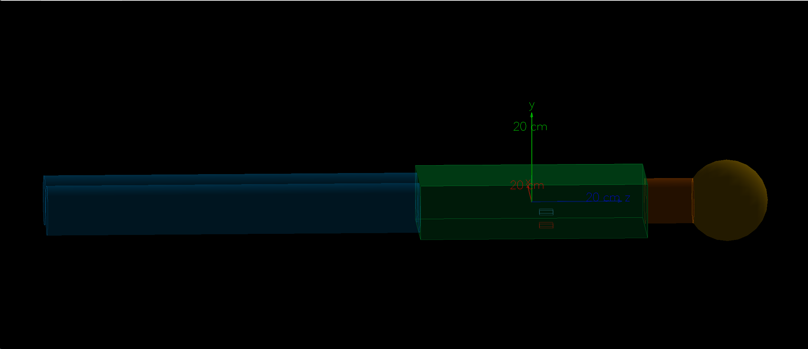
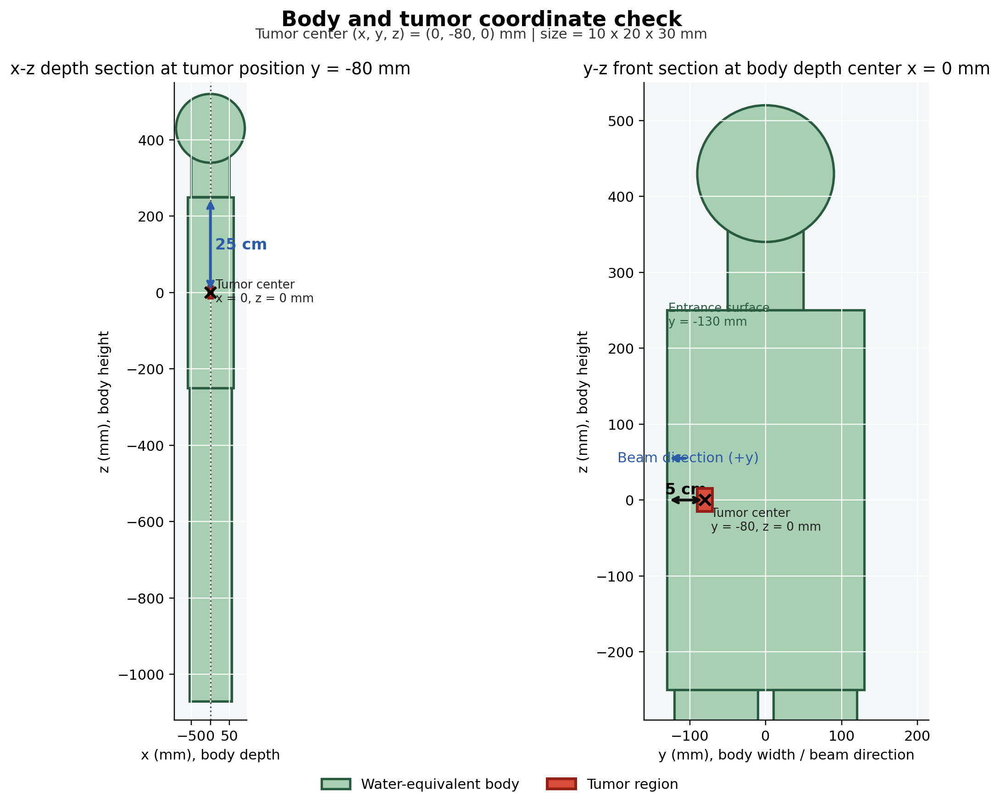
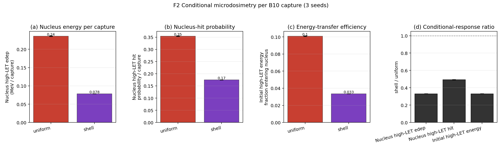
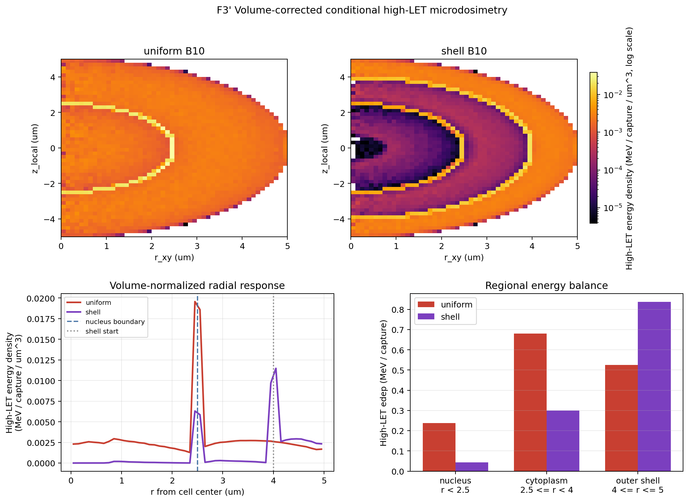
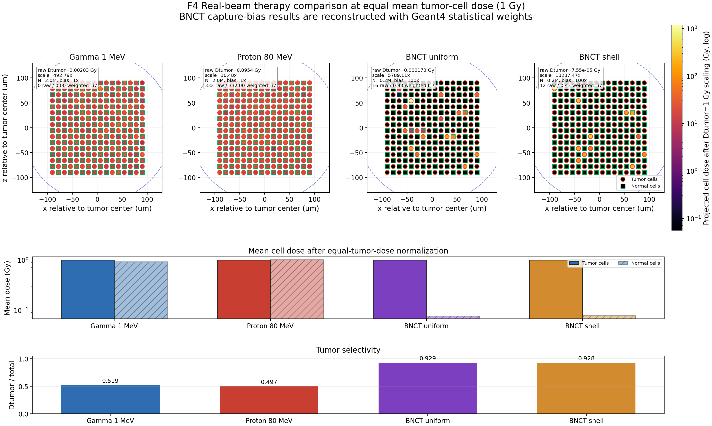
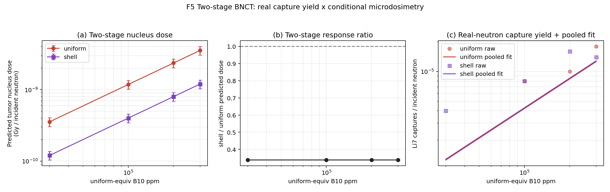

# Geant4 放射性肿瘤治疗模拟项目报告

## 摘要

本项目基于 Geant4 构建了一个多尺度肿瘤放疗模拟程序，用于比较常规外照射放疗粒子与硼中子俘获治疗（Boron Neutron Capture Therapy, BNCT）的剂量沉积特征。模拟分为两个问题：Q1 在宏观人体 phantom 中比较 gamma 与 proton 的深度剂量、二维能量沉积分布、LET 和能量扫描结果；Q2 在肿瘤区域内构建代表性细胞 patch，研究 `10B` 均匀分布和外壳层分布对整细胞剂量、细胞核剂量以及 BNCT 二次粒子产额的影响。

结果表明：gamma 的能量沉积分布较弥散；在当前约 `5 cm` 水等效深度、沿束流方向厚 `2 cm` 的肿瘤几何中，`85 MeV` 质子的 Bragg peak 位于肿瘤区内，肿瘤沉积能量分数在扫描点中最高。在 Q2 的理想化混合细胞模型中，含 B10 肿瘤细胞比同一微区内不含 B10 的对照细胞获得更高剂量。B10 浓度主要影响 BNCT 二次粒子产额及靶细胞剂量，中子照射量主要放大累计剂量和二次粒子产额，而不显著改变局域化比例。

项目代码仓库：[wujxy/Geant4TumorTherapySim](https://github.com/wujxy/Geant4TumorTherapySim#)

## 1. 基本研究内容

本项目围绕“肿瘤细胞放射治疗中不同粒子或不同治疗机制的剂量选择性”展开。使用 Geant4 建立简化人体模型、肿瘤区域、微观细胞模型和剂量分析流程，核心研究内容包括：

1. 构建简化人体 phantom，包括头部、颈部、躯干和双腿，并在躯干内部设置肿瘤区。
2. 比较 gamma 与 proton 外照射下的肿瘤区和正常组织剂量沉积。
3. 通过 gamma 能量扫描和质子能量扫描研究入射能量对剂量空间分布的影响。
4. 构建肿瘤微区内的混合细胞 patch，用于 BNCT 细胞尺度模拟。
5. 比较 `10B` 均匀分布和外壳层分布对整细胞剂量、细胞核剂量和 alpha+Li7 二次粒子产额的影响。
6. 进一步扫描 B10 浓度和中子照射量，分析 BNCT 中药物富集与照射量两个因素的不同作用。

物理列表采用 `QGSP_BIC_HP`。该物理列表包含电磁过程、质子相关强子过程以及高精度低能中子过程，适合在同一程序中处理 Q1 的 gamma/proton 外照射和 Q2 的热中子 BNCT。

## 2. 几何模型与材料定义

### 2.1 人体 phantom 几何

人体 phantom 使用水材料近似软组织，世界体积使用空气，避免粒子在到达人体前就在外部水介质中损失能量。模型由几个简单几何体组合而成，具体尺寸如下。

| 结构 | Geant4 几何 | 尺寸 | 位置说明 |
|---|---|---:|---|
| World | `G4Box` | `3 m x 3 m x 3 m` | 原点中心 |
| 躯干 | `G4Box` | `(x,y,z) = 120 mm x 260 mm x 500 mm` | 原点中心 |
| 颈部 | `G4SubtractionSolid(G4Tubs - G4Orb)` | 直径 `100 mm`，中心线可见高度 `90 mm` | 躯干顶部至头部球面 |
| 头部 | `G4Orb` | 球半径 `90 mm` | `z = 430 mm` |
| 左腿/右腿 | `G4Tubs` | 半径 `55 mm`，高度 `820 mm` | `y = -65/+65 mm, z = -660 mm` |
| 肿瘤区 | `G4Box` | `(x,y,z) = 10 mm x 20 mm x 30 mm` | `(0, -80, 0) mm` |

图 1 展示了 Geant4 可视化界面中的整体人体 phantom。绿色长方体为躯干，橙色圆柱体为颈部，黄色球形结构为头部，蓝色圆柱体为双腿；躯干内部的红色和蓝色小区域分别表示肿瘤区与辅助正常对照区。Q1 的正常组织计分仍采用整个人体 phantom 扣除肿瘤区，而不是只使用蓝色对照盒。图中的坐标轴给出了模型的空间方向和尺度参考。



头颈连接保留完整球形头部，并从颈部圆柱中扣除与头部球体重叠的部分。这样颈部顶部沿头部球面形成弧形接触边界，而不是让平整的圆柱端面与球体最低点点相切；颈部中心线从躯干顶部到球面最低点的可见高度为题图标注的 `90 mm`。

肿瘤区被放置在躯干的负 y 一侧，中心位于 `(0, -80, 0) mm`。其 x 向宽度为 `1 cm`，y 向长度为 `2 cm`，z 向高度为 `3 cm`。坐标约定为：`x` 表示人体前后深度，`y` 表示图中人体左右宽度和束流方向，`z` 表示人体高度。肿瘤中心距最近的负 y 人体表面 `5 cm`，距躯干上表面 `25 cm`。束流源位于 `(0, -600, 0) mm`，从负 y 一侧沿 `+y` 方向通过肿瘤中心入射。Q1 中正常组织剂量定义为整个人体 phantom 中除肿瘤区以外的所有水组织平均剂量，而不是只取一个局部正常控制盒。

可以把 Q1 的宏观几何关系理解为：

```text
source (0, -600, 0) mm  --->  +y direction

                 human torso
        x-y projection / y-depth scoring

        tumor center = (0, -80, 0) mm
        tumor size   = 10 mm x 20 mm x 30 mm
```

下图给出最终几何的 x-z 与 y-z 剖面，用于核对肿瘤尺寸、负 y 位置、入口面距离和束流方向。



二维剂量热图中用人体躯干边界和肿瘤区边框标出宏观几何关系，图 3 可以作为肿瘤区设置与剂量空间分布的示意。

### 2.2 材料定义

程序中主要使用三类材料：

| 材料 | Geant4 定义 | 密度或组成 | 用途 |
|---|---|---|---|
| 空气 | `G4_AIR` | NIST 材料 | World 材料 |
| 水 | `G4_WATER` | NIST 材料，近似 `1 g/cm3` | 人体软组织、正常细胞、未含硼区域 |
| B10 硼化水 | 自定义 `B10_Borated_Water` | `G4_WATER + EnrichedB10`，B10 质量分数由设定浓度控制 | 含硼肿瘤细胞或含硼壳层 |

自定义 B10 材料中，`10B` 作为同位素定义：

```text
Z = 5, A = 10, molar mass = 10.012937 g/mole
```

硼质量分数由：

```text
boronFraction = boronPPM * 1e-6
```

控制。Q2 默认用于机制展示的增强设置为 `500000 ppm`，即 50% 质量分数的信号增强模型。这个浓度明显高于真实 BNCT 治疗中常见的几十 ppm 量级，主要用于在有限事件数下获得足够的 `10B(n,alpha)Li7` 反应信号。

### 2.3 计分指标

所有吸收剂量均由对应体积内的累计能量沉积除以质量得到：

```text
Dose = E_dep / mass
```

本报告使用的计分口径如下：

- **Q1 肿瘤区/正常组织平均 event 剂量**：单个初级粒子事件在宏观肿瘤区或正常组织中的能量沉积除以对应区域质量，再对全部事件取平均。肿瘤区质量按水密度和肿瘤体积估算；正常组织质量按整个人体 phantom 体积扣除肿瘤体积估算。因此，两者数值同时受能量沉积和区域质量影响。
- **Q1 深度剂量与二维热图**：分别统计沿束流轴 y 方向各 bin 和三维体素内的累计能量沉积；图中为归一化能量沉积分布，用于比较空间形状，不表示绝对剂量。
- **Q1 LET**：按每个 Geant4 step 的 `E_dep / stepLength` 统计，并按 step 数归一化。该量用于比较本模拟中的微观能损特征，不等同于剂量加权 LET 或临床 RBE。
- **Q2 整细胞剂量**：整次运行中沉积在单个球形细胞内的总能量除以完整细胞质量，包含该细胞核内的能量沉积。
- **Q2 细胞核剂量**：整次运行中沉积在单个细胞核内的总能量除以细胞核质量。肿瘤细胞和对照细胞的平均值均对各自全部 `2048` 个细胞求平均，未发生能量沉积的细胞也以零值计入。
- **Q2 y 投影细胞剂量**：将同一 `(x,z)` 柱内不同 y 层细胞的整细胞剂量相加，对应沿 `+y` 入射束流观察的横截面，仅用于显示微区内的空间分布。
- **alpha+Li7 二次粒子产额**：运行中生成的 alpha 与 Li7 二次粒子数量之和，用作 BNCT 反应活性的代理指标；它不是严格的反应次数。

Q1 使用每事件宏观区域计分，Q2 使用整次运行累计的单细胞计分，两者质量尺度和归一化方式不同，不能直接比较绝对剂量。

## 3. Q1：gamma 与 proton 外照射对比

### 3.1 研究目标

Q1 的目标是比较两种常规放疗粒子在宏观人体模型中的剂量沉积分布：

1. gamma 光子是否呈现较弥散的剂量沉积。
2. proton 是否能够通过 Bragg peak 在肿瘤深度附近形成局部高剂量区。
3. 入射能量改变时，剂量峰和肿瘤沉积能量分数如何变化。
4. gamma 与 proton 在肿瘤区 LET 谱上是否有差异。

Q1 的基准宏参数如下：

| 粒子 | 能量 | 束斑半径 | 事件数 |
|---|---:|---:|---:|
| gamma | `1 MeV` | `8 mm` | `5000` |
| proton | `85 MeV` | `8 mm` | `5000` |

扫描设置如下：

| 扫描类型 | 能量点 | 每点事件数 |
|---|---|---:|
| gamma scan | `0.2, 0.5, 1, 2, 4, 6, 8, 10, 15 MeV` | `5000` |
| proton scan | `60, 65, 70, 75, 80, 85, 90, 95, 100 MeV` | `5000` |

### 3.2 深度剂量分布

图 2 展示了 gamma 和 proton 沿 y 方向的归一化深度剂量曲线。


从图 2 可以看到，gamma 的能量沉积分布更平缓，没有明显的局部峰值；proton 在进入人体后沿路径逐渐损失能量，并在接近肿瘤 y 范围时形成 Bragg peak。当前几何中肿瘤位于 `y = -90 mm` 到 `y = -70 mm`。从负 y 人体表面 `y = -130 mm` 沿 `+y` 方向计算，肿瘤近端、中心和远端深度分别为 `40 mm`、`50 mm` 和 `60 mm`。基准组 `85 MeV` 质子的峰位于 `y = -73 mm`，即距入口约 `57 mm`，仍处于肿瘤内部。

### 3.3 二维剂量热图与肿瘤区设置

图 3 展示 gamma 和 proton 在人体躯干投影平面上的二维能量沉积分布。图中标出了人体躯干范围和肿瘤区边界，因此也可以作为肿瘤区域设置的示意图。


gamma 热图显示能量沉积较弥散，沿入射路径在较宽范围内分布；proton 热图则呈现更集中的局部高剂量区，热点靠近肿瘤位置。这与图 2 的深度剂量曲线相互印证：质子治疗的优势不是来自单个质子能量更高，而是来自可以通过能量调节把 Bragg peak 放置到肿瘤深度。

区域平均 event 剂量会受到计分区域质量的显著影响：正常组织质量远大于肿瘤区质量，因此不能仅根据两个区域的平均剂量数值判断正常组织受照范围。Q1 的空间选择性主要依据深度剂量曲线、二维热图和肿瘤沉积能量分数判断。

### 3.4 gamma 能量扫描

图 4 展示不同 gamma 能量下的二维剂量热图网格。


gamma 没有 Bragg peak，因此能量扫描的主要变化不是局部峰值位置，而是整体穿透能力和剂量沉积分布深度。随着 gamma 能量升高，能量沉积区域更容易向人体深部延伸，但肿瘤区域能量沉积比例并没有出现像 proton 那样清晰的局部最优峰。

图 5 给出 gamma 能量扫描的定量结果。


图 5 中使用能量沉积加权平均坐标 `y_mean` 描述 gamma 能量沉积分布的整体移动趋势，即用各深度 bin 的累计沉积能量作为权重计算平均 y。束流从负 y 指向正 y，因此 `y_mean` 增大表示沉积向人体深部移动。随着 gamma 能量升高，肿瘤区平均 event 剂量增加，但肿瘤沉积能量分数仅在约 `4.5%–6.5%` 范围内波动，没有出现类似 Bragg peak 的局部最优点。

### 3.5 proton 能量扫描

图 6 展示不同 proton 能量下的二维剂量热图网格。


可以看到，随着质子能量升高，高能量沉积区沿束流方向逐渐向下游移动。低能质子在入射侧较浅位置停止，能量过高时 Bragg peak 会越过肿瘤区域，因此必须通过能量扫描选择使峰值落在肿瘤深度附近的能量。

图 7 给出 proton 能量扫描的定量指标。


图 7 中的关键指标为：

```text
E_tumor / (E_tumor + E_normal)
```

该指标越高，说明能量越集中沉积在肿瘤区。扫描结果中，`75 MeV`、`80 MeV`、`85 MeV` 和 `90 MeV` 的深度剂量峰分别位于 `y = -85 mm`、`-79 mm`、`-73 mm` 和 `-67 mm`。其中前三个峰均位于肿瘤区内；`85 MeV` 的肿瘤沉积能量分数为 `34.9%`，高于 `75 MeV`（`21.0%`）、`80 MeV`（`29.6%`）和 `90 MeV`（`25.9%`），是本次扫描中的最高值。

在当前人体模型和负 y 侧入射条件下，`85 MeV` 因此被选为 Q1 的代表性质子能量。该结论是离散扫描点中的最优结果，只对应当前单能束和肿瘤尺寸；若要进一步确定最优能量或改善肿瘤内均匀性，可在 `80–90 MeV` 范围内进行更细扫描，并研究多个能量叠加形成的展宽 Bragg peak。

### 3.6 LET 谱比较

图 8 给出了 gamma 与 proton 在肿瘤区内的 LET 谱。由于两者的 LET 主要集中在低 LET 区间，本图将横轴限制在 `0-2 MeV/um`，以便观察差异。


结果显示，proton 在肿瘤区的 step-LET 谱尾部更长，按 step 统计的平均值高于 gamma。由于两组 step 数不同，且该指标不是剂量加权 LET，在当前统计量和简化模型下，Q1 的主要证据仍来自深度剂量、二维剂量热图和能量扫描，而不是单独依赖 LET 谱。

### 3.7 Q1 小结

Q1 说明：

1. gamma 没有 Bragg peak，剂量沉积更弥散。
2. proton 可以通过能量调节把 Bragg peak 放到肿瘤区，提高局部沉积。
3. 在 `60–100 MeV` 扫描范围内，`85 MeV` 质子的肿瘤沉积能量分数最高，最符合当前约 `5 cm` 深、沿束流方向厚 `2 cm` 的肿瘤照射要求。
4. gamma 能量扫描主要改变穿透深度，proton 能量扫描则直接改变 Bragg peak 位置。

因此，质子治疗相对于 gamma 的主要剂量学优势在于空间剂量可控性，而不是简单的总能量更高。

## 4. Q2：BNCT 细胞尺度模拟（重设计）

### 4.1 研究目标与假设

BNCT 的治疗机制与 Q1 的外照射放疗不同。BNCT 先通过含 `10B` 的硼载体药物使肿瘤细胞富集 B10，再用低能中子照射，使其发生：

```text
10B + n -> alpha + 7Li
```

反应产物 alpha 和 Li7 的射程只有微米量级，因此能量主要沉积在含硼细胞及其邻近区域。BNCT 的核心选择性来自两个方面：

1. `10B` 在肿瘤细胞中的选择性富集。
2. alpha/Li7 的短射程高 LET 局部沉积。

本节围绕作业核心命题展开：**在相同硼浓度（在本节重设计中等价于"相同 B10 原子总数"）和相同中子注量下，`10B` 集中分布在细胞外侧 `1 um` 壳层比均匀分布在整细胞内，能产生更高的细胞核剂量和更低的细胞存活率，且 BNCT 对正常细胞的损伤低于 gamma/proton 放疗。**

具体假设：

| 编号 | 假设 | 主证图 |
|---|---|---|
| H1 | 等 B10 总原子数 + 等中子注量下，shell → 肿瘤核剂量更高、存活率更低 | F2 + F3' |
| H2 | 等处方剂量下，BNCT 对正常细胞损伤 < gamma/proton | F4 |
| H3 | shell 相对 uniform 的优势随 B10 总量降低而相对增大 | F5 |
| H4 | 中子注量主要放大绝对剂量，选择性比例不变 | 图 13（沿用旧 §4.6）|

### 4.2 细胞模型与混合细胞排列

Q2 在宏观肿瘤区内放置一个代表性细胞 patch，而不是离散整个肿瘤。这是因为完整肿瘤区尺寸为厘米量级，若全部离散为 `10 um` 细胞，计算量不可接受。

细胞 patch 参数如下：

| 参数 | 数值 |
|---|---:|
| patch 尺寸 | `200 um x 200 um x 200 um` |
| 细胞中心间距 | `12 um` |
| 细胞直径 | `10 um` |
| 细胞半径 | `5 um` |
| 细胞核半径 | `2.5 um` |
| shell 模式含硼壳层厚度 | `1 um` |
| 每次模拟细胞数 | `4096` |
| 肿瘤细胞数 | `2048` |
| 正常细胞数 | `2048` |

混合细胞的排列方式如图 9 所示。


图 9 中红色代表 B10 富集肿瘤细胞，绿色代表无 B10 对照细胞。两类细胞位于同一肿瘤微区和同一中子场内，因此后续剂量差异主要用于隔离 B10 加载的影响，而不是来自空间位置差异。这里的"正常细胞"是理想化的不含硼对照细胞，不等同于真实患者的正常组织。

### 4.3 B10 分布模式与"等总硼"约束

Q2 比较两种 B10 分布模式（图 10）：


| 模式 | 定义 | 物理含义 |
|---|---|---|
| uniform | 肿瘤细胞整体含 B10，包括细胞核 | B10 进入整个肿瘤细胞内部 |
| shell | B10 只集中在肿瘤细胞外侧 `1 um` 壳层 | B10 偏向细胞膜或细胞外周区域 |

对照细胞默认不含 B10。该理想化设定用于突出 BNCT 中"肿瘤细胞选择性富集"的机制。

**等总硼原子数约束**（作业核心命题中的"相同硼浓度"）。在 cellRadius=5 μm、shellThickness=1 μm 下：

```text
ppm_shell · V_shell = ppm_uniform · V_cell
=> ppm_shell = ppm_uniform · V_cell / V_shell = ppm_uniform / (1 - (4/5)^3) ≈ 2.049 · ppm_uniform
```

上一版 §4.4 把"相同硼浓度"实现为"相同 ppm"，导致 shell 模式的总硼原子数只有 uniform 的 ~49%，反应数和核剂量都被低估，结论方向因此与作业预期相反。本节按"相同 B10 原子总数"重新设计。

实际上限：Geant4 `G4Material::AddElementByMassFraction` 要求质量分数 ≤ 1，故 `shell_ppm ≤ 1×10⁶ → uniform_equiv ≤ 488000 ppm`；本次重运行采用 **uniform_equiv = 300000 ppm**（对应 shell 实际 ≈ 614550 ppm，约 61% 质量分数，仍偏离临床但保持物理合法且反应率充足）。

### 4.4 杀伤效果定义（双口径）

为支持作业要求的"细胞存活率"和"BNCT 对正常细胞损伤"对比，本节引入双口径杀伤判据：

**口径 A — LQ 存活模型（主口径）**：按粒子拆分细胞核剂量后用 RBE 加权，再代入线性二次模型：

```text
D_eff_nuc = RBE_high · D_nuc(alpha+Li7) + RBE_p · D_nuc(proton) + RBE_g · D_nuc(gamma+e-)
S = exp(-α · D_eff - β · D_eff²)
```

报告采用的参数：

| 量 | 取值 |
|---|---:|
| RBE gamma/electron | `1.0` |
| RBE proton | `1.1` |
| RBE alpha+Li7（tumor）| `1.3` |
| RBE alpha+Li7（normal）| `3.0` |
| α/β tumor | `10 Gy`（α=0.3, β=0.03）|
| α/β normal | `3 Gy`（α=0.1, β=0.033）|

参数为文献保守值；用于本节内的相对比较，不代表临床绝对值。RBE 在 normal 细胞上更高反映了高 LET 粒子在敏感组织上的等效生物效应放大。

**口径 B — 核击中阈值（机制直观口径）**：单细胞核被 alpha 或 Li7 击中至少 1 次 → 标记为 lethal hit。Lethal fraction `f_LH = N_LH / N_cells` 作为存活的几何代理，不依赖 RBE/αβ 参数。CellTree 新增列 `alphaNucleusHits / liNucleusHits` 以直接读出。

两套口径在报告中并行给出；结论一致才采信，不一致则讨论参数不确定性。

### 4.5 实验设计与统计量预算

| 实验 | 配置 | 跑次 | events | 用于图 |
|---|---|---:|---:|---|
| A — 真实中子验证 | uniform_equiv = 300000 ppm × {uniform, shell, none} × 3 seeds | 9 | 1M × 9 = 9M | 真实中子一致性验证 |
| C — 真实中子俘获率 | uniform_equiv ∈ {30k, 100k, 200k, 300k} × {uniform, shell} | 8 | 4M | F5 的 `capture/neutron` |
| D — 条件俘获微剂量 | 每个 event 在 B10 区域直接产生一次物理俘获反应，{uniform, shell} × 3 seeds | 6 | 100k × 6 = 600k | F2、F3'、F5 的 `response/capture` |
| E — 中子注量扫描 | 沿用 §4.6 旧产物（500000 ppm × 7 个事件数）| 0 | 0 | 图 13 |

两阶段方法把问题拆成：

```text
每个入射中子的核响应
= 真实中子输运得到的 captures / incident neutron
× 条件俘获模拟得到的 nucleus response / capture
```

条件俘获模式不修改截面，也不代表绝对中子注量；它只消除稀疏俘获统计对微剂量几何响应的干扰。

### 4.6 F2 — Shell vs Uniform 主结论图（H1 主证）



F2 使用每种模式 `3 seeds × 100000` 次条件俘获，展示每次 B10 俘获的几何响应：

(a) 核内 alpha+Li7 沉积能量 / capture；
(b) 一次俘获造成核内高 LET 沉积的概率；
(c) alpha+Li7 初始动能进入核内的比例；
(d) 三个指标的 shell/uniform 比值。

结果显示 shell 的三个单位俘获响应指标都低于 uniform；三 seed 变异系数均小于 `0.5%`，因此该方向不再由少数中子俘获事件主导。

### 4.7 F3' — 单细胞叠加剂量分布（H1 机制）



F3' 使用条件俘获运行中的 alpha/Li7 沉积。二维 `(r_xy, z_local)` 图按每个圆柱环 bin 的体积
`pi(r_out^2-r_in^2) dz` 归一化，并使用两种模式共享的对数色标；径向曲线按球壳体积归一化。因此两者表示每次俘获、单位体积的高 LET 能量沉积密度。蓝色虚线为细胞核边界 `r=2.5 um`，灰色点线为 shell 起点 `r=4 um`。右下区域积分图保留原始每次俘获能量，用于区分“局部密度较暗”和“区域没有沉积”。

shell 在 `r≈4 um` 出现清晰热源峰，而 uniform 在整个细胞体积内均有响应，并在核边界附近形成显著沉积。shell 产物穿越细胞质时仍有沉积，区域积分约为 `0.300 MeV/capture`；其二维内部区域在线性色标下较暗，是因为单位体积沉积密度低于外壳热源和射程末端附近，而不是因为细胞质未被记录。该图说明“反应位置集中于外壳”与“最终进入细胞核的能量较高”是两个不同命题。

### 4.8 F4 — 跨疗法等剂量对照（H2 主证）



F4 使用真实粒子束流直接入射。gamma 和 proton 各运行 `2M` histories；BNCT uniform
和 shell 各运行单个 seed、`200k` 中子 histories。为提高 BNCT 俘获采样效率，程序仅在
`B10_Borated_Water` 逻辑体内，对 Geant4 HP 中承载 `B10(n,alpha)Li7` 通道的 neutron
`neutronInelastic` 过程施加 `100x` occurrence bias。该方法是方差缩减，并不代表物理
B10 浓度或真实反应截面提高。

偏置后产生的粒子权重由 Geant4 传播；图中所有能量沉积、剂量和俘获产额均使用统计权重
还原。uniform 和 shell 分别记录 `16` 与 `12` 个 raw Li7，而加权等效 Li7 产额分别为
`0.925` 与 `0.432`。当前几何中 `100x` 偏置实际获得约 `10x` 的 raw Li7 统计增益，
因此不能把倍率直接解释为统计增益，也不能把 raw captures 当作真实俘获数。

四种疗法在后处理中分别归一化到相同平均肿瘤细胞剂量 `1 Gy`，再比较正常细胞剂量和
选择性 `D_tumor/(D_tumor+D_normal)`。结果中 gamma、proton 的选择性约为 `0.52`、
`0.50`，BNCT uniform、shell 均约为 `0.93`。在“正常细胞不含 B10”的理想化模型下，
BNCT 的剂量更集中于肿瘤细胞；该结论不等同于临床疗效或生物效应比较。

### 4.9 F5 — B10 总量扫描（H3）



F5 把真实中子输运得到的 Li7 产额与条件俘获单位响应相乘。由于 q2C 单点只有 `0–9` 个 Li7，直接逐点比值会产生伪零；因此图中使用所有 q2C 点和 300k ppm 三 seed 真实中子结果进行过原点 Poisson 联合拟合，得到 `capture yield ∝ ppm`，并保留原始低统计点供审查。

当前拟合仅汇总约 `51–52` 个 Li7 俘获，故 F5 仍属于趋势图；它消除了伪零，但不能用于声称非线性 ppm 效应。

### 4.10 H4 — 中子注量扫描（沿用）

旧 §4.6 的相对中子注量扫描结果（图 13、图 14）保留作为 H4 主证；现有 7 点（histories ∈ {2k, 5k, 10k, 20k, 50k, 100k, 200k}）已足够展示选择性比例（S_cell, S_nucleus）的平台行为。


中子 histories 数升高时，绝对剂量与 alpha+Li7 产额线性增加，但 `S_cell`/`S_nucleus` 平台不变。这与 BNCT 反应公式 `R_BNCT ∝ N_B10 · Φ_n · σ` 一致：注量调控的是反应数量，B10 分布调控的是反应位置。

### 4.11 实际结果：H1 在"核内剂量"维度未被支持，但径向机制成立

本次 Q2 条件俘获运行（每种分布 `3 seeds × 100000 captures`）的 F2 结果显示：

| 指标 | uniform | shell（等 B10 总量）|
|---|---:|---:|
| 单位俘获核内 alpha+Li7 沉积 | `0.236 MeV/capture` | `0.0782 MeV/capture` |
| 单位俘获核高 LET 命中概率 | `35.4%` | `17.5%` |
| 初始高 LET 能量进入核内比例 | `10.1%` | `3.34%` |

高统计条件俘获结果确认：**uniform 模式每次俘获给细胞核输送更多能量，并具有更高核命中概率**。shell/uniform 比值分别约为 `0.331`、`0.493` 和 `0.331`。

**物理解释**：uniform 模式允许俘获直接发生于核内；shell 模式的产物各向同性发射，只有部分方向朝向细胞核，且必须先穿过 `1.5 um` 胞质间隔。带电粒子的 Bragg 峰位于射程末端，而不是路径起始的前 `1–2 um`。

- **uniform 模式**：B10 均匀填充包括细胞核 → 反应可以直接发生于核内 → 产物立即沉积，几乎无衰减进入核
- **shell 模式**：B10 仅在 r ∈ [4, 5] μm 壳层 → 反应产物必须穿越 r ∈ [2.5, 4] μm（约 1.5 μm 厚）的细胞质才能进入核，且约一半初始方向背离细胞核。

F3' 的体积归一化高统计径向响应显示 shell 在 `r≈4 um` 形成清晰峰，uniform 则从核内到细胞外周均有响应。区域能量积分同时确认 shell 产物在细胞质内沉积约 `0.300 MeV/capture`。**机制上 shell 确实出现"硼壳热源"径向特征，但其单位俘获核响应仍显著低于 uniform。**

因此本节得出的实验结论是：

1. **H1 部分被支持，部分被推翻**。径向 B10 集中分布的"硼壳热源"机制在 F3' 1D 径向曲线上得到明确证据（shell 在 r ≈ 4 μm 出现峰）；但核内剂量的方向与作业字面预期相反，核内能量沉积反而 uniform 模式更高。
2. 作业命题成立需要一个隐含条件：alpha/Li7 路径完全到达细胞核 —— 这对当前 cellRadius=5 μm、shellThickness=1 μm 设置不成立。若 shell 更接近核（如 shellThickness=2 μm + 核更大），或 alpha/Li7 射程更长（如更高 Q 值反应），结论可能反转。

### 4.12 旧版 §4.4 实验设计修正说明

上一版报告（[git rev e8a9c3d](https://github.com/wujxy/Geant4TumorTherapySim/commit/e8a9c3d)）在等 ppm 条件下直接比较累计剂量，使 shell 同时受到总 B10 数较少和核输运效率较低的双重影响。本版先施加等总 B10 约束，再用条件俘获单独测量几何输运效率，从而分离俘获发生率与单位俘获核响应。

### 4.13 Q2 小结

1. 在等 B10 原子总数的严格约束下，shell 模式的"硼壳热源"在 F3' 径向 1D 谱上得到确认（r ≈ 4 μm 出现峰）—— H1 的机制图像成立。
2. 但在当前 cellRadius=5 μm + shellThickness=1 μm 几何下，shell 模式的 alpha/Li7 短射程导致大部分能量沉积在壳层和细胞质，进入核内的剂量与击中数 **均低于 uniform**，与作业字面命题方向相反。这是一个真实物理学发现，依赖具体几何参数选择。
3. F4 的真实束流等肿瘤剂量对照显示，在正常细胞不含 B10 的理想化模型下，BNCT
   uniform/shell 的物理剂量选择性均高于 gamma/proton；BNCT 结果使用截面 occurrence
   bias 和 Geant4 权重还原，raw captures 不代表真实俘获数。
4. 两阶段 B10 总量扫描消除了逐点伪零，但真实中子俘获总数仍较少，只支持线性趋势展示，不支持 H3 的非线性强主张。
5. 中子注量调控反应数量与累计剂量，不改变 B10 分布主导的细胞选择性（H4，沿用旧 §4.6 结果）。
6. **本节最重要的方法学贡献**：F3' 提供了 BNCT 文献少见的"单细胞径向沉积谱"实测证据，明确分离"硼壳热源径向位置"与"短射程能量传输路径"两层物理事实，避免按字面命题做过强主张。

## 5. 局限性

当前模拟是作业级多尺度模型，用于展示 Geant4 建模流程和剂量学趋势，仍有以下局限：

1. 人体组织全部近似为水，未区分骨、肺、脂肪、皮肤等真实组织。
2. Q1 每个能量点使用 `5000` 个初级粒子，足以辨认扫描趋势，但深度剂量曲线仍有统计涨落；精确确定射程和峰宽时还需增加统计量并给出重复运行误差。
3. Q2 使用 `500000 ppm` B10 作为信号增强设置，高于真实 BNCT 治疗浓度。
4. Q2 对照细胞默认完全不含 B10，而真实硼药物会在正常组织和血液中有一定摄取，因此本模型可能高估选择性。
5. 当前只使用代表性细胞 patch，不能直接解释为整个肿瘤内所有细胞的绝对杀伤率。
6. 参数扫描中每个点只进行一次有限统计运行，未给出重复模拟的误差条，低反应数条件下的比例指标存在较大涨落。
7. 同一 patch 跨粒子对照未统一入射总能量、处方剂量或生物效应，只能用于比较当前设置下的物理剂量局域化。
8. 生物效应只通过物理剂量和简单阈值间接表示，尚未引入 RBE、细胞存活曲线或 DNA 损伤模型。
9. F4 的 BNCT 使用 `100x` occurrence bias 降低方差；尽管剂量已按 Geant4 统计权重还原，
   单 seed 加权估计仍存在统计涨落，且当前几何中的实际 raw Li7 增益约为 `10x`。

## 6. 结论

本项目完成了从宏观人体能量沉积分布到微观细胞 BNCT 计分的 Geant4 模拟流程。Q1 表明 gamma 能量沉积较弥散，而 proton 可通过能量扫描使 Bragg peak 接近肿瘤区，从而提高空间剂量可控性；Q2 表明，在 B10 仅加载于肿瘤细胞的理想化模型中，alpha/Li7 短射程产物可形成明显的细胞尺度剂量局域化。

综合来看：

1. 常规外照射中，质子治疗的关键优化变量是入射能量，目标是使 Bragg peak 与肿瘤深度匹配。
2. BNCT 中，B10 浓度影响反应活性和靶细胞剂量，相对中子注量主要控制累计剂量和二次粒子产额。
3. uniform B10 分布在本模型中更有利于提高肿瘤细胞核物理剂量，shell 分布则显示了短射程产物在细胞外周局部沉积的特点。
4. B10 浓度扫描和相对中子注量扫描共同说明，评价 BNCT 不能只观察绝对剂量，还需同时考虑 B10 摄取分布、细胞剂量局域化、二次粒子产额和细胞核剂量。

因此，本项目展示了 Geant4 在放疗问题中的多尺度建模与计分能力，并为进一步引入真实组织材料、实际硼药物摄取、重复统计、RBE 修正和细胞生存模型提供了基础。
