# Geant4 放射性肿瘤治疗模拟项目报告

## 摘要

本项目基于 Geant4 构建了一个多尺度肿瘤放疗模拟程序，用于比较常规外照射放疗粒子与硼中子俘获治疗（Boron Neutron Capture Therapy, BNCT）的剂量沉积特征。模拟分为两个问题：Q1 在宏观人体 phantom 中比较 gamma 与 proton 的能量沉积、深度剂量、二维剂量分布、LET 分布以及能量扫描结果；Q2 在肿瘤区域内构建代表性细胞 patch，研究 `10B` 在肿瘤细胞中均匀分布和外壳层分布时的细胞剂量、细胞核剂量、B10 浓度扫描和中子流强扫描。

整体研究表明：gamma 剂量分布较弥散，质子束可以通过能量扫描把 Bragg peak 调到肿瘤区，从而增强肿瘤局部能量沉积；BNCT 的选择性主要来自 `10B` 在肿瘤细胞中的富集，以及 `10B(n,alpha)Li7` 反应产物在微米尺度内释放高 LET 剂量。B10 浓度扫描主要反映药物富集程度对靶向剂量的影响，中子流强扫描主要反映照射量对绝对剂量和反应产额的放大作用。

## 1. 基本研究内容

本项目围绕“肿瘤细胞放射治疗中不同粒子或不同治疗机制的剂量选择性”展开。使用 Geant4 建立简化人体模型、肿瘤区域、微观细胞模型和 ROOT 输出分析流程，核心研究内容包括：

1. 构建简化人体 phantom，包括头部、颈部、躯干和双腿，并在躯干内部设置肿瘤区。
2. 比较 gamma 与 proton 外照射下的肿瘤区和正常组织剂量沉积。
3. 通过 gamma 能量扫描和质子能量扫描研究入射能量对剂量空间分布的影响。
4. 构建肿瘤微区内的混合细胞 patch，用于 BNCT 细胞尺度模拟。
5. 比较 `10B` 均匀分布和外壳层分布对细胞剂量、细胞核剂量和 alpha/Li7 产额的影响。
6. 进一步扫描 B10 浓度和中子流强，分析 BNCT 中药物富集与照射量两个因素的不同作用。

物理列表采用 `QGSP_BIC_HP`。该物理列表包含电磁过程、质子相关强子过程以及高精度低能中子过程，适合在同一程序中处理 Q1 的 gamma/proton 外照射和 Q2 的热中子 BNCT。

## 2. 几何模型与材料定义

### 2.1 人体 phantom 几何

人体 phantom 使用水材料近似软组织，世界体积使用空气，避免粒子在到达人体前就在外部水介质中损失能量。模型由几个简单几何体组合而成，具体尺寸如下。

| 结构 | Geant4 几何 | 尺寸 | 位置说明 |
|---|---|---:|---|
| World | `G4Box` | `3 m x 3 m x 3 m` | 原点中心 |
| 躯干 | `G4Box` | `260 mm x 120 mm x 500 mm` | 原点中心 |
| 颈部 | `G4Tubs` | 半径 `50 mm`，高度约 `105.2 mm` | `z = 302.6 mm` |
| 头部 | `G4SubtractionSolid(G4Orb - G4Tubs)` | 球半径 `90 mm`，扣除颈部插入球冠 | `z = 430 mm` |
| 左腿/右腿 | `G4Tubs` | 半径 `55 mm`，高度 `820 mm` | `x = -65/+65 mm, z = -660 mm` |
| 肿瘤区 | `G4Box` | `20 mm x 10 mm x 30 mm` | `(-45, -45, 30) mm` |

颈部上端进入头部球体，插入上端面取在球半径 `90 mm` 与颈部半径 `50 mm` 的交线处，因此头颈外轮廓由原来的点接触改为面接触。为避免 Geant4 几何重叠，头部不是与颈部直接相交的完整球体，而是在球体下方用 CSG 扣除了对应的颈部插入球冠。

肿瘤区被放置在躯干内，大小为 `2 cm x 1 cm x 3 cm`。束流源位于 `(-45, -600, 30) mm`，方向为 `+y`，即沿肿瘤中心所在直线入射。Q1 中正常组织剂量定义为整个人体 phantom 中除肿瘤区以外的所有水组织平均剂量，而不是只取一个局部正常控制盒。

可以把 Q1 的宏观几何关系理解为：

```text
source (-45, -600, 30) mm  --->  +y direction

                 human torso
        x-z projection / y-depth scoring

        tumor center = (-45, -45, 30) mm
        tumor size   = 20 mm x 10 mm x 30 mm
```

二维剂量热图中用人体躯干边界和肿瘤区边框标出宏观几何关系，图 2 可以作为肿瘤区设置与剂量空间分布的示意。

### 2.2 材料定义

程序中主要使用三类材料：

| 材料 | Geant4 定义 | 密度或组成 | 用途 |
|---|---|---|---|
| 空气 | `G4_AIR` | NIST 材料 | World 材料 |
| 水 | `G4_WATER` | NIST 材料，近似 `1 g/cm3` | 人体软组织、正常细胞、未含硼区域 |
| B10 硼化水 | 自定义 `B10_Borated_Water` | `G4_WATER + EnrichedB10`，B10 质量分数由 `/therapy/boronPPM` 控制 | 含硼肿瘤细胞或含硼壳层 |

自定义 B10 材料中，`10B` 作为同位素定义：

```text
Z = 5, A = 10, molar mass = 10.012937 g/mole
```

硼质量分数由：

```text
boronFraction = boronPPM * 1e-6
```

控制。Q2 默认用于机制展示的增强设置为 `500000 ppm`，即 50% 质量分数的信号增强模型。这个浓度明显高于真实 BNCT 治疗中常见的几十 ppm 量级，主要用于在有限事件数下获得足够的 `10B(n,alpha)Li7` 反应信号。

### 2.3 计分量与 ROOT 输出

程序输出 ROOT 文件，主要包含：

| Tree/Histogram | 内容 |
|---|---|
| `RunTree` | 模拟模式、事件数、细胞数、B10 浓度等运行参数 |
| `EventTree` | 每个事件的总能量沉积、肿瘤区/正常组织剂量、secondary 数量 |
| `CellTree` | 每个细胞累积剂量、细胞核剂量、含硼区域剂量、alpha/Li7 hit 数 |
| `hDepthDose` | 沿 y 方向的深度剂量分布 |
| `hVoxelDose3D` | 三维体素能量沉积分布 |
| `hLETTumor` / `hLETNormal` | 肿瘤区和正常组织 LET 分布 |

剂量由能量沉积除以对应质量得到：

```text
Dose = E_dep / mass
```

其中宏观肿瘤区质量按水密度和肿瘤体积估算，正常组织质量按整个 phantom 体积扣除肿瘤体积估算。

## 3. Q1：gamma 与 proton 外照射对比

### 3.1 研究目标

Q1 的目标是比较两种常规放疗粒子在宏观人体模型中的剂量沉积分布：

1. gamma 光子是否呈现较弥散的剂量沉积。
2. proton 是否能够通过 Bragg peak 在肿瘤深度附近形成局部高剂量区。
3. 入射能量改变时，剂量峰和肿瘤沉积能量分数如何变化。
4. gamma 与 proton 在肿瘤区 LET 谱上是否有差异。

Q1 的基准宏参数如下：

| 粒子 | 能量 | 束斑半径 | 事件数 |
|---|---:|---:|---:|
| gamma | `1 MeV` | `8 mm` | `1000` |
| proton | `45 MeV` | `8 mm` | `1000` |

扫描设置如下：

| 扫描类型 | 能量点 | 每点事件数 |
|---|---|---:|
| gamma scan | `0.2, 0.5, 1, 2, 4, 6, 8, 10, 15 MeV` | `1000` |
| proton scan | `30, 35, 40, 45, 50, 55, 60, 70, 80 MeV` | `500` |

### 3.2 深度剂量分布

图 1 展示了 gamma 和 proton 沿 y 方向的归一化深度剂量曲线。

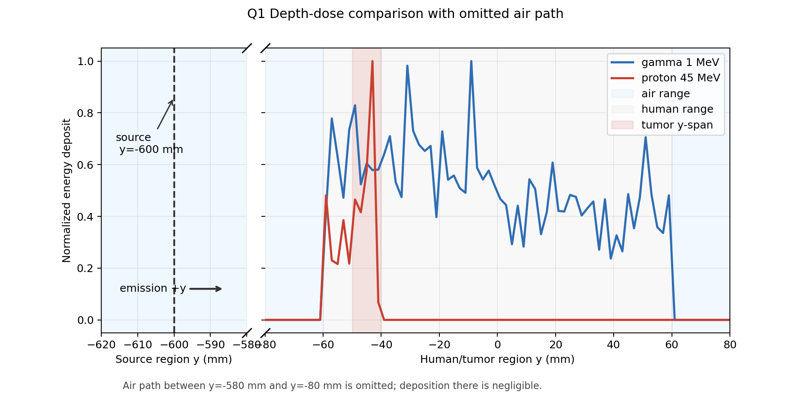

从图 1 可以看到，gamma 的能量沉积分布更平缓，没有明显的局部峰值；proton 在进入人体后沿路径逐渐损失能量，并在接近肿瘤 y 范围时形成 Bragg peak。当前几何中肿瘤位于 `y = -50 mm` 到 `y = -40 mm` 附近，`45 MeV` 质子的峰值位置与该区间较匹配，因此 proton 对肿瘤区的能量沉积显著高于 gamma。

### 3.3 二维剂量热图与肿瘤区设置

图 2 展示 gamma 和 proton 在人体躯干投影平面上的二维能量沉积分布。图中标出了人体躯干范围和肿瘤区边界，因此也可以作为肿瘤区域设置的示意图。

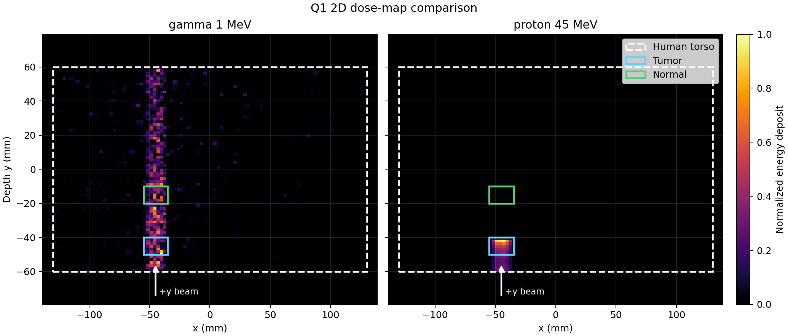

gamma 热图显示能量沉积较弥散，沿入射路径在较宽范围内分布；proton 热图则呈现更集中的局部高剂量区，热点靠近肿瘤位置。这与图 1 的深度剂量曲线相互印证：质子治疗的优势不是来自单个质子能量更高，而是来自可以通过能量调节把 Bragg peak 放置到肿瘤深度。

本次运行得到的平均 event 剂量为：

| 模式 | 肿瘤区平均剂量/Gy | 整体正常组织平均剂量/Gy |
|---|---:|---:|
| gamma `1 MeV` | `7.46e-13` | `1.35e-15` |
| proton `45 MeV` | `7.19e-10` | `7.73e-14` |

由于正常组织质量远大于肿瘤区质量，表中正常组织平均剂量较小；但从空间热图看，gamma 在非肿瘤组织中仍有更广泛沉积，proton 的高沉积区更集中。

### 3.4 gamma 能量扫描

图 3 展示不同 gamma 能量下的二维剂量热图网格。

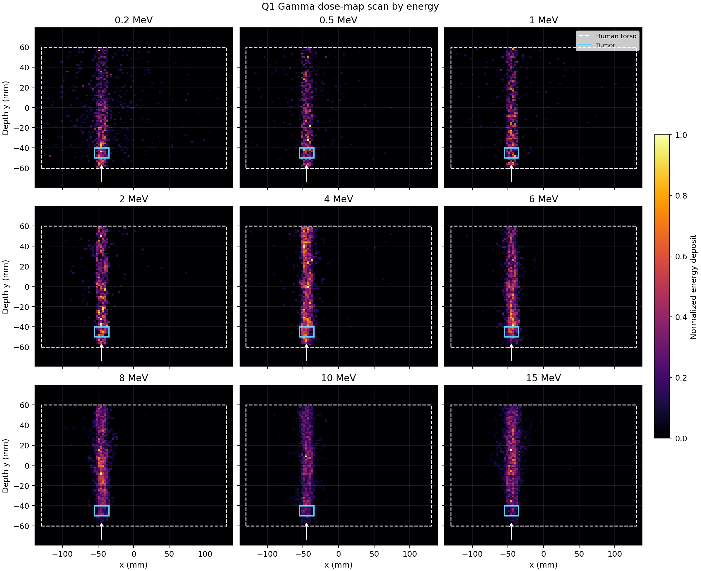

gamma 没有 Bragg peak，因此能量扫描的主要变化不是局部峰值位置，而是整体穿透能力和剂量沉积分布深度。随着 gamma 能量升高，能量沉积区域更容易向人体深部延伸，但肿瘤区域能量沉积比例并没有出现像 proton 那样清晰的局部最优峰。

图 4 给出 gamma 能量扫描的定量结果。

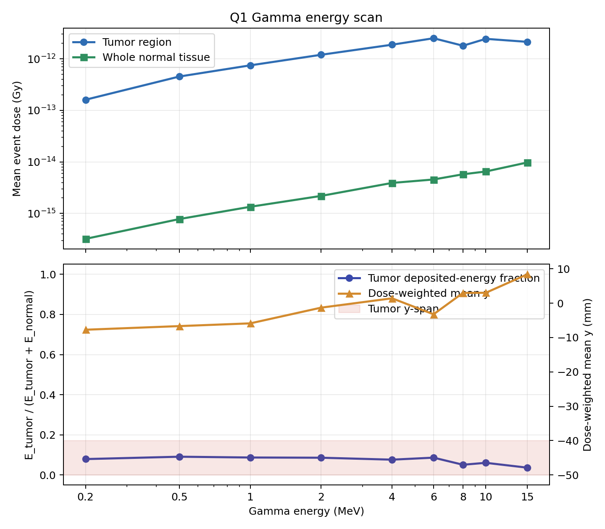

图 4 中使用剂量加权平均深度 `y_mean` 描述 gamma 能量沉积分布的整体移动趋势。扫描结果表明，gamma 能量升高时，整体穿透能力增强，`y_mean` 有向更深区域移动的趋势；但肿瘤沉积能量分数仍主要维持在较低水平，没有形成强剂量聚焦。

代表性数据如下：

| gamma 能量/MeV | 肿瘤平均剂量/Gy | 整体正常组织平均剂量/Gy | 肿瘤沉积能量分数 | `y_mean`/mm |
|---:|---:|---:|---:|---:|
| `0.2` | `1.61e-13` | `3.22e-16` | `0.079` | `-7.7` |
| `1` | `7.46e-13` | `1.35e-15` | `0.087` | `-5.9` |
| `4` | `1.88e-12` | `3.91e-15` | `0.076` | `1.4` |
| `15` | `2.13e-12` | `9.75e-15` | `0.036` | `8.4` |

### 3.5 proton 能量扫描

图 5 展示不同 proton 能量下的二维剂量热图网格。

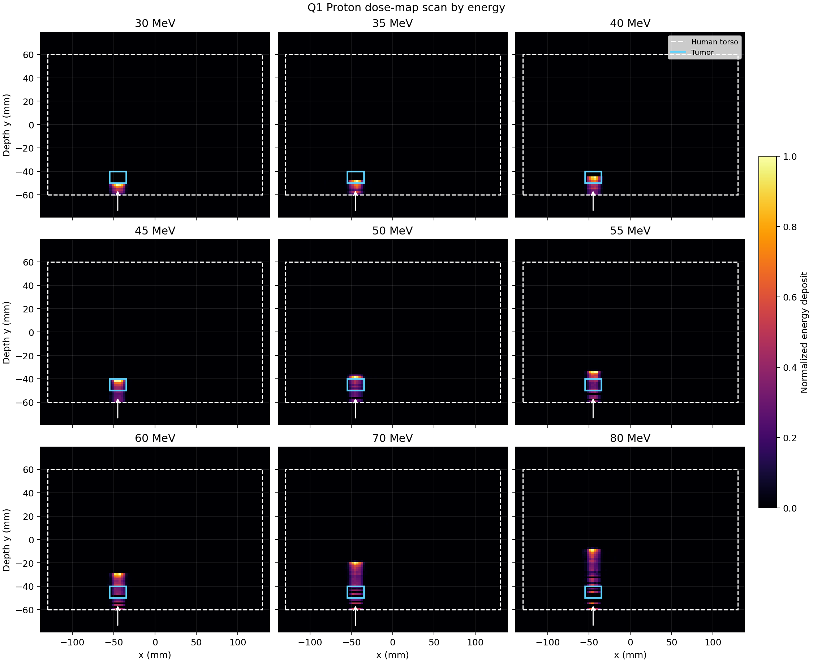

可以看到，随着质子能量升高，高能量沉积区沿束流方向逐渐向下游移动。低能质子在入射侧较浅位置停止，能量过高时 Bragg peak 会越过肿瘤区域，因此必须通过能量扫描选择使峰值落在肿瘤深度附近的能量。

图 6 给出 proton 能量扫描的定量指标。

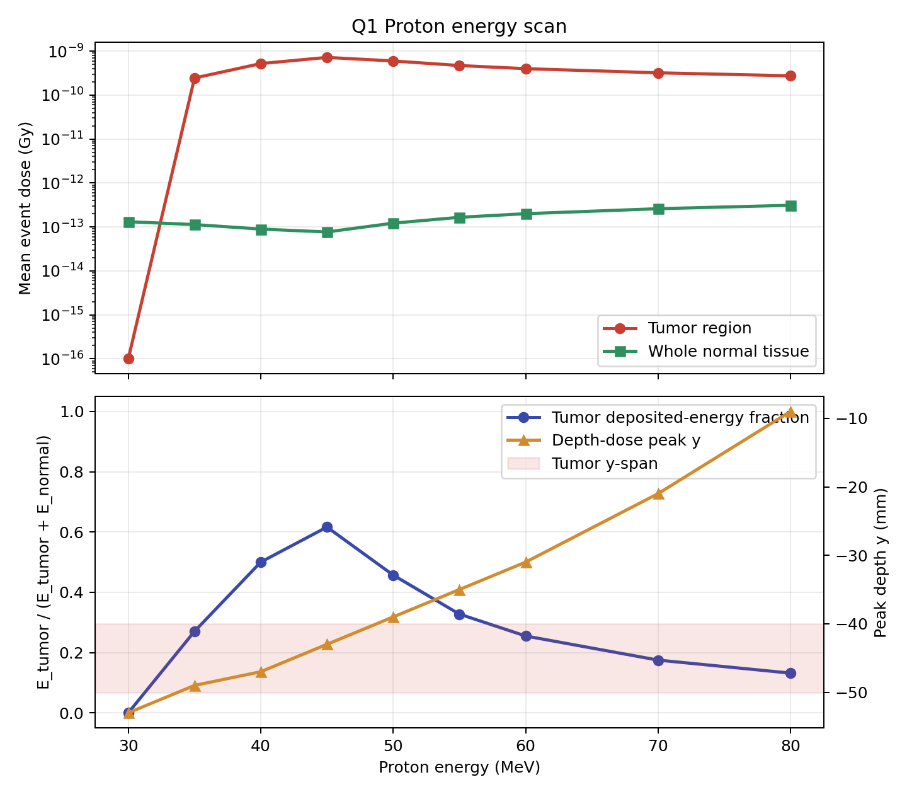

图 6 中的关键指标为：

```text
E_tumor / (E_tumor + E_normal)
```

该指标越高，说明能量越集中沉积在肿瘤区。扫描结果显示，当前几何中 `45 MeV` 质子可以把 Bragg peak 放在肿瘤区附近，肿瘤沉积能量分数达到扫描点中的较高水平。

代表性数据如下：

| 质子能量/MeV | 深度剂量峰 y/mm | 肿瘤沉积能量分数 |
|---:|---:|---:|
| `30` | `-53` | `0.000` |
| `35` | `-49` | `0.270` |
| `40` | `-47` | `0.500` |
| `45` | `-43` | `0.616` |
| `50` | `-39` | `0.457` |
| `60` | `-31` | `0.255` |
| `80` | `-9` | `0.132` |

这说明质子治疗的优化重点是“能量匹配肿瘤深度”。在该人体模型和束流入射条件下，`45 MeV` 是较合适的展示能量。

### 3.6 LET 谱比较

图 7 给出了 gamma 与 proton 在肿瘤区内的 LET 谱。由于两者的 LET 主要集中在低 LET 区间，本图将横轴限制在 `0-2 MeV/um`，以便观察差异。

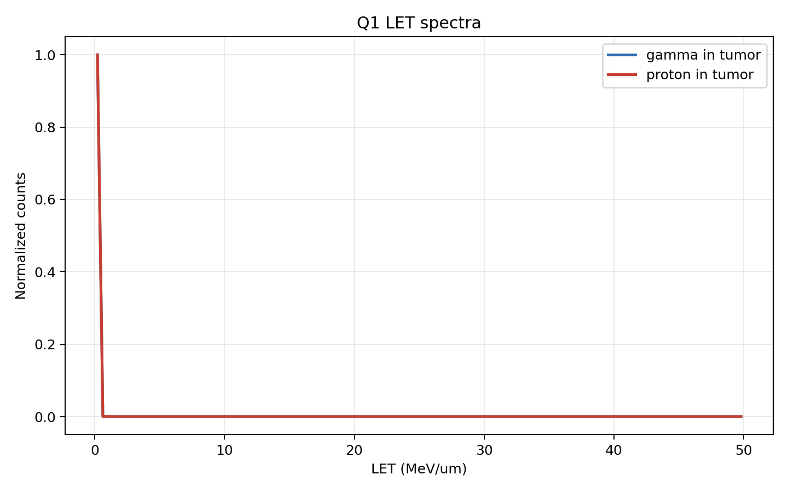

结果显示，proton 在肿瘤区的 LET 谱尾部略长，平均 LET 高于 gamma：

| 粒子 | 肿瘤区 step 数 | 平均 LET/(MeV/um) |
|---|---:|---:|
| gamma `1 MeV` | `1233` | `0.0052` |
| proton `45 MeV` | `22672` | `0.0090` |

不过，在当前统计量和简化模型下，Q1 的主要证据仍应来自深度剂量、二维剂量热图和能量扫描，而不是单独依赖 LET 谱。

### 3.7 Q1 小结

Q1 说明：

1. gamma 没有 Bragg peak，剂量沉积更弥散。
2. proton 可以通过能量调节把 Bragg peak 放到肿瘤区，提高局部沉积。
3. `45 MeV` 质子在当前几何中与肿瘤深度匹配较好。
4. gamma 能量扫描主要改变穿透深度，proton 能量扫描则直接改变 Bragg peak 位置。

因此，质子治疗相对于 gamma 的主要剂量学优势在于空间剂量可控性，而不是简单的总能量更高。

## 4. Q2：BNCT 细胞尺度模拟

### 4.1 研究动机

BNCT 的治疗机制与 Q1 的外照射放疗不同。BNCT 先通过含 `10B` 的硼载体药物使肿瘤细胞富集 B10，再用低能中子照射，使其发生：

```text
10B + n -> alpha + 7Li
```

反应产物 alpha 和 Li7 的射程只有微米量级，因此能量主要沉积在含硼细胞及其邻近区域。BNCT 的核心选择性来自两个方面：

1. `10B` 在肿瘤细胞中的选择性富集。
2. alpha/Li7 的短射程高 LET 局部沉积。

Q2 的目标是在细胞尺度上研究：当 B10 在肿瘤细胞内均匀分布，或集中在外侧 `1 um` 壳层时，细胞剂量、细胞核剂量和治疗选择性有何差异。

### 4.2 细胞模型与混合细胞排列

Q2 在宏观肿瘤区内放置一个代表性细胞 patch，而不是离散整个肿瘤。这是因为完整肿瘤区尺寸为厘米量级，若全部离散为 `10 um` 细胞，计算量不可接受。

细胞 patch 参数如下：

| 参数 | 数值 |
|---|---:|
| patch 尺寸 | `200 um x 200 um x 200 um` |
| 细胞中心间距 | `12 um` |
| 细胞直径 | `10 um` |
| 细胞半径 | `5 um` |
| 细胞核半径 | `2.5 um` |
| shell 模式含硼壳层厚度 | `1 um` |
| 每次模拟细胞数 | `4096` |
| 肿瘤细胞数 | `2048` |
| 正常细胞数 | `2048` |

混合细胞的排列方式如图 8 所示。


图 8 中红色代表 B10 富集肿瘤细胞，绿色代表无 B10 正常细胞。肿瘤细胞和正常细胞位于同一微区、同一中子场内，因此后续剂量差异主要来自 B10 富集，而不是来自空间上把两类细胞分开。为了让热点图可以沿束流方向投影，同一个 `(x,z)` 柱内所有 y 层保持同一种细胞类型，`x-z` 平面仍保持交错分布。

### 4.3 B10 分布模式

Q2 比较两种 B10 分布模式，示意见图 9。

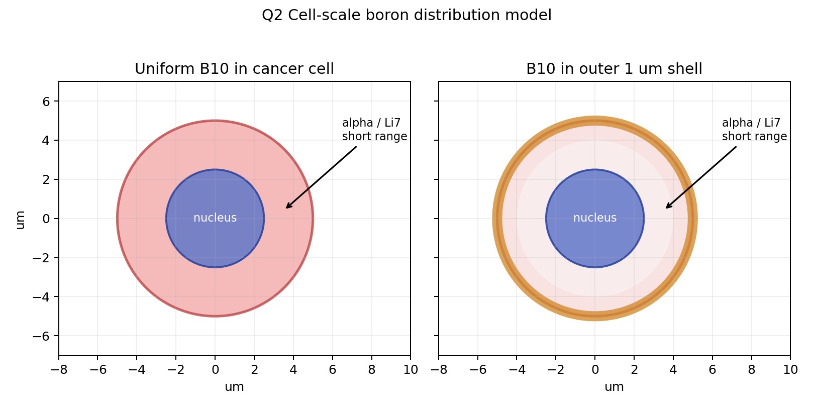

两种模式分别为：

| 模式 | 定义 | 物理含义 |
|---|---|---|
| uniform | 肿瘤细胞整体含 B10，包括细胞核 | B10 进入整个肿瘤细胞内部 |
| shell | B10 只集中在肿瘤细胞外侧 `1 um` 壳层 | B10 偏向细胞膜或细胞外周区域 |

正常细胞默认不含 B10。该设定用于突出 BNCT 中“肿瘤选择性富集”的机制。

Q2 基准宏参数如下：

| 参数 | 数值 |
|---|---:|
| 中子能量 | `0.5 eV` |
| 束斑半径 | `150 um` |
| B10 浓度 | `500000 ppm` |
| 每组事件数 | `20000` |

### 4.4 固定浓度下的热点图与剂量比较

图 10 展示了 uniform 和 shell 两种模式下的 y 投影细胞剂量热点图。每列上方为微区几何投影，颜色表示同一 `(x,z)` 柱内所有 y 层细胞剂量之和；中间柱状图给出肿瘤细胞与正常细胞的平均整细胞剂量；底部柱状图给出肿瘤细胞核与正常细胞核的平均剂量。

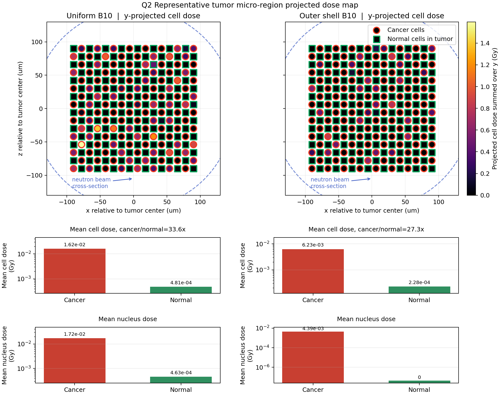

从图 10 可以看到，肿瘤细胞柱整体比正常细胞柱更容易出现高剂量沉积，说明剂量选择性主要来自肿瘤细胞内 B10 富集。下方柱状图进一步给出定量结果：

| 模式 | alpha 数 | Li7 数 | gamma 数 | 肿瘤细胞平均剂量/Gy | 正常细胞平均剂量/Gy | 肿瘤核平均剂量/Gy | 正常核平均剂量/Gy |
|---|---:|---:|---:|---:|---:|---:|---:|
| uniform | `84` | `79` | `7149` | `1.62e-02` | `4.81e-04` | `1.72e-02` | `4.63e-04` |
| shell | `38` | `33` | `7214` | `6.23e-03` | `2.28e-04` | `4.39e-03` | `0.00e+00` |

uniform 模式下，B10 可以存在于细胞核附近甚至细胞核中，因此 alpha/Li7 反应产物更容易把能量沉积到细胞核内，肿瘤核平均剂量较高。shell 模式下，B10 位于外侧壳层，反应产物射程只有微米量级，更多能量沉积在壳层或细胞质附近，进入细胞核的概率降低，因此肿瘤核剂量低于 uniform 模式。与此同时，本次 shell 运行中的正常细胞核平均剂量为零，说明 shell 对正常细胞核的保护更强，但其向肿瘤细胞核输送剂量的能力弱于 uniform 模式。

就“杀伤肿瘤细胞核”这一目标而言，uniform 模式在本模拟中优于 shell 模式；但 shell 模式也体现了 BNCT 的局部沉积特征，即剂量主要集中在含硼区域附近。

### 4.5 B10 浓度扫描

为了研究“药物富集浓度”对 BNCT 治疗效果的影响，本项目在固定中子能量和照射事件数下扫描 B10 浓度：

```text
1000, 3000, 10000, 30000, 100000, 300000, 500000 ppm
```

定义剂量局域化指标：

```text
S_cell    = D_tumor_cell / (D_tumor_cell + D_normal_cell)
S_nucleus = D_tumor_nucleus / (D_tumor_nucleus + D_normal_nucleus)
```

图 11 展示 B10 浓度扫描结果。

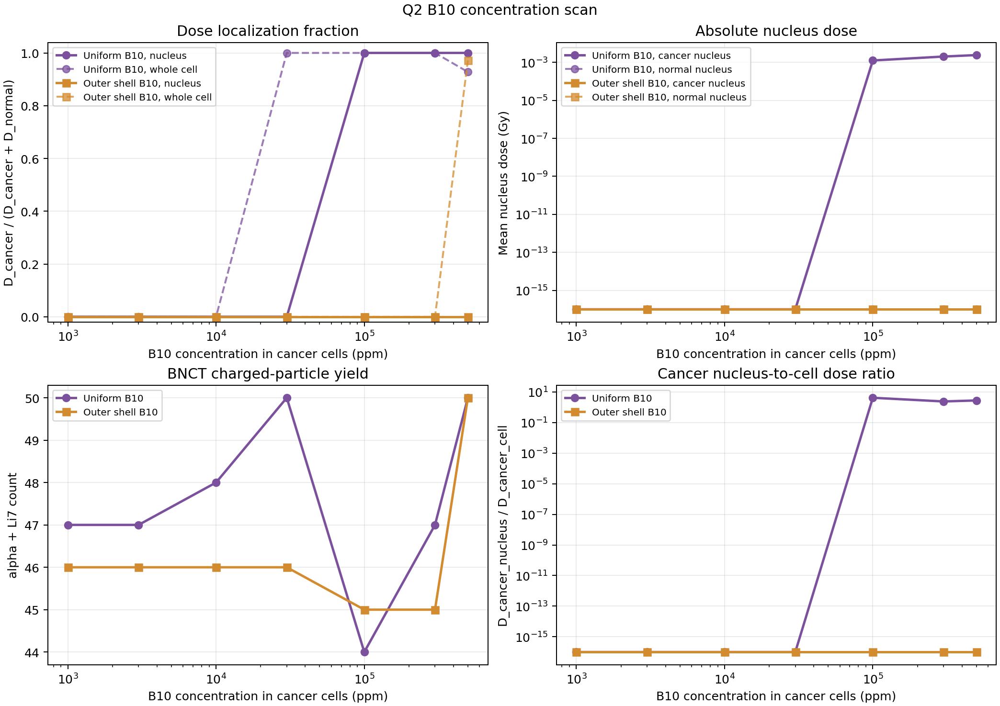

图 11 包含四个子图：

1. 左上为剂量局域化比例，说明剂量是否主要集中在肿瘤细胞。
2. 右上为细胞核绝对剂量，说明肿瘤细胞核是否真正获得足够剂量。
3. 左下为 alpha+Li7 产额，验证剂量增强是否来自 BNCT 反应数增加。
4. 右下为肿瘤核剂量与肿瘤整细胞剂量之比，反映剂量在细胞内部是否更靠近细胞核。

扫描结果显示，随着 B10 浓度提高，alpha+Li7 产额整体升高，肿瘤核剂量也整体增加。uniform 模式在提高肿瘤细胞核剂量方面明显优于 shell 模式。低浓度点由于反应数很少，`S_nucleus` 容易出现统计涨落，因此不能只根据低浓度区的单个比例值判断最优浓度。

代表性结果如下：

| 模式 | B10/ppm | alpha+Li7 数 | `S_cell` | `S_nucleus` | 肿瘤核平均剂量/Gy |
|---|---:|---:|---:|---:|---:|
| uniform | `1000` | `1` | `0.547` | `0.000` | `0.00e+00` |
| uniform | `100000` | `32` | `0.964` | `1.000` | `2.84e-03` |
| uniform | `500000` | `148` | `0.960` | `1.000` | `1.20e-02` |
| shell | `1000` | `1` | `0.609` | `0.000` | `0.00e+00` |
| shell | `100000` | `24` | `0.921` | `0.134` | `4.60e-05` |
| shell | `500000` | `63` | `0.980` | `1.000` | `4.82e-04` |

因此，B10 浓度扫描主要说明：提高肿瘤细胞中的 B10 富集程度可以增加 BNCT 反应产物数量和肿瘤核剂量；但真实治疗中还必须考虑硼药物毒性和正常组织摄取，不能简单认为 B10 浓度越高越好。

### 4.6 中子流强扫描

为了区分“提高 B10 富集浓度”和“增强中子照射量”的作用，本项目还在固定 `500000 ppm` B10 下扫描中子 histories 数：

```text
2000, 5000, 10000, 20000, 50000, 100000, 200000
```

这里 histories 数可理解为相对中子 fluence 或相对照射时间的代理量。图 12 展示中子流强扫描的剂量和产额曲线。

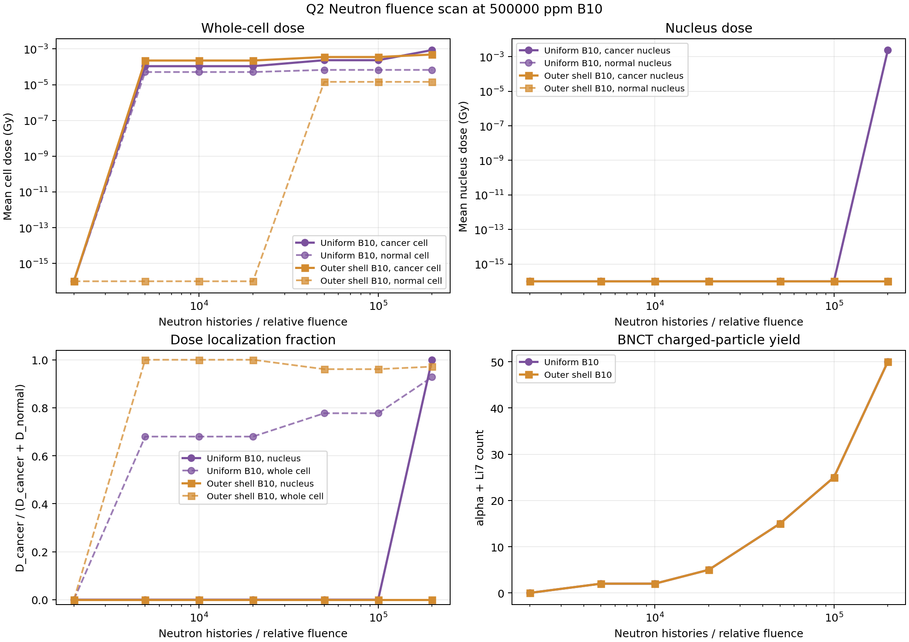

图 12 显示，随着中子 histories 数增加，肿瘤细胞剂量、肿瘤细胞核剂量以及 alpha+Li7 产额均整体升高。这符合 BNCT 反应率的近似关系：

```text
R_BNCT ∝ N_B10 · Phi_n · sigma
```

在 B10 浓度固定时，提高中子 fluence 会增加反应次数和绝对剂量。但图中剂量局域化比例 `S_cell` 与 `S_nucleus` 基本维持在较高平台附近，并没有随 fluence 明显单调提高。这说明增强中子束流主要是在放大照射强度，而不是根本改善 tumor/normal 选择性。

代表性结果如下：

| 模式 | neutron histories | alpha+Li7 数 | `S_cell` | `S_nucleus` | 肿瘤细胞平均剂量/Gy | 肿瘤核平均剂量/Gy |
|---|---:|---:|---:|---:|---:|---:|
| uniform | `2000` | `16` | `1.000` | `1.000` | `1.33e-03` | `2.34e-03` |
| uniform | `20000` | `163` | `0.971` | `0.974` | `1.62e-02` | `1.72e-02` |
| uniform | `200000` | `1495` | `0.977` | `0.991` | `1.54e-01` | `2.06e-01` |
| shell | `2000` | `8` | `0.994` | `1.000` | `7.81e-04` | `1.19e-03` |
| shell | `20000` | `71` | `0.965` | `1.000` | `6.23e-03` | `4.39e-03` |
| shell | `200000` | `829` | `0.963` | `0.966` | `6.99e-02` | `3.47e-02` |

图 13 进一步给出不同中子 histories 下的 y 投影热点图。

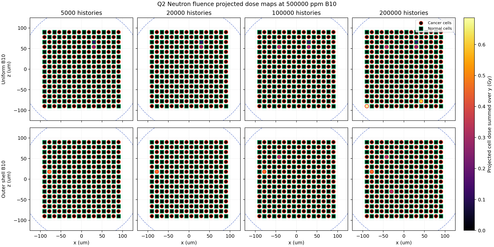

图 13 中，随着 histories 数从 `5000` 增加到 `200000`，热点数量和亮度明显增加，说明更多细胞柱获得可见剂量沉积。与此同时，正常细胞背景剂量也会随照射量累积。因此，增强中子流强并不等价于提高 B10 肿瘤富集：前者主要控制绝对照射强度，后者主要控制靶向反应位置和选择性。

### 4.7 BNCT 与常规射线在同一细胞 patch 下的对比

由于 Q1 使用宏观人体 phantom 区域剂量，而 Q2 使用微观混合细胞 patch 细胞剂量，直接把 Q1 的 gamma/proton 与 Q2 的 BNCT 原始剂量放在同一张图中并不公平。因此，本项目补充了一组 Q2 内部的微观对照实验：保持同一个 `200 um x 200 um x 200 um` 混合细胞 patch、同一个束流位置和 `150 um` 束斑半径，把 Q2 的中子 BNCT 与 `gamma 1 MeV`、`proton 45 MeV` 常规射线放到同一细胞尺度下比较。该实验不是替代 Q1，而是补充一个公平的微观细胞尺度比较。

对照组设置如下：

| 方法 | Q2 几何 | B10 模式 | 粒子与能量 | 事件数 |
|---|---|---|---|---:|
| gamma | mixed cell patch | none | `gamma 1 MeV` | `20000` |
| proton | mixed cell patch | none | `proton 45 MeV` | `20000` |
| BNCT uniform | mixed cell patch | uniform, `500000 ppm` | `neutron 0.5 eV` | `20000` |
| BNCT shell | mixed cell patch | shell, `500000 ppm` | `neutron 0.5 eV` | `20000` |

本次运行得到的代表性汇总指标如下：

| 方法 | 肿瘤细胞平均剂量/Gy | 正常细胞平均剂量/Gy | 肿瘤核平均剂量/Gy | 正常核平均剂量/Gy | `S_cell` | `S_nucleus` | alpha+Li7 |
|---|---:|---:|---:|---:|---:|---:|---:|
| gamma | `2.59e-05` | `2.85e-05` | `2.24e-05` | `1.93e-05` | `0.476` | `0.537` | `0` |
| proton | `5.76e-04` | `5.45e-04` | `5.34e-04` | `5.46e-04` | `0.514` | `0.494` | `602` |
| BNCT uniform | `1.62e-02` | `4.81e-04` | `1.72e-02` | `4.63e-04` | `0.971` | `0.974` | `163` |
| BNCT shell | `6.23e-03` | `2.28e-04` | `4.39e-03` | `0.00e+00` | `0.965` | `1.000` | `71` |

在这个同一细胞 patch 口径下，gamma 和 proton 的肿瘤/正常细胞剂量接近，说明它们在微区内主要体现外照射穿透和空间沉积特征；BNCT 两组则因为只有肿瘤细胞携带 B10，剂量局域化指标明显更高。proton 组也会产生少量 alpha/Li7 等强子二次粒子，但它们不是来自 `10B(n,alpha)Li7` 靶向反应，因此不能等同于 BNCT 的含硼细胞局部释放机制。

图 14 使用同一 `x-z` 投影布局展示四种方法的整细胞剂量热点图。每个 panel 采用各自归一化色标，以便观察该方法内部剂量落点；图中角标给出对应的肿瘤细胞和正常细胞平均剂量。

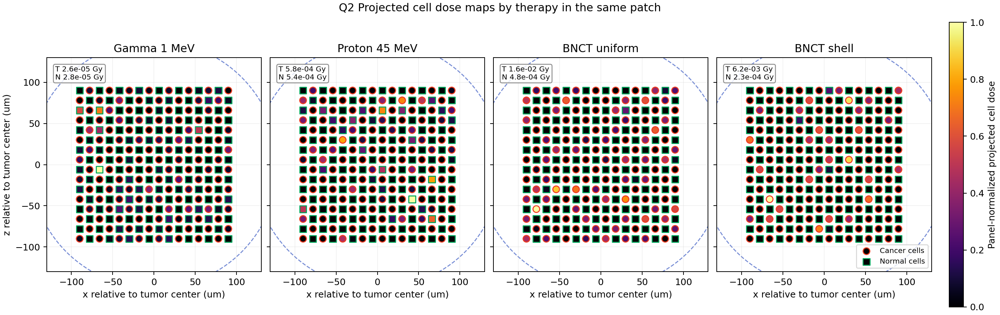

图 15 使用 `1 x 3` 柱状图汇总四种方法的整细胞指标：左图比较肿瘤细胞与正常细胞平均剂量，中图比较整细胞剂量局域化 `S_cell`，右图比较整细胞正常组织负担 `D_normal_cell / D_cancer_cell`。跨射线主比较只采用整细胞口径，使结论集中在不同治疗机制对肿瘤细胞与正常细胞的整体选择性上；细胞核剂量则保留在 uniform 与 shell 的 B10 分布机制分析中。

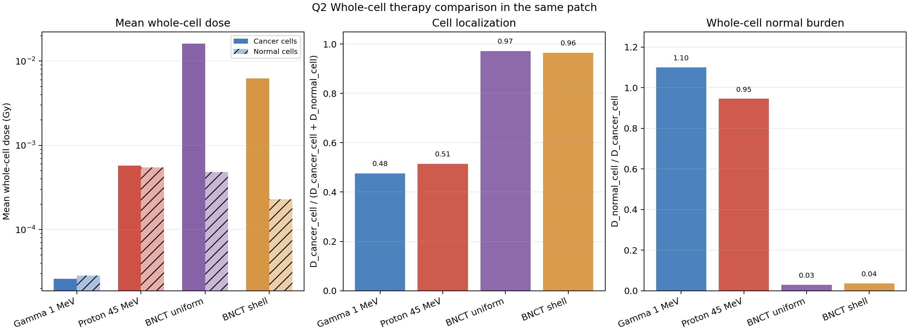

### 4.8 Q2 小结

Q2 说明：

1. BNCT 的核心优势来自 B10 在肿瘤细胞中的选择性富集。
2. uniform B10 分布比 shell 分布更容易提高肿瘤细胞核剂量。
3. B10 浓度扫描反映药物富集程度对反应产额和核剂量的影响。
4. 中子流强扫描反映照射强度对绝对剂量的放大作用，但不显著改善局域化比例。
5. 几何热点图和柱状摘要共同说明：同一中子场内，含硼肿瘤细胞获得更高剂量，正常细胞剂量较低。

## 5. 局限性

当前模拟是作业级多尺度模型，用于展示 Geant4 建模流程和剂量学趋势，仍有以下局限：

1. 人体组织全部近似为水，未区分骨、肺、脂肪、皮肤等真实组织。
2. Q1 每个能量点事件数有限，若要获得更平滑的 Bragg 曲线，应提高统计量。
3. Q2 使用 `500000 ppm` B10 作为信号增强设置，高于真实 BNCT 治疗浓度。
4. 正常细胞默认无 B10，而真实硼药物也会在正常组织和血液中有一定摄取。
5. 当前只使用代表性细胞 patch，不能直接解释为整个肿瘤内所有细胞的绝对杀伤率。
6. 生物效应只通过剂量和简单阈值间接表示，尚未引入 RBE、细胞存活曲线或 DNA 损伤模型。

## 6. 结论

本项目完成了从宏观人体剂量学到微观细胞 BNCT 的 Geant4 模拟流程。Q1 表明 gamma 剂量沉积较弥散，而 proton 可以通过能量扫描使 Bragg peak 落在肿瘤区，从而增强肿瘤局部能量沉积；Q2 表明 BNCT 的选择性主要来自 B10 的肿瘤细胞富集和 alpha/Li7 的微米尺度局部沉积。

综合来看：

1. 常规外照射中，质子治疗的关键优化变量是入射能量，目标是使 Bragg peak 与肿瘤深度匹配。
2. BNCT 中，B10 浓度控制靶向反应位点数量，中子流强控制照射强度和反应总数。
3. uniform B10 分布在本模型中更有利于提高肿瘤细胞核剂量，shell 分布则显示了短射程产物在细胞外周局部沉积的特点。
4. B10 浓度扫描和中子流强扫描共同说明，BNCT 优化不能只依赖提高束流或提高药物浓度，而应同时考虑肿瘤/正常组织摄取比、绝对剂量、反应产额和细胞核剂量。

因此，本项目较完整地展示了 Geant4 在放疗问题中的多尺度建模能力，也为进一步引入真实组织材料、真实硼药物摄取、RBE 修正和细胞生存模型奠定了基础。
