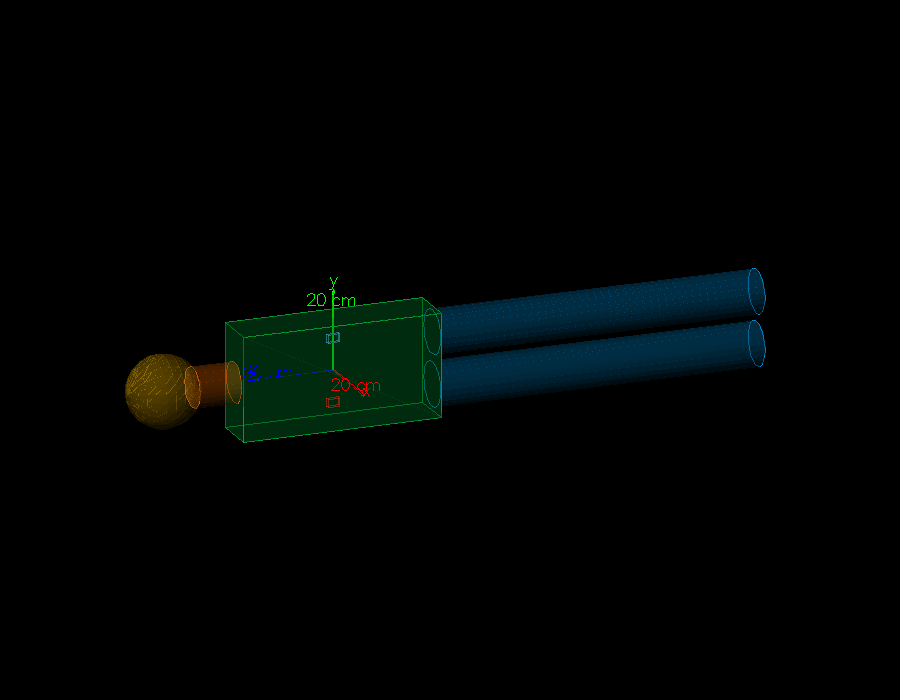
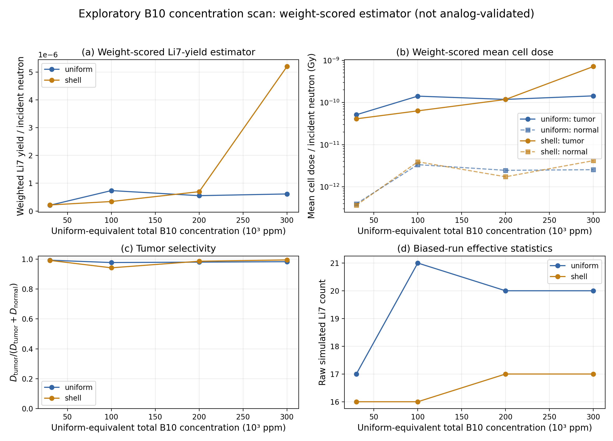
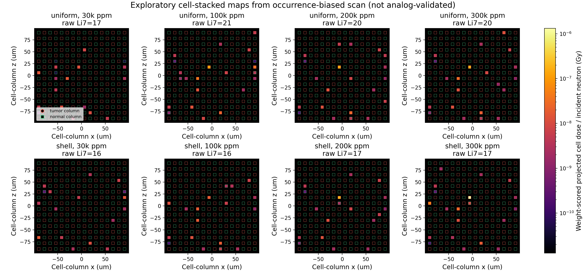
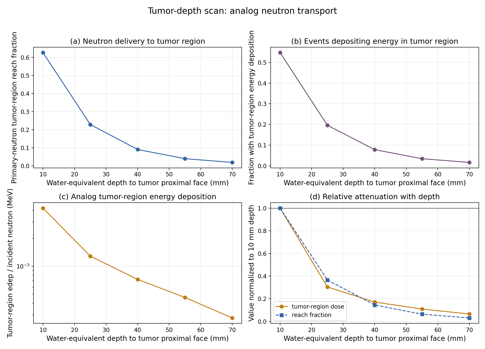
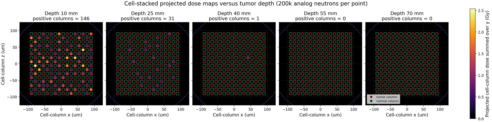

# Geant4 肿瘤放射治疗模拟实验报告

## 摘要

本报告基于 Geant4 构建了一个跨厘米—微米尺度的多尺度肿瘤放射治疗模拟程序，在统一可执行程序与 `QGSP_BIC_HP` 物理列表下对比三种放疗机制：光子、质子外照射与硼中子俘获治疗（Boron Neutron Capture Therapy，BNCT）。报告由两个相互独立、各自完整的研究部分组成。第一部分在简化人体 phantom 内比较 $1\,\mathrm{MeV}$ 光子与 $85\,\mathrm{MeV}$ 质子的宏观剂量学行为，包括深度剂量、二维能量沉积、step-LET 谱与入射能量扫描，验证质子相对光子的剂量学优势源于 Bragg peak 带来的宏观空间可控性，其中 $60$–$100\,\mathrm{MeV}$ 扫描给出 $85\,\mathrm{MeV}$ 的最高肿瘤沉积能量分数 $f_{\text{tumor}}\approx 34.9\%$。第二部分在肿瘤微区构建混合肿瘤/正常细胞 patch，研究 $0.5\,\mathrm{eV}$ 低能中子 BNCT 的细胞尺度剂量学与 $^{10}\mathrm{B}$ 亚细胞分布（均匀、胞质与壳层）的关系，并与光子、质子作探索性跨疗法对比。条件俘获结果显示，在当前高浓度人工含硼材料模型下，反应位点由细胞内部向外周移动时，单位俘获核内剂量与核命中概率下降；这一结果同时受到反应位置和含硼材料组成影响，不能解释为纯几何效应。报告还评估了含硼水材料内中子 `neutronInelastic` 过程的 occurrence bias 方差缩减方案：该估计量在当前实现与统计量下未通过偏置因子独立性验证，因此相关结果仅作探索性展示。

**小组分工：** 李典：模拟程序实现、报告撰写；廖诚鑫：模拟程序实现、报告撰写；刘赵晴：结果汇总理解、报告撰写；刘雨珊：结果汇总理解、报告撰写。

项目代码仓库：[wujxy/Geant4TumorTherapySim](https://github.com/wujxy/Geant4TumorTherapySim#)

## 1 引言

放射治疗的核心矛盾在于"杀伤肿瘤"与"保护正常组织"的对立，其本质是一个**剂量选择性**问题：如何让电离辐射的能量尽可能作用于肿瘤，而尽量少地沉积在正常组织。这种选择性可以发生在不同的空间尺度上——宏观上体现为剂量在体内的深度分布是否集中于肿瘤位置，微观上体现为剂量是否优先作用于肿瘤细胞而非正常细胞。不同粒子与不同治疗机制的选择性天然落在不同尺度，这正是比较各类放疗方案时需要首先厘清的物理图像。

本报告对比三种代表性机制。光子通过光电效应、康普顿散射等电磁过程在路径上较为弥散地沉积能量，没有可控的局部峰值。质子作为带电粒子，其阻止本领（stopping power）在低能区急剧上升，在水中形成显著的 Bragg peak，可通过调节入射能量把峰值放置到肿瘤深度，从而在宏观尺度上实现剂量选择。硼中子俘获治疗（BNCT）则依赖两步机制：含 $^{10}\mathrm{B}$ 的载体药物使肿瘤细胞选择性富集硼，再用低能中子照射引发 $^{10}\mathrm{B}(n,\alpha)^{7}\mathrm{Li}$ 反应；反应产物 $\alpha$ 与 $^{7}\mathrm{Li}$ 射程为微米量级，使高 LET 沉积主要局限在含硼细胞及其近邻。三类机制的差异最自然地落在"尺度"这一维度上。

围绕上述图像，本报告组织为两个相互独立、各自完整的研究部分。**第一部分**在简化人体 phantom 中比较光子与质子的深度剂量、二维能量沉积、LET 谱与入射能量扫描，判定二者优劣差异的物理根源是否在于质子 Bragg peak 带来的宏观空间可控性。**第二部分**在肿瘤微区构建混合肿瘤/正常细胞 patch，使用 $0.5\,\mathrm{eV}$ 单能低能中子束流，研究肿瘤细胞内 $^{10}\mathrm{B}$ 分布模式与单位俘获响应的关系，并探索 BNCT 与光子、质子在等肿瘤细胞剂量下的细胞尺度差异。两个部分共享同一套 Geant4 基础设施（`QGSP_BIC_HP` 物理列表、单一可执行程序、统一的 ROOT 输出），但各自携带完整的物理原理、实验方案、结果与讨论，可独立阅读。

## 2 光子与质子束流的宏观剂量学对比

### 2.1 研究背景与目标

外照射放疗最常用的两种粒子是光子与质子。二者在宏观尺度上的剂量学行为有本质差异：光子通过电磁过程在路径上弥散沉积，没有可控的局部峰值；质子作为带电粒子，其阻止本领在低能区急剧上升，在水中形成 Bragg peak，理论上可通过能量调节把峰值放置到肿瘤深度。这一差异若成立，意味着质子相对光子的优势不在于"单粒子能量更高"，而在于**宏观空间剂量的可控性**——即能否把剂量集中到肿瘤深度、并保护肿瘤后方的正常组织。

本部分的目标即在简化人体 phantom 中定量验证这一图像，具体回答三个问题：第一，光子是否确实呈现弥散无峰的沉积形态；第二，质子是否确实形成可被放置到肿瘤深度的 Bragg peak；第三，在固定肿瘤几何下，质子的最优入射能量是多少、其最优性的物理根源是什么。为此，本部分在相同束流条件下直接比较 $1\,\mathrm{MeV}$ 光子与 $85\,\mathrm{MeV}$ 质子的剂量沉积形态，并分别开展光子能量扫描（$0.2$–$15\,\mathrm{MeV}$）与质子能量扫描（$60$–$100\,\mathrm{MeV}$），以解耦"粒子种类差异"与"入射能量影响"两个变量——若只比较单一能量的光子与质子，就无法判断质子的优势究竟来自粒子本身还是来自能量恰好匹配。

### 2.2 物理原理

#### 2.2.1 带电粒子能量损失与 Bragg peak

带电粒子在物质中的能量损失由 Bethe-Bloch 公式描述：

$$
-\left\langle\frac{dE}{dx}\right\rangle=\frac{4\pi}{m_e c^{2}}\cdot\frac{n_e z^{2} e^{4}}{\beta^{2}}\left[\ln\!\left(\frac{2 m_e c^{2}\beta^{2}\gamma^{2}}{I}\right)-\beta^{2}\right]
$$

其中 $n_e$ 为介质电子数密度，$z$ 为入射粒子电荷数，$\beta=v/c$、$\gamma$ 为相应洛伦兹因子，$I$ 为介质平均激发能。阻止本领正比于 $z^{2}/\beta^{2}$，因此当质子接近射程末端、速度 $\beta\to 0$ 时，$dE/dx$ 急剧上升（在有效低能截止前），形成 Bragg peak。由于能量损失集中在射程末端，带电粒子具有确定的连续慢化近似射程（CSDA range），且在峰值之后能量迅速耗尽、剂量急速下降到接近零。这一机制预言了质子深度剂量的峰形与峰后近零剂量，是质子相对光子在宏观剂量学上的优势根源。

#### 2.2.2 光子相互作用

光子通过光电效应、康普顿散射与电子对产生与物质作用，其能量主要由产生的次级电子沉积，构成电磁级联。光子注量沿路径指数衰减：

$$
I(x)=I_{0}\,e^{-\mu x}
$$

其中 $\mu$ 为线衰减系数。光子本身不带电、没有确定的"射程"，沉积沿入射路径连续发生、没有局部峰值。这一机制预言了光子沿入射方向的弥散柱状沉积、无 Bragg peak，以及肿瘤沉积能量分数 $f_{\text{tumor}}$ 不随能量出现局部最优、只随能量整体右移的特征。两类粒子的差异——带电粒子的射程-能量关系 versus 中性光子的指数衰减——正是本部分比较的物理基础。

### 2.3 实验方案

#### 2.3.1 人体几何与材料

人体 phantom 以水近似软组织、World 以空气填充，避免粒子在到达人体前于外部水介质中损失能量。模型由头/颈/躯干/双腿四个简单几何体组合而成，肿瘤为躯干内的小长方体。

| 结构 | Geant4 几何 | 尺寸 | 位置 |
|---|---|---:|---|
| World | `G4Box` | $3\,\mathrm{m} \times 3\,\mathrm{m} \times 3\,\mathrm{m}$ | 原点中心 |
| 躯干 | `G4Box` | $120 \times 260 \times 500\,\mathrm{mm}$ | 原点中心 |
| 颈部 | `G4SubtractionSolid` | 圆柱减去头部球面，直径 $100\,\mathrm{mm}$，可见高度 $90\,\mathrm{mm}$ | 躯干顶部至头部球面 |
| 头部 | `G4Orb` | 球半径 $90\,\mathrm{mm}$ | $z = 430\,\mathrm{mm}$ |
| 双腿 | `G4Tubs` | 半径 $55\,\mathrm{mm}$，高 $820\,\mathrm{mm}$ | $y = \pm 65\,\mathrm{mm},\ z = -660\,\mathrm{mm}$ |
| 肿瘤区 | `G4Box` | $10 \times 20 \times 30\,\mathrm{mm}$ | $(0, -80, 0)\,\mathrm{mm}$ |

颈部用圆柱减去头部球体，在顶端形成与头部球面相切的弧形边界，避免平整端面与球体最低点的点接触。肿瘤位于躯干负 $y$ 一侧，距负 $y$ 表面 $5\,\mathrm{cm}$；束流源置于 $(0, -600, 0)\,\mathrm{mm}$，沿 $+y$ 方向通过肿瘤中心入射。坐标约定：$x$ 表示前后深度，$y$ 表示束流方向，$z$ 表示高度。"全部正常组织"定义为整个 phantom 减肿瘤区后的全部水组织（头/颈/躯干/双腿），而非局部对照盒。

图 1 为当前程序构建的 Geant4 宏观几何模型直接可视化结果。绿色长方体、橙黄色球体及颈部、蓝色双圆柱分别对应躯干、头颈与双腿；躯干内部红色和浅蓝色小长方体分别为肿瘤区与同尺寸正常对照区。图中的“20 cm”为可视化坐标刻度，而非结构尺寸标注。Q2 使用的微米级混合细胞 patch 位于肿瘤区内部，受宏观尺度限制，无法在该图中直接分辨。

材料上，软组织以 NIST `G4_WATER`（密度约 $1\,\mathrm{g/cm^{3}}$）近似，World 为 `G4_AIR`。本部分不涉及含硼材料。

#### 2.3.2 物理列表、源与计分

物理列表采用 `QGSP_BIC_HP`；本部分主要使用其中的电磁过程与质子相关强子过程（HP 低能中子部分在本部分不发挥主要作用，但为统一程序所共有）。源配置如下：

| 参数 | 取值 |
|---|---|
| 源点坐标 | $(0, -600, 0)\,\mathrm{mm}$ |
| 入射方向 | $(0, 1, 0)$（$+y$） |
| 束斑半径 | $8\,\mathrm{mm}$ |
| 基准粒子/能量 | 光子 $1\,\mathrm{MeV}$、质子 $85\,\mathrm{MeV}$，各 $5000$ 事件 |
| 能量扫描 | 光子 $0.2$–$15\,\mathrm{MeV}$ 九点；质子 $60$–$100\,\mathrm{MeV}$ 九点，每点 $5000$ 事件 |

计分指标定义如下。吸收剂量 $D=E_{\text{dep}}/m$，其中 $E_{\text{dep}}$ 为目标体积内累计能量沉积，$m$ 为该体积质量（按水密度与几何体积估算）。**深度剂量**为能量沉积按 $y$ bin 累积的归一化曲线，用于形状对比而非绝对剂量。**二维剂量热图**为能量沉积按 $(x,y)$ 体素累积并归一化。**肿瘤沉积能量分数** $f_{\text{tumor}}=E_{\text{tumor}}/(E_{\text{tumor}}+E_{\text{normal}})$，直接刻画能量在肿瘤侧的集中程度，与受质量归一化影响的区域剂量互为补充。**能量加权平均深度** $\bar{y}_{E}=\sum_{i}y_{i}E_{i}/\sum_{i}E_{i}$，刻画沉积分布的重心。**step-LET** $\mathrm{LET}_{\text{step}}=E_{\text{dep,step}}/\Delta s$，按每个 step 计入直方图再按 step 数归一化，仅用于比较微观能损特征，不等同于剂量加权 LET，也不直接对应临床 RBE。**区域平均事件剂量**为单个初级粒子事件在宏观区域的能量沉积除以区域质量再对全部事件取平均。

需特别说明："全部正常组织"质量远大于肿瘤区，因此区域平均剂量的肿瘤/正常数值差距主要由质量归一化主导，判断空间选择性应以深度剂量与二维热图的形态为主。

### 2.4 深度剂量形态对照：光子与质子

深度剂量曲线是沿束流轴 $y$ 的归一化能量沉积分布，也是比较两类粒子宏观剂量形态最直接的指标。按 §2.2 的预期，质子作为带电粒子应在射程末端形成 Bragg peak 并随后急剧截止，而光子作为中性粒子应沿路径连续沉积、无局部峰值。图 3 的结果与这一预期一致：$1\,\mathrm{MeV}$ 光子进入人体后立即出现 buildup，随后沿整个躯干 $y$ 跨度缓变沉积，离开 phantom 后剂量平缓回落，曲线全程不存在局部峰值；$85\,\mathrm{MeV}$ 质子则在 $y\approx -73\,\mathrm{mm}$ 处出现一个显著的 Bragg peak，该位置从入口面（$y=-130\,\mathrm{mm}$）起算的物理深度约 $57\,\mathrm{mm}$，恰落在肿瘤 $y$ 跨度 $[-90,-70]\,\mathrm{mm}$ 的内部偏远端，且峰后剂量急速下降到接近零。

这一形态差异并非数值上的偶然，而是两类粒子能量损失机制的直接体现。质子的峰形来自 §2.2.1 所述 Bethe-Bloch 阻止本领在低能区的急剧上升：质子在接近射程末端时速度降低，$dE/dx$ 显著增大，能量被集中沉积在一个较窄的深度区间内；一旦能量耗尽，粒子停止，射程之外的初级质子沉积迅速降低，于是峰后出现明显的剂量跌落。光子则完全不同，它通过光电、康普顿等过程产生次级电子、并以电磁级联方式沿路径连续沉积，自身没有确定的射程，因此沉积是渐进的、贯穿整个 phantom 的，无法在任何深度形成类似质子末端峰的局部集中。从治疗角度看，在当前纯水、单束、有限统计模型中，质子峰后的沉积接近零，体现了其保护远端组织的潜力；真实治疗中仍需考虑核反应次级粒子、组织异质性、射程不确定性与束流展宽。

### 2.5 二维剂量分布与三维局域化

深度剂量曲线只反映沿束流轴的一维信息，二维热图则补充了横向 $(x)$ 与纵向 $(y)$ 的联合分布，用以确认剂量集中是真正的三维局域化而非一维上的巧合。图 4 给出 phantom 在 $(x,y)$ 平面的归一化能量沉积（标出躯干与肿瘤边框）。光子在沿入射轴较宽的 $y$ 范围内都有可见沉积，整体呈一条沿束流方向的"长柱"，柱内在 $x$ 方向也有一定宽度；质子的高沉积区则紧贴肿瘤位置，在肿瘤近端到中心形成一个明亮的局部热点，沿 $x$ 方向较窄（由 $8\,\mathrm{mm}$ 束斑决定），热点之外几乎看不到沿束流方向延伸的均匀沉积。

热图的形态与深度剂量曲线相互印证，并补充了两点信息。其一，光子的长柱是其电磁级联在路径上连续沉积的空间表现，柱的横向展宽来自次级电子的有限射程与散射；其二，质子热点的空间局域化说明 Bragg peak 的集中是三维的——在束流轴方向有峰、在横向有束斑约束，二者叠加形成一个紧凑的高剂量体积。对于 $85\,\mathrm{MeV}$ 质子，多次库仑散射在水中造成的横向展宽远小于束斑半径，因此横向宽度主要由束斑而非散射主导。综合图 3 与图 4 可以确认：质子的宏观选择性是真实的三维空间局域化，而光子在任何二维投影下都呈现弥散的贯穿性沉积。

### 2.6 光子能量扫描：穿透深度对照

为了检验光子能否通过能量调节获得类似 Bragg peak 的局部集中，本节在 $0.2$–$15\,\mathrm{MeV}$ 九个能量点扫描光子束。图 5 的结果给出了明确的否定答案：所有能量点的沉积形态都是沿束流方向的长柱，没有任何一个能量出现局部峰值；随着能量升高，柱状结构变得更长、更宽，并整体向人体深部延伸，但"弥散贯穿"的基本特征不变。

定量指标进一步刻画了这一点。图 6 上子图给出肿瘤区与全部正常组织的平均事件剂量（对数轴），两条曲线均随能量单调上升，肿瘤区始终高于正常组织；但需注意，这一差值主要由质量归一化造成（肿瘤体积远小于全部正常组织），并不代表光子在空间上选择了肿瘤。真正反映空间集中程度的是下子图的肿瘤沉积能量分数 $f_{\text{tumor}}$ 与能量加权平均深度 $\bar{y}_{E}$：$f_{\text{tumor}}$ 在所有光子能量下都停留在约 $4.5\%$–$9\%$ 的低平台，没有任何能量给出局部最优；$\bar{y}_{E}$ 则随能量单调右移，从约 $-45\,\mathrm{mm}$ 移到 $+10\,\mathrm{mm}$。

这一结果与 §2.2.2 的机制完全吻合。光子没有射程概念，沉积沿路径连续发生，提高能量只是降低了衰减系数 $\mu$、从而让注量穿透得更深（$\bar{y}_{E}$ 右移），却无法把能量"重新放置"到某个深度；因此无论怎样调能量，能量始终摊在整条路径上，$f_{\text{tumor}}$ 只能停留在低平台。由此可得出一个对治疗策略有意义的推论：光子不存在以能量为旋钮的空间定位手段，要改善其肿瘤剂量集中度只能借助多野照射、强度调制等几何手段。这与下文质子扫描形成的鲜明对比，正是两类粒子在宏观选择性上的根本分野。

### 2.7 质子能量扫描：Bragg peak 位置调控

质子的能量扫描旨在验证其 Bragg peak 能否被精确放置到肿瘤深度。按 §2.2.1，质子的 CSDA 射程由能量单值决定，因此扫描能量等价于沿深度轴连续移动 Bragg peak 的位置。图 7 给出 $60$–$100\,\mathrm{MeV}$ 九个能量点的 $(x,y)$ 沉积分布，结果呈现高度规律性的三段：$60/65/70\,\mathrm{MeV}$ 时峰位尚在肿瘤近端之外（$y$ 偏负侧），高沉积区落在肿瘤入口前；$75/80/85\,\mathrm{MeV}$ 时峰进入肿瘤区，峰位分别为 $y=-85/-79/-73\,\mathrm{mm}$，其中 $85\,\mathrm{MeV}$ 最靠近肿瘤中心偏远端；$90/95/100\,\mathrm{MeV}$ 时峰越过肿瘤远端，多余能量沉积到肿瘤后方的正常组织中。

图 8 把这一过程量化。上子图的肿瘤区平均事件剂量显示：$60/65\,\mathrm{MeV}$ 因峰未进入肿瘤，肿瘤剂量为零或极低；从 $70\,\mathrm{MeV}$ 起肿瘤剂量跃升约 $5$–$6$ 个数量级，这正是因为 Bragg peak 首次跨入肿瘤范围；在 $85\,\mathrm{MeV}$ 达到极大值后，随能量继续升高（峰越过肿瘤）而缓降。下子图的 $f_{\text{tumor}}$ 呈现一个清晰的单峰，详细数值如下：

| 质子能量 / MeV | 峰位 $y$ / mm | $f_{\text{tumor}}$ |
|---:|---:|---:|
| 60 | $-101$ | $\sim 0$ |
| 65 | $-95$ | $\sim 0$ |
| 70 | $-91$ | $0.048$ |
| 75 | $-85$ | $0.210$ |
| 80 | $-79$ | $0.296$ |
| 85 | $-73$ | $0.349$ |
| 90 | $-67$ | $0.259$ |
| 95 | $-61$ | $0.201$ |
| 100 | $-55$ | $0.165$ |

$f_{\text{tumor}}$ 的单峰结构由入口平台、Bragg peak 的宽度与位置、以及肿瘤外沉积共同决定。在当前离散扫描中，$85\,\mathrm{MeV}$ 将峰位放置在肿瘤远端内侧（约 $y=-73\,\mathrm{mm}$），既保留了肿瘤内的高沉积，又避免了更高能量下明显的远端溢出，因此取得最大 $f_{\text{tumor}}=0.349$。该最优点并不要求峰值严格位于肿瘤中心，并且依赖当前肿瘤几何与扫描步长；肿瘤深度、厚度或材料改变时，最优能量也会变化。值得注意的是 $90$–$100\,\mathrm{MeV}$ 的情形：峰越过肿瘤远端后，多余能量沉积到肿瘤后方正常组织，说明能量选得过高会削弱远端组织保护。若要求 Bragg peak 在整个肿瘤 $y$ 跨度内均匀展宽而非集中于一点，可叠加多组能量形成展宽 Bragg peak（SOBP）。与光子相比，质子拥有一个真实、灵敏且可预测的空间定位旋钮——入射能量，这正是其宏观剂量学优势的可操作来源。

### 2.8 肿瘤区线性能量传递谱对照

线性能量传递（LET）刻画的是单位径迹长度上的能量沉积，它与电离密度、进而与相对生物效应（RBE）相关：LET 越高，电离越密集，对 DNA 的集群损伤越强。本报告不引入 RBE 模型，但 LET 谱仍可作为微观能损特征的辅助证据。图 9 上子图给出肿瘤区内光子与质子的 step-LET 归一化分布（半对数纵轴），下子图为平均 LET 柱状图。两者的 LET 都主要集中在 $<0.05\,\mathrm{MeV/\mu m}$ 区间，但质子谱有一条明显延伸到约 $0.4\,\mathrm{MeV/\mu m}$ 的高能损尾部，而光子几乎完全压在最低 bin。平均 step-LET 上，光子约 $0.005\,\mathrm{MeV/\mu m}$（$8035$ steps），质子约 $0.009\,\mathrm{MeV/\mu m}$（$101745$ steps）。

质子的高 LET 尾部同样可由 §2.2.1 解释：质子在接近射程末端时 $dE/dx$ 升高，这些低速 step 贡献了谱的高能损部分；光子的能量沉积主要由次级电子承担，其 LET 普遍较低，故谱压在低 bin。两组 step 数差异很大（$8035$ 对 $101745$），但 step 数同时受粒子种类、次级粒子产生、物理过程与 Geant4 步进划分影响，不能直接解释为径迹长度差异。需强调，本报告统计的是 step-LET 而非剂量加权 LET，不能直接换算为 RBE；它只能作为当前输运与计分设置下的定性微观补充。

### 2.9 区域平均剂量的归一化语境

图 10 以对数纵轴并列展示基准配置下两类粒子的肿瘤区与全部正常组织平均事件剂量。两类粒子的肿瘤区剂量都显著高于正常组织剂量，乍看似乎说明两种粒子都"选择了"肿瘤。但这是一种需要警惕的误读：区域平均剂量是能量沉积除以区域质量，而全部正常组织的质量远大于肿瘤区（前者是整个 phantom 减去肿瘤的全部水组织），因此这个巨大的数值差距主要被质量归一化主导，而非真正的空间选择性。

正因如此，本部分不把区域剂量作为空间选择性的判据，而把它定位为质量归一化后的强度参考。判断剂量究竟落在空间何处，应以深度剂量曲线（图 3）和二维热图（图 4）的形态证据为主——前者显示质子有局域峰、光子无峰，后者显示三维局域化的有无。图 10 的价值在于提供一个量级参考，并明确提示读者：质量归一化会放大肿瘤/正常之间的数值表观差距，不能脱离空间分布单独解读这一指标。

### 2.10 本部分小结

综合六项对照结果，宏观剂量学的图像是自洽的：光子沿入射方向呈弥散柱状沉积、无 Bragg peak，调节能量只改变穿透深度而不产生局部集中，$f_{\text{tumor}}$ 始终停留在 $5\%$–$9\%$ 低平台；质子在肿瘤深度附近形成明显的 Bragg peak，峰后近乎零剂量，通过能量调节可把峰精确放到肿瘤范围内，$85\,\mathrm{MeV}$ 给出 $f_{\text{tumor}}\approx 34.9\%$ 的最优，并在肿瘤区以更高的 step-LET 沉积。因此质子相对光子的关键剂量学优势是**宏观空间剂量的可控性**——其本质是带电粒子的射程-能量关系提供了一个可预测的空间定位旋钮，而非质子单粒子能量更高。这一宏观空间选择性结论，将与第三部分揭示的 BNCT 微观选择性在 §4 中形成正交对照。

## 3 硼中子俘获治疗的细胞尺度剂量学

### 3.1 研究背景与目标

与第一部分关注宏观深度分布不同，硼中子俘获治疗（BNCT）的选择性本质上发生在细胞尺度。它依赖两步机制：含 $^{10}\mathrm{B}$ 的载体药物使肿瘤细胞优先富集硼（化学靶向），再用低能中子照射引发 $^{10}\mathrm{B}(n,\alpha)^{7}\mathrm{Li}$ 反应；反应产物 $\alpha$ 与 $^{7}\mathrm{Li}$ 在水中射程仅微米量级，使高 LET 沉积局限在含硼细胞及其近邻（物理靶向）。两层机制叠加，使剂量在细胞尺度上偏向肿瘤侧。

本部分在肿瘤微区构建混合肿瘤/正常细胞 patch，使用 $0.5\,\mathrm{eV}$ 单能低能中子束流，回答三个问题：第一，当反应位置在肿瘤细胞内采取均匀、胞质或外周壳层分布时，单位俘获的核内响应有何差异；第二，在等肿瘤细胞剂量归一化下，当前理想化模型能否呈现 BNCT 与光子、质子的细胞尺度差异；第三，肿瘤前方组织厚度如何影响中子到达与沉积。由于真实束流输运下 $^{10}\mathrm{B}$ 俘获事件极其稀少（即便在远高于临床的浓度下），本部分同时引入条件俘获与 occurrence bias 两种统计增强手段，并对后者的有效性进行评估。

### 3.2 物理原理

#### 3.2.1 $^{10}\mathrm{B}(n,\alpha)^{7}\mathrm{Li}$ 反应与产物射程

热中子被 $^{10}\mathrm{B}$ 俘获发生如下反应：

$$
^{10}\mathrm{B}+n\;\rightarrow\;\alpha+^{7}\mathrm{Li}
$$

反应有两个分支：94% 分支生成激发态 $^{7}\mathrm{Li}^{*}$（$\alpha$ 动能 $1.47\,\mathrm{MeV}$、$^{7}\mathrm{Li}$ 动能 $0.84\,\mathrm{MeV}$，并伴随 $0.478\,\mathrm{MeV}$ 退激 $\gamma$；带电产物动能和约为 $2.31\,\mathrm{MeV}$，包含退激 $\gamma$ 后总释放能约为 $2.79\,\mathrm{MeV}$）；6% 分支生成基态 $^{7}\mathrm{Li}$（$\alpha$ 动能 $1.78\,\mathrm{MeV}$、$^{7}\mathrm{Li}$ 动能 $1.01\,\mathrm{MeV}$，总释放能约为 $2.79\,\mathrm{MeV}$）。

两种产物在水中的 CSDA 射程为：$\alpha(1.47\,\mathrm{MeV})\approx 8\,\mu\mathrm{m}$、$\alpha(1.78\,\mathrm{MeV})\approx 10\,\mu\mathrm{m}$；$^{7}\mathrm{Li}(0.84\,\mathrm{MeV})\approx 4\,\mu\mathrm{m}$、$^{7}\mathrm{Li}(1.01\,\mathrm{MeV})\approx 4.5\,\mu\mathrm{m}$（来源：NIST ASTAR 与 SRIM/ICRU 73；近期 Dartz et al. 2024 的更新截面给出 $^{7}\mathrm{Li}$ 在 $3.7$–$4.4\,\mu\mathrm{m}$ 区间）。由于动量守恒，$\alpha$ 与 $^{7}\mathrm{Li}$ 背对背发射，两者合计路径可达约 $12\,\mu\mathrm{m}$，与一个细胞直径（$10\,\mu\mathrm{m}$）同量级。这正是 BNCT 实现"单细胞杀伤"的物理基础，也是本部分全部讨论的关键尺度。

#### 3.2.2 双靶选择性与亚细胞几何模型

BNCT 的细胞尺度选择性来自两层机制的叠加：**化学靶向**——硼载体药物使肿瘤细胞优先富集 $^{10}\mathrm{B}$；**物理靶向**——$\alpha$ 与 $^{7}\mathrm{Li}$ 短射程使高 LET 沉积局限在含硼细胞及其邻近薄层。前者决定"反应发生在哪类细胞"，后者决定"能量沉积在多大范围内"。

反应源在肿瘤细胞内采取不同空间分布时，几何上会改变产物到达细胞核的路径长度和有效发射方向。在 uniform 分布下，反应可直接发生在细胞核内（$r<2.5\,\mu\mathrm{m}$）；在 shell 分布下，反应源位于 $r\in[4,5]\,\mu\mathrm{m}$ 外层，产物到达核边界前须穿越胞质，且仅部分发射方向朝向核。因此在其它输运条件完全相同时，反应源向外移动通常会降低核命中机会。当前实现中各模式的含硼材料组成也不同，故具体响应比必须由模拟给出，不能由几何单独预测。

#### 3.2.3 中子输运与方差缩减

$0.5\,\mathrm{eV}$ 位于常用热中子与超热中子分类边界附近。该低能中子在水中会发生以氢弹性散射为主的慢化与偏转；肿瘤前方水层越厚，初级中子保持原方向并到达目标区的概率通常越低。由于当前模型中的“到达率”同时受束斑、散射角分布、几何边界与吸收影响，本报告不使用简单指数模型对其作定量拟合。

为在有限事件数下提高稀有的 $^{10}\mathrm{B}$ 俘获反应统计量，本部分在束流模式中对含硼水材料内的中子 `neutronInelastic` 过程施加 occurrence bias，并使用 Geant4 统计权重计分能量沉积与二次粒子产额。概率守恒的截面偏置在正确实现且统计充分时应保持估计量期望值不随偏置因子变化；偏斜权重会增加方差，但本身不等同于产生系统偏差。当前实现得到的估计值未表现出可靠的偏置因子独立性，且无偏基准俘获数也较少，因此尚无法区分实现问题、过程选择问题与有限统计效应的贡献。本报告据此将该估计量明确标注为探索性结果，不作为已验证的物理俘获率或剂量。

### 3.3 实验方案

#### 3.3.1 细胞 patch 几何与材料

宏观人体几何沿用第一部分的 phantom，肿瘤区位置与束流方向不变；BNCT 模拟将束斑收缩到 $R=150\,\mu\mathrm{m}$ 并对准 patch 中心。patch 与细胞参数如下：

| 参数 | 数值 |
|---|---:|
| patch 尺寸 | $200 \times 200 \times 200\,\mu\mathrm{m}$ |
| 细胞中心间距 | $12\,\mu\mathrm{m}$ |
| 细胞直径 | $10\,\mu\mathrm{m}$ |
| 细胞半径 $R_{\text{cell}}$ | $5\,\mu\mathrm{m}$ |
| 细胞核半径 $R_{\text{nuc}}$ | $2.5\,\mu\mathrm{m}$ |
| shell 模式含硼壳厚 $t_{\text{shell}}$ | $1\,\mu\mathrm{m}$（$r \in [4, 5]\,\mu\mathrm{m}$） |
| 单 run 细胞数 | $4096$（肿瘤 $2048$ + 正常 $2048$） |

patch 中肿瘤细胞与正常细胞在 $(x, z)$ 平面以棋盘格混合排列，并在 $+y$ 方向上同一 $(x, z)$ 柱内保持同一种细胞类型，便于沿束流方向投影做二维热图。

含硼区域填充自定义材料 `B10_Borated_Water`，由 `G4_WATER` 与 `EnrichedB10` 按质量分数 $\text{boronFraction}=\text{ppm}\times 10^{-6}$ 混合而成；其余区域填充 `G4_WATER`。$^{10}\mathrm{B}$ 同位素参数为 $Z=5$、$A=10$、摩尔质量 $10.012937\,\mathrm{g/mol}$。需要注意，程序中的 ppm 不只是反应发生概率标签，而会实际改变输运材料组成；在本研究使用的高 ppm 下，带电产物在不同模式中经历的材料并不完全相同。

直接比较"相同 ppm"会让 shell（仅在小体积内含硼）含硼总量显著少于 uniform，反应数被低估。本部分施加"等 $^{10}\mathrm{B}$ 总原子数"约束，把"相同硼浓度"的等价含义定义为"等总硼"。在 $R_{\text{cell}}=5\,\mu\mathrm{m}$、$t_{\text{shell}}=1\,\mu\mathrm{m}$ 下：

$$
\frac{V_{\text{shell}}}{V_{\text{cell}}}=1-\left(\frac{4}{5}\right)^{3}\approx 0.488,\quad
\text{ppm}_{\text{shell}}\approx 2.049\cdot\text{ppm}_{\text{uniform}}
$$

cytoplasm 模式同理 $\text{ppm}_{\text{cyto}}\approx 1.143\cdot\text{ppm}_{\text{uniform}}$。由于 Geant4 材料接口要求元素质量分数 $\le 1$，$\text{ppm}_{\text{shell}}\le 10^{6}$，对应 $\text{ppm}_{\text{uniform, equiv}}\lesssim 488\,000\,\mathrm{ppm}$。条件俘获和深度扫描采用 $\text{ppm}_{\text{uniform, equiv}}=300\,000\,\mathrm{ppm}$，即 uniform 含硼材料约为 $30\%$ B10 质量分数，shell 实际约为 $614\,754\,\mathrm{ppm}$（约 $61.5\%$ B10 质量分数）。这些数值远高于临床水平，并会改变材料的阻止本领与粒子射程。因此 uniform/cytoplasm/shell 的比较是“反应位置分布与高浓度人工材料组成共同变化”下的响应比较，不能视为严格的纯几何对照。

#### 3.3.2 物理列表、源、计分与方差缩减

物理列表采用 `QGSP_BIC_HP`，其中 HP（High Precision）包覆 $<20\,\mathrm{MeV}$ 中子的精细评估库；承载 $^{10}\mathrm{B}(n,\alpha)^{7}\mathrm{Li}$ 通道的过程为 `neutronInelastic`（在当前 Geant4 配置中 $^{10}\mathrm{B}(n,\alpha)$ 通过 inelastic 通道的 final-state 模型实现，而非 capture 通道）。源点为 $(0,-600,0)\,\mathrm{mm}$，方向 $(0,1,0)$，束斑半径 $150\,\mu\mathrm{m}$，入射中子能量 $0.5\,\mathrm{eV}$（位于常用热/超热分类边界附近）；条件俘获模式不生成初级中子。

计分指标定义如下。单细胞剂量 $D_{\text{cell}}=E_{\text{dep,cell}}/m_{\text{cell}}$、核剂量 $D_{\text{nuc}}=E_{\text{dep,nuc}}/m_{\text{nuc}}$，在各自 $2048$ 个细胞上求平均，未沉积者以零计入。选择性 $S_{\text{cell}}=D_{\text{tumor,cell}}/(D_{\text{tumor,cell}}+D_{\text{normal,cell}})$、$S_{\text{nucleus}}$ 同理，跨疗法对照采用 $S_{\text{therapy}}$。单位俘获响应 $R_{\text{high-LET}}=E_{\text{dep},\alpha+^{7}\mathrm{Li}}/N_{\text{capture}}$ 与核命中概率 $P_{\text{hit,nuc}}=N_{\text{capture,nuc-hit}}/N_{\text{capture}}$。$y$ 投影细胞剂量将同一 $(x,z)$ 柱内不同 $y$ 层细胞剂量相加。在低能中子含硼配置中，每次 $^{10}\mathrm{B}(n,\alpha)^{7}\mathrm{Li}$ 反应生成一个 $^{7}\mathrm{Li}$，故以 $^{7}\mathrm{Li}$ 数量作为俘获次数代理；该代理不跨粒子类型使用，$\alpha$ 也可能来自其它反应通道。

本部分提供两种统计增强手段。其一为 occurrence bias：在含硼水逻辑体上挂接 `B10CaptureBiasOperator`，对中子 `neutronInelastic` 整体过程施加偏置（跨疗法对照与浓度扫描分别使用 $100\times$ 与 $1000\times$），偏置后能量沉积与 $^{7}\mathrm{Li}$ 产额按 track weight 计分 $E_{\text{dep,w}}=\sum_{i}w_{i}E_{i}$、$N_{^{7}\mathrm{Li},w}=\sum_{i}w_{i}$。其二为条件俘获：通过 `/therapy/sourceMode b10Capture` 在指定区域内直接生成背对背 $\alpha$ 与 $^{7}\mathrm{Li}$，并按真实分支概率生成伴随 $\gamma$；该模式由 `PrimaryGeneratorAction` 实现，与偏置 operator 相互独立，每个 event 严格对应一次条件俘获，输出当前材料模型下的单位俘获响应。

#### 3.3.3 研究配置

细胞尺度研究围绕 BNCT 微剂量响应组织为一组互补配置，从无偏输运、方差缩减与条件俘获等不同角度相互印证：

| 研究目的 | 配置 | 事件数 | 对应图 |
|---|---|---|---|
| 无偏中子输运基准 | $\text{ppm}_{\text{uniform, equiv}}=300\,\mathrm{k}$ × {uniform, shell, none} × 3 seeds | $1\,\mathrm{M}\times 9=9\,\mathrm{M}$ | 验证用，不作主图 |
| 跨治疗方式等剂量对照 | 光子 $1\,\mathrm{MeV}$、质子 $80\,\mathrm{MeV}$、BNCT {uniform, shell} | 光子/质子各 $2\,\mathrm{M}$，BNCT 各 $200\,\mathrm{k}$（$100\times$ 偏置） | F4 |
| 硼浓度方差缩减扫描 | $\text{ppm}_{\text{uniform, equiv}}\in\{30,100,200,300\}\,\mathrm{k}$ × {uniform, shell} | 每点 $200\,\mathrm{k}$，共 $1.6\,\mathrm{M}$，$1000\times$ 偏置 | 图 16、17 |
| 条件俘获单位响应 | {uniform, cytoplasm, shell} × 3 seeds | $100\,\mathrm{k}\times 3\times 3=900\,\mathrm{k}$ 条件俘获 | F2、F3 |
| 肿瘤深度中子输运扫描 | uniform $300\,\mathrm{k}\,\mathrm{ppm}$，近端深度 $\{10,25,40,55,70\}\,\mathrm{mm}$ | 每点 $200\,\mathrm{k}$，共 $1.0\,\mathrm{M}$ 无偏中子 | 图 18、19 |

其中无偏基准为方差缩减估计量提供偏置因子独立性的低统计检验锚点；条件俘获配置不含中子输运、不修改反应截面，用于测量当前材料模型下的单位俘获响应。原则上，真实束流的单位入射中子高 LET 响应可分解为“束流俘获产额 × 单位俘获响应”，但当前偏置束流尚不能可靠提供第一项。跨治疗方式对照在后处理中将各疗法的肿瘤细胞平均剂量归一化到 $D_{\text{tumor, cell}}=1\,\mathrm{Gy}$，用于探索等肿瘤剂量下的正常细胞代价。

### 3.4 无偏中子输运下的俘获产额基准

在 $\text{ppm}_{\text{uniform, equiv}}=300\,000\,\mathrm{ppm}$ 下，本研究以 {uniform, shell, none} 三种 $^{10}\mathrm{B}$ 分布 × 3 个独立随机种子、共 $9\,\mathrm{M}$ 个无偏入射中子运行，提供一个不含任何偏置的基准数据集。其中 uniform 分布的 3 个种子共 $3\,\mathrm{M}$ histories 记录到 $33$ 个 raw $^{7}\mathrm{Li}$，对应点估计约 $1.1\times 10^{-5}\,^{7}\mathrm{Li}/\text{neutron}$；仅按泊松计数估算，其相对统计不确定度已约为 $1/\sqrt{33}\approx17\%$。因此该数据适合作为低统计无偏参照，而不能称为精确真值。它一方面用于检查 §3.7 中 occurrence-bias 估计量是否表现出偏置因子独立性，另一方面直接暴露真实束流输运下 $^{10}\mathrm{B}$ 俘获事件极其稀少这一事实。正是这种统计限制，才促使本部分尝试方差缩减，并另行采用条件俘获测量单位俘获响应。

### 3.5 当前高浓度材料模型下的条件俘获响应

条件俘获模式强制每个 event 在一个随机选取的肿瘤细胞指定区域内生成一次 $^{10}\mathrm{B}(n,\alpha)^{7}\mathrm{Li}$ 反应，从而把单位俘获响应从中子输运与稀疏俘获统计中解耦出来测量。它不依赖 occurrence bias，每个 event 严格对应一次条件俘获，并以 3 个独立种子给出误差（核心指标种子间变异较小）。但该配置仍沿用各模式对应的 `B10_Borated_Water` 材料，因此反应位置与材料组成同时变化。图 13 给出三种模式 × 3 seeds × $100\,\mathrm{k}$ 条件俘获的响应。

从整细胞层面看，tumor uniform、cytoplasm、shell 的高 LET 沉积分别约为 $1.46$、$1.39$、$1.19\,\mathrm{MeV/capture}$。这些数值是每次条件俘获在全部肿瘤细胞内产生的 $\alpha+{}^{7}\mathrm{Li}$ 沉积之和，明显低于每次俘获约 $2.34\,\mathrm{MeV}$ 的平均初始高 LET 动能，说明相当部分能量离开了所记录的肿瘤细胞集合；shell 的肿瘤细胞总沉积更低，可能同时来自反应位置靠近边界和壳层高 B10 质量分数造成的输运差异。正常对照细胞也存在较小但非零的沉积，来源于肿瘤细胞内产生的 $\alpha$/$^{7}\mathrm{Li}$ 跨细胞输运。

关键差异出现在细胞核层面。所有肿瘤细胞核合计的高 LET 沉积从 uniform 的约 $0.236\,\mathrm{MeV/capture}$ 依次降到 cytoplasm 的 $0.135$ 与 shell 的 $0.0782$，shell/uniform 之比仅 $\approx 0.331$，cytoplasm/uniform $\approx 0.572$；核命中概率（单次俘获使任一肿瘤细胞核内至少出现一次高 LET 沉积的事件比例）同样从 uniform 的 $35.4\%$ 降到 cytoplasm 的 $26.3\%$ 与 shell 的 $17.5\%$。整细胞高 LET 选择性 $E_{\text{tumor}}/(E_{\text{tumor}}+E_{\text{normal}})$ 在三种模式下都接近 $0.97$，与"对照细胞不含 $^{10}\mathrm{B}$"的理想化设定一致。

这一核内排序与反应位点逐渐远离细胞核的几何预期一致：uniform 允许反应直接发生在核内，cytoplasm 将反应排除到核外，shell 则把反应限制在 $r\in[4,5]\,\mu\mathrm{m}$ 外层；俘获产物近似各向同性发射，因此外层反应只有部分方向能够到达核。然而，当前三种模式还使用了不同 B10 质量分数与空间分布的输运材料，带电产物阻止过程并未被严格控制。因此实测 shell/uniform 核内沉积比 $0.331$ 只能解释为当前联合模型的结果，不能声称它由纯几何理论预测，也不能直接外推到临床浓度。

图 14 的细胞局部坐标聚合径向谱把这一联合响应可视化。它将全部条件俘获事件中落入同类细胞的沉积变换到各自细胞中心坐标后叠加，并不代表某一个固定细胞的单独历史。上排是 $(r_{xy},z_{\text{local}})$ 二维谱（按圆柱环体积 $\pi(r_{\text{out}}^{2}-r_{\text{in}}^{2})\,\mathrm{d}z$ 归一化，共享对数色标），下排是按球壳体积归一化的径向 $1\mathrm{D}$ 曲线，蓝虚线标核边界 $r=2.5\,\mu\mathrm{m}$、绿虚线标 shell 起点 $r=4\,\mu\mathrm{m}$。Tumor uniform 的径向曲线在细胞内部相对平缓；cytoplasm 在核内下降、胞质内升高；shell 在核内进一步下降，并在 $r\approx 4\,\mu\mathrm{m}$ 出现清晰外周峰。Normal cytoplasm 对照明显低于三种 tumor 模式，但从共享对数坐标观察，其差距随半径变化，不能概括为固定四个数量级。

图 14 的核心价值在于区分反应源分布与最终核内响应：shell 配置在 $r\approx4\,\mu\mathrm{m}$ 形成外周峰，同时核内段低于 uniform。该结果表明，在当前模型中把反应源移向外周并未提高核响应。不过，由于高浓度含硼材料同时改变了输运介质，这一结果只能作为机制提示；若要形成面向药物设计的纯几何结论，应在所有模式中统一使用水等效输运材料，仅改变条件俘获位置分布后重新模拟。

### 3.6 等肿瘤剂量归一化下的探索性跨治疗方式对照

本节把 BNCT 与光子、质子放到同一个混合细胞 patch、同一束流几何下作探索性比较。在后处理中将每种疗法的肿瘤细胞平均剂量归一化到 $D_{\text{tumor, cell}}=1\,\mathrm{Gy}$，再比较正常细胞剂量与选择性指标 $S_{\text{therapy}}$。这种归一化能够比较空间分配形态，但也会放大低统计 BNCT 样本中的少数热点，因此不能替代可靠的绝对剂量估计。图 15 上排为 patch 在 $+y$ 投影的细胞剂量图，中排为归一化后的肿瘤/正常平均剂量，下排为 $S_{\text{therapy}}$。

光子（$1\,\mathrm{MeV}$）与质子（$80\,\mathrm{MeV}$）的 $S_{\text{therapy}}$ 分别约为 $0.519$ 与 $0.497$，说明在当前化学上同质的棋盘格细胞模型中，两者没有明显区分肿瘤/正常标签。BNCT uniform 与 shell 的图示点估计分别约为 $0.929$ 与 $0.928$，呈现肿瘤侧热点；但两组分别只有 $16$ 与 $12$ 个 raw $^{7}\mathrm{Li}$，且 weight-scored 估计量未通过偏置因子独立性验证。等肿瘤剂量缩放还将少数热点显著放大，因此这些 BNCT 数值不能解释为可靠的跨疗法定量优势。

图 15 所呈现的 BNCT 肿瘤侧富集方向符合模型设定：只有肿瘤细胞含 B10，正常细胞完全不含 B10，而高 LET 产物射程较短。条件俘获结果也表明，肿瘤细胞内产生的高 LET 能量大部分沉积在肿瘤细胞侧，并有少量跨细胞输运进入正常细胞。然而，这主要验证了当前理想化“肿瘤有硼、正常零硼”模型的内部一致性，尚不能证明真实治疗条件下 BNCT 相对光子/质子的选择性幅度。

因此，图 15 应被理解为探索性空间形态图：它显示当前设定可以产生肿瘤侧热点，但不能可靠给出 $S_{\text{therapy}}$ 的数值，也不能单独支撑“BNCT 相对光子/质子具有已验证的治疗选择性优势”。要完成该比较，需要先修正并验证束流偏置估计量，增加独立种子，并引入非零正常细胞 B10 摄取。

### 3.7 硼浓度扫描与方差缩减的有效性

这是一项探索性的方法学研究，目的有二：一是尝试用 occurrence bias 在有限事件数下复现"BNCT 响应随 $^{10}\mathrm{B}$ 浓度变化"的趋势（这是无偏输运因俘获事件太少而无法直接给出的）；二是借此检验该偏置方案是否可靠。扫描在等总硼约束下取 $\text{ppm}_{\text{uniform, equiv}}\in\{30\,\mathrm{k},100\,\mathrm{k},200\,\mathrm{k},300\,\mathrm{k}\}$ × {uniform, shell}，每点 $200\,\mathrm{k}$ 中子并施加 $1000\times$ 偏置。图 16 的四个子图分别给出按 track weight 计分的 $^{7}\mathrm{Li}$ 产额估计、平均细胞剂量估计、肿瘤选择性，以及偏置运行实际获得的 raw $^{7}\mathrm{Li}$ 数。

结果未能给出可用的浓度趋势：即使施加了 $1000\times$ 偏置，各浓度点的 raw $^{7}\mathrm{Li}$ 仍只有 $16$–$21$ 个，完全没有随 ppm 呈现可分辨的单调变化；weight-scored 曲线则存在明显离群点。这本身就是一个需要解释的负结果。

用 §3.4 的低统计无偏基准检查该估计量，可以看到尚未解决的一致性问题。在 uniform $300\,\mathrm{k}\,\mathrm{ppm}$ 下，无偏的 $3\,\mathrm{M}$ histories 得到 $33$ 个 $^{7}\mathrm{Li}$，点估计约为 $1.1\times 10^{-5}/\text{neutron}$；而 $100\times$ 偏置文件的加权估计约为 $4.6\times 10^{-6}/\text{neutron}$，更高偏置倍率的结果也未表现出稳定收敛。概率守恒的方差缩减估计量在统计充分时应与偏置因子一致。当前无偏基准和偏置样本的有效统计量都有限，因此现有数据足以判定“尚未验证”，但不足以精确量化系统偏差。

当前数据不能唯一确定不一致性的来源。可能因素包括：偏置作用于完整 `neutronInelastic` 过程而非单一 B10 反应通道；离散微米含硼体使有效穿越样本稀少；偏置权重分布高度偏斜，导致有效样本量远低于 raw 事件数；以及无偏基准本身仅包含数十次 Li7。图 17 的细胞列投影可用于检查偏置运行实际采样到的空间位置，但其颜色强度不能作为物理剂量结论。本节因此记录的是“当前偏置估计量尚未验证”的负结果，而不是已经确定其失效物理机制。后续应开展多 seed、多个偏置因子、有效样本量与单一反应通道偏置的系统验证。

### 3.8 肿瘤深度对中子输运与沉积的影响

本节用无偏中子输运研究肿瘤前方水层厚度对 BNCT 束流响应的影响。它在 uniform $300\,\mathrm{k}\,\mathrm{ppm}$ 下仅改变肿瘤区域及其混合细胞 patch 的 $y$ 坐标，使肿瘤近端的水等效深度取 $\{10,25,40,55,70\}\,\mathrm{mm}$，而保持入射能量、束斑、$^{10}\mathrm{B}$ 分布、浓度与 histories 全部不变。因此，在当前固定纯水 phantom 与源设置下，扫描主要反映目标前方水层厚度及相应输运几何变化的共同影响。图 18 给出四个定量指标随深度的变化：

| 肿瘤近端深度 / mm | 主中子到达率 | 肿瘤区非零沉积事件比例 | 肿瘤区沉积能量 / incident neutron / MeV |
|---:|---:|---:|---:|
| 10 | $0.6273$ | $0.5468$ | $4.235\times 10^{-3}$ |
| 25 | $0.2292$ | $0.1962$ | $1.288\times 10^{-3}$ |
| 40 | $0.0909$ | $0.0786$ | $7.236\times 10^{-4}$ |
| 55 | $0.0401$ | $0.0349$ | $4.619\times 10^{-4}$ |
| 70 | $0.0193$ | $0.0170$ | $2.781\times 10^{-4}$ |

从 $10\,\mathrm{mm}$ 增至 $70\,\mathrm{mm}$，初级中子到达率从 $0.63$ 降到 $0.019$，仅剩浅层点的约 $3.1\%$；每入射中子在肿瘤区的沉积能量降到约 $6.6\%$。两者均随深度下降，说明前方水层中的输运会显著削弱目标区响应；但下降比例并不相同，现有数据不足以排除到达后散射谱、路径长度与能量沉积过程的变化。值得注意的是，深度 $40/55/70\,\mathrm{mm}$ 的 raw $^{7}\mathrm{Li}$ 分别只有 $1/0/0$ 个，因此本节在深部只能讨论初级中子到达率与宏观沉积，不能讨论深部 B10 俘获剂量。

图 19 把这一衰减落到细胞尺度。五个深度点的无偏中子细胞列投影剂量热点图使用从零开始的统一线性色标（红边圆/绿边方分别表示肿瘤/正常细胞列，填充色为该列在 $200\,000$ 入射中子中的累计剂量；黑色表示该列未记录到沉积，不等同于其物理期望剂量严格为零）。随着肿瘤近端深度由 $10\,\mathrm{mm}$ 增至 $25/40/55/70\,\mathrm{mm}$，记录到非零剂量的细胞列数量由 $146$ 急剧降到 $31/1/0/0$，热点亮度同步减弱。这一细胞尺度结果与图 18 的到达率下降相互印证，说明前方水层增厚会从两个层面削弱 BNCT 响应：既减少了到达肿瘤的中子数，也相应减少了能在细胞列上留下可见沉积的事件。

把肿瘤深度扫描与单位俘获响应、跨治疗方式对照联系起来看，可以得到一条完整的认识：BNCT 的最终治疗效果并不只由肿瘤细胞内的 $^{10}\mathrm{B}$ 分布决定（§3.5 给出的单位俘获响应），还要受到中子能否有效输运到肿瘤这一前置条件的制约（§3.8 给出的到达率）。换言之，"药物加载"与"中子输运"是两条必须分别控制、又共同决定疗效的链路——前者决定到达后的俘获在细胞内如何分配剂量（§3.5 给出的单位俘获响应），后者决定有多少中子能到达。本结论基于纯水 phantom 与 $0.5\,\mathrm{eV}$ 单能入射中子，未包含真实组织中骨、肺等异质材料的慢化与衰减，也不涉及临床 BNCT 的中子束能谱优化，因此不应直接外推到临床深部治疗。

### 3.9 本部分小结

原则上，细胞尺度的高 LET 束流响应可分解为“束流俘获产额 × 单位俘获响应”。条件俘获以多 seed 稳定测得当前高浓度材料模型下的单位俘获响应，但尚未隔离材料组成与反应位置的影响；当前偏置束流估计量又未通过一致性验证，因此本研究尚不能可靠完成两阶段绝对重建。两类结果必须分别解释，不能混为同一绝对剂量。

当前理想化模型呈现了 BNCT 肿瘤侧热点这一预期方向，但 F4 的选择性数值来自未验证的偏置估计量和零正常细胞硼摄取假设，不能作为跨疗法定量结论。条件俘获结果显示，当前联合模型中反应源由细胞内部移向外层时，核内响应下降；由于输运材料也同时变化，该排序尚需统一水等效材料后复核。无偏深度扫描则可靠表明，在当前单能低能中子与纯水 phantom 条件下，肿瘤前方水层增厚会降低初级中子到达率和目标区宏观沉积。

## 4 总结与展望

### 4.1 两条正交选择性维度

将第一部分的宏观结果与第二部分的细胞结果并置，可以得到一个具有启发性的尺度框架。光子在毫米尺度沿入射轴弥散沉积；质子可通过 Bragg peak 在宏观位置上集中沉积，当前扫描得到最高 $f_{\text{tumor}}\approx0.35$；BNCT 的理论优势则依赖 B10 富集位置与短程高 LET 产物，但本研究的跨疗法定量选择性尚未完成可靠验证。因而，“质子的宏观空间可控性”已由当前模拟清楚支持，而“BNCT 的微观细胞选择性”在当前工作中主要作为理想化模型下的机制展示，仍需使用临床相关材料、非零正常组织硼摄取和经验证的束流估计量复核。

### 4.2 局限性与机制鲁棒性

本报告的主要结论属于理想化模型下的剂量学与机制分析。以下局限会影响结论的定量值，部分也可能影响 Q2 结论方向：

- **非物理浓度与材料混杂**：uniform 与 shell 分别使用约 $30\%$ 与 $61.5\%$ B10 质量分数的人工材料。该设定不仅改变俘获概率，也改变带电产物输运，因此 F2/F3 不能解释为纯几何对照。
- **occurrence-bias 估计量未通过倍率独立性验证**：F4 与浓度扫描只能作探索性展示，不能承担物理俘获率、剂量或跨疗法选择性结论。
- **正常细胞零硼摄取**：该设定预先赋予肿瘤细胞化学标签，会显著抬高 BNCT 肿瘤侧富集；真实正常组织本底可能改变选择性幅度，甚至影响不同微观配置的排序。
- **纯水 phantom 与单能低能中子**：真实组织材料会改变质子峰位、带电产物射程、中子慢化、吸收与深度响应；当前定量位置和衰减不能直接外推。

综上，质子的宏观空间可控性由当前 Q1 数据充分支持；Q2 则可靠展示了条件俘获响应、稀疏俘获统计困难与中子深度输运效应，但关于临床相关 B10 分布和跨疗法选择性的定量结论仍需进一步验证。其它局限还包括代表性 patch、未建模生物效应，以及部分配置仅使用单一随机种子。

### 4.3 后续方向

后续应首先在条件俘获模式中统一使用水等效输运材料，仅改变反应位置分布，以隔离纯几何效应；随后修正并验证 occurrence-bias 估计量，采用多 seed 与有效样本量分析，并将 B10 浓度恢复到临床相关量级。其它方向包括：引入真实组织材料评估 Bragg peak 落点与中子慢化；构造展宽 Bragg peak（SOBP）；引入非零正常组织 B10 摄取；扫描 $t_{\text{shell}}$ 与 $R_{\text{cell}}$；在验证后的物理剂量基础上引入 RBE 与细胞存活模型。

## 参考文献

1. NIST. ASTAR: Stopping-Power and Range Tables for Helium Ions. National Institute of Standards and Technology. <https://physics.nist.gov/PhysRefData/Star/Text/ASTAR.html>
2. Dartz O, Incerti S, et al. Lithium inelastic cross-sections and their impact on micro and nano dosimetry of boron neutron capture. *Phys. Med. Biol.* 2024. PMID 38964312. <https://pmc.ncbi.nlm.nih.gov/articles/PMC11271803/>
3. Gschwind A, et al. Advancing lithium neutron capture therapy. *APL* 2024;124(4):043701. <https://pubs.aip.org/aip/apl/article/124/4/043701/3050693/>
4. ICRU. Stopping Powers and Ranges for Protons and Alpha Particles, Report 49. International Commission on Radiation Units and Measurements, 1993.
5. Agostinelli S, et al. Geant4 — a simulation toolkit. *Nucl. Instrum. Meth. A* 2003;506:250–303.
