# Geant4 肿瘤放射治疗模拟最终实验报告

## 1. 摘要

本项目基于 Geant4 构建了一个跨厘米—微米的多尺度肿瘤放疗模拟程序，比较两种治疗范式：常规外照射放疗（gamma、proton）与硼中子俘获治疗（Boron Neutron Capture Therapy，BNCT）。模拟分为两个相对独立的子实验：第一部分（Q1）在简化人体 phantom 中比较 `gamma 1 MeV` 与 `proton 85 MeV` 的深度剂量、二维能量沉积分布、LET 谱与能量扫描行为；第二部分（Q2）在肿瘤区内构建混合细胞 patch，比较 `10B` 在肿瘤细胞内不同分布（uniform / cytoplasm / shell）下的细胞剂量、细胞核剂量与 BNCT 二次粒子产额，并与等肿瘤剂量下的 gamma/proton 进行跨疗法对照。

主要结论：

1. **Q1**：gamma 沿入射路径呈弥散沉积，没有 Bragg peak；在 `5 cm` 水等效深度、沿束流方向厚 `2 cm` 的肿瘤几何中，proton 通过能量调节可将 Bragg peak 放置在肿瘤区内，`60–100 MeV` 扫描中 `85 MeV` 的肿瘤沉积能量分数 `~34.9%` 为最优。
2. **Q2**：在等 `10B` 原子总数约束下，shell 模式在单细胞径向 1D 谱上形成清晰的 `r≈4 μm` "硼壳热源"，但因 α/Li7 射程仅微米量级，shell 模式的单位俘获核内能量与核命中概率均显著低于 uniform；在跨疗法等肿瘤剂量 `1 Gy` 归一化下（理想化模型，正常细胞不含硼），BNCT uniform/shell 的细胞尺度选择性 `D_tumor/(D_tumor+D_normal)≈0.93`，显著高于 gamma/proton 的 `~0.50`。

技术关键：物理列表统一使用 `QGSP_BIC_HP`；BNCT 真实中子输运中，对 `B10_Borated_Water` 逻辑体内承载 `10B(n,α)7Li` 通道的 neutron `neutronInelastic` 过程施加 `100x` occurrence bias 进行方差缩减，俘获产额与剂量按 Geant4 统计权重还原；同时引入"B10 区域条件俘获"两阶段方法，将"每个入射中子的核响应"分解为"真实中子下俘获率"与"单位俘获核响应"两个独立可测量的因子，消除稀疏俘获事件对几何响应估计的统计干扰。

项目代码仓库：[wujxy/Geant4TumorTherapySim](https://github.com/wujxy/Geant4TumorTherapySim#)

## 2. 基本研究内容

本项目围绕"不同放疗粒子或不同治疗机制在肿瘤细胞尺度上的剂量选择性"这一核心问题，建立了从宏观人体到微观细胞的统一 Geant4 模拟平台，核心研究内容包括：

1. **多尺度几何建模**：在同一可执行程序 `build/tumor_therapy` 中实现简化人体 phantom（头/颈/躯干/双腿/肿瘤区）、宏观计分区域，以及肿瘤微区内的代表性混合细胞 patch（含核、含可选含硼壳层）。粒度由 cm 到 μm 跨越四个量级，避免直接将整个 `2 cm × 1 cm × 3 cm` 肿瘤区离散为细胞所带来的不可承受的计算量。
2. **Q1：外照射剂量学**：比较 gamma 与 proton 在简化人体 phantom 中的剂量沉积分布；通过 gamma 能量扫描（`0.2–15 MeV`）和 proton 能量扫描（`60–100 MeV`），研究入射能量对剂量空间分布与 Bragg peak 落点的影响，并比较两种粒子在肿瘤区内的 step-LET 谱。
3. **Q2：BNCT 微剂量学**：构建混合肿瘤/正常细胞 patch，研究三种 `10B` 分布模式（uniform / cytoplasm / shell）在等总硼约束下的单细胞响应；并通过"条件俘获 + 真实中子"两阶段法分别测量"单位俘获几何响应"与"每个中子的俘获率"；最后将 BNCT 与外照射放疗在等肿瘤细胞剂量 `1 Gy` 下进行选择性对照。
4. **方差缩减与稀疏事件应对**：在 BNCT 真实中子直接入射模式下引入 `100x` occurrence bias，并在条件俘获模式下在 B10 区域内逐 event 强制生成一次 `10B(n,α)7Li` 反应，从而在合理 wall-clock 内得到足以稳定估计的单细胞径向沉积分布。
5. **统一物理列表与分析口径**：物理列表统一采用 `QGSP_BIC_HP`，覆盖电磁过程、质子相关强子过程以及 Geant4 高精度低能中子（HP）过程，使同一程序可同时处理 Q1 的 MeV gamma/proton 与 Q2 的 `0.5 eV` 热中子；所有 ROOT 输出统一通过 `TherapyAnalysisManager` 写入 `RunTree / EventTree / CellTree / StepTree`。

实验交付物包括：

- 可复现的统一可执行程序 `build/tumor_therapy` 与一组 macro（`macros/`）；
- Q1 的 9 个 gamma 能量点 + 9 个 proton 能量点扫描结果；
- Q2 的 3 种 B10 模式 × 3 seeds 真实中子运行、4 个 ppm 点真实中子俘获率扫描、3 种 B10 模式 × 3 seeds × `100k` 条件俘获、7 个中子注量点扫描；
- 全部最终图集位于 `figures_final/`。

## 3. 变量约定

本节集中列出报告中使用的物理量、几何量与实验控制量，以避免后续章节重复定义。所有几何量按 Geant4 内部单位制（mm、MeV、ns）配置；分析阶段统一以 Gy、MeV/μm、MeV/capture 等便于阅读的量纲呈现。

### 3.1 坐标与几何量

| 符号 | 含义 | 数值/范围 |
|---|---|---|
| `x` | 人体前后深度方向 | World 沿 x 跨 `3 m` |
| `y` | 束流方向，源在负 y 一侧 | 源位置 `y = -600 mm`，方向 `+y` |
| `z` | 人体高度方向 | 躯干 z 跨 `500 mm` |
| World | 世界体积材料 | `G4_AIR` |
| Torso | 躯干长方体尺寸 | `120 × 260 × 500 mm` |
| Neck | 颈部圆柱（与头部球面相减） | 直径 `100 mm`，可见高度 `90 mm` |
| Head | 头部球 | 球半径 `90 mm`，球心 `z = 430 mm` |
| Leg | 双腿圆柱 | 半径 `55 mm`，高 `820 mm`，`y = ±65 mm, z = -660 mm` |
| TumorRegion | 肿瘤长方体 | `10 × 20 × 30 mm`，中心 `(0, -80, 0) mm` |
| `R_cell` | 细胞半径 | `5 μm` |
| `R_nuc` | 细胞核半径 | `2.5 μm` |
| `t_shell` | 含硼壳层厚度（shell 模式） | `1 μm` |
| patch | 微观细胞 patch 尺寸 | `200 × 200 × 200 μm` |
| `N_cells` | patch 内细胞总数 | `4096`（肿瘤 / 正常各 `2048`） |
| 细胞中心间距 | 细胞排列间距 | `12 μm` |

### 3.2 材料定义

| 材料 | 定义来源 | 主要参数 | 用途 |
|---|---|---|---|
| 空气 | NIST `G4_AIR` | 默认密度 | World |
| 水 | NIST `G4_WATER` | `~1 g/cm³` | 软组织、正常细胞、非硼区 |
| EnrichedB10 | 自定义同位素 | `Z=5, A=10, M=10.012937 g/mol` | 同位素富集的 `10B` |
| B10_Borated_Water | `G4_WATER` 中按质量分数掺入 `EnrichedB10` | `boronFraction = ppm × 1e-6` | 含硼肿瘤细胞 / 含硼壳层 |

### 3.3 源与束流参数

| 参数 | 含义 | Q1 取值 | Q2 取值 |
|---|---|---|---|
| `sourcePosition` | 源点坐标 | `(0, -600, 0) mm` | `(0, -600, 0) mm` |
| `sourceDirection` | 入射方向 | `(0, 1, 0)`（`+y`） | `(0, 1, 0)` |
| `beamRadius` | 束斑半径 | `8 mm` | `150 μm`（对准 patch） |
| 粒子种类 | `gamma` / `proton` | `neutron` | — |
| 入射能量 | gamma `1 MeV`、proton `85 MeV` 基准 | 热中子 `0.5 eV` | — |
| events / run | 单次模拟初级粒子数 | 基准 `5000`/扫描点 `5000` | 见 5.3 节按实验配置 |

### 3.4 物理量与计分口径

**吸收剂量**

```text
D = E_dep / m
```

其中 `E_dep` 为目标体积内的累计能量沉积，`m` 为该体积的质量。质量按水密度 `1 g/cm³` 和几何体积估算。

**Q1 区域平均 event 剂量**：每个初级粒子事件在宏观区域中的能量沉积除以区域质量，再对全部事件取平均。肿瘤区质量按肿瘤体积估算；"全部正常组织"指整个人体 phantom 体积扣除肿瘤体积后的水组织。两者数值同时受能量沉积与区域质量影响。

**Q1 深度剂量**：将能量沉积按 y bin 累积，得到沿束流轴的归一化曲线；图中显示形状对比，不表示绝对剂量。

**Q1 二维剂量热图**：将能量沉积按 `(x, y)` 体素累积并归一化，用于展示空间形态对比。

**Q1 step LET**：

```text
LET_step = E_dep_step / stepLength
```

按每个 Geant4 step 计入直方图，再按 step 数归一化。仅用于比较模拟中 step 级别的微观能损特征，不等同于剂量加权 LET，也不直接对应临床 RBE。

**肿瘤沉积能量分数**：

```text
f_tumor = E_tumor / (E_tumor + E_normal)
```

其中 `E_tumor` 与 `E_normal` 分别为肿瘤区与全部正常组织的累计能量沉积。该量与"区域剂量"互为补充：区域剂量受质量归一化影响，而 `f_tumor` 直接刻画能量在肿瘤侧的集中程度。

**能量沉积加权平均深度**：

```text
y_mean = Σ_i y_i · E_i / Σ_i E_i
```

`E_i` 为深度 bin `y_i` 内的累计沉积能量。该量用于刻画 gamma 没有 Bragg peak 时整体沉积分布的"重心移动趋势"。

**Q2 单细胞剂量与核剂量**：

```text
D_cell = E_dep_cell / m_cell
D_nuc  = E_dep_nuc  / m_nuc
```

肿瘤细胞与对照细胞分别在各自全部 `2048` 个细胞上求平均，未发生能量沉积的细胞亦以零计入。

**Q2 y 投影细胞剂量**：将同一 `(x, z)` 柱内不同 y 层细胞的整细胞剂量相加，对应沿 `+y` 入射束流观察的横截面，用于显示微区内空间分布。

**BNCT 二次粒子产额**：单次运行中生成的 α 与 Li7 二次粒子数之和，记为 `N_(α+Li7)`。在 occurrence bias 运行中以 Geant4 权重还原得到加权产额；该量是 BNCT 反应活性的代理指标，不是严格反应次数。

**条件俘获单位响应**（Q2 D 类实验，下文 5.3）：

```text
R_high-LET = E_dep_(α+Li7) / N_capture     [MeV / capture]
P_hit_nuc  = N_capture_with_hit_nuc / N_capture
```

`R_high-LET` 分别在整细胞和细胞核上分别计；`P_hit_nuc` 为单次俘获使核内至少有一次高 LET 沉积的概率。

**选择性指标**：

```text
S_cell    = D_tumor_cell / (D_tumor_cell + D_normal_cell)
S_nucleus = D_tumor_nuc  / (D_tumor_nuc  + D_normal_nuc)
S_therapy = D_tumor / (D_tumor + D_normal)   (跨疗法对照，§5.4)
```

`S_cell / S_nucleus` 取值范围 `[0, 1]`；越接近 1 表示剂量越偏向肿瘤侧。

### 3.5 生物效应口径（仅用于 §5 内相对比较）

**口径 A（LQ 存活模型，主口径）**：先把核剂量按粒子拆分并用 RBE 加权，再代入线性二次模型：

```text
D_eff = RBE_high · D_nuc(α+Li7) + RBE_p · D_nuc(proton) + RBE_g · D_nuc(γ+e-)
S = exp(-α · D_eff - β · D_eff²)
```

本报告采用的保守参考值：

| 参数 | 值 |
|---|---:|
| `RBE_γ/e-` | `1.0` |
| `RBE_p` | `1.1` |
| `RBE_α+Li7`（tumor） | `1.3` |
| `RBE_α+Li7`（normal） | `3.0` |
| α/β tumor（α, β） | `10 Gy`（`0.3`, `0.03`） |
| α/β normal（α, β） | `3 Gy`（`0.1`, `0.033`） |

**口径 B（核击中阈值，机制直观口径）**：单细胞核被 α 或 Li7 击中至少 1 次即标记为 lethal hit；

```text
f_LH = N_lethal_hit / N_cells
```

`f_LH` 不依赖 RBE/αβ 参数，仅作为 LQ 模型的几何代理对照。

两套口径仅用于 §5 内相对比较，不代表临床绝对值。

### 3.6 实验控制量

| 控制量（macro 命令） | 含义 |
|---|---|
| `/therapy/mode {problem1, problem2}` | 选择宏观计分模式（外照射 / BNCT 微区） |
| `/therapy/boronMode {none, uniform, cytoplasm, shell}` | B10 分布模式 |
| `/therapy/boronPPM <ppm>` | uniform 等效 ppm（程序内换算为 shell 实际 ppm） |
| `/therapy/sourcePosition`, `/sourceDirection`, `/beamRadius` | 束流配置 |
| `/therapy/cellPatchSize`, `/cellPitch`, `/cellDiameter`, `/nucleusRadius` | 细胞 patch 几何 |
| `/therapy/saveStepTree {true,false}` | 是否输出 step 级 ROOT 树 |
| `/therapy/killDoseThreshold` | 用于细胞存活几何代理的剂量阈值（本报告主要用 LQ 模型，不依赖此项） |

## 4. gamma 与 proton 束流治疗对比（Q1）

### 4.1 实验动机与目标

常规外照射放疗最常用的两种粒子是 gamma 光子与 proton。前者通过电磁过程在路径上较弥散地沉积能量，没有可控的局部峰；后者由于带电粒子的 stopping power 在低能区急剧上升，在水中具有显著的 Bragg peak，可通过能量调节把峰值放置到肿瘤深度。本章在简化人体 phantom 中比较二者的剂量沉积形态，并扫描 proton 入射能量寻找当前肿瘤几何下最优的 Bragg peak 落点。具体目标为：

1. 验证 gamma 沉积是否呈现弥散无峰特征；
2. 验证 proton 是否可以通过能量调节把 Bragg peak 放入肿瘤区；
3. 在固定肿瘤位置下进行 proton 能量扫描，定量给出"肿瘤沉积能量分数 `f_tumor`"对入射能量的依赖；
4. 比较 gamma 与 proton 在肿瘤区内 step-LET 谱的差异。

### 4.2 人体几何与材料构建

人体 phantom 用水近似软组织、World 用空气，以避免粒子在到达人体前就在外部水介质中损失能量。模型由头/颈/躯干/双腿四个简单几何体组合而成，肿瘤为放在躯干内的小长方体。完整尺寸定义见 §3.1，几何示意见图 1。

| 结构 | Geant4 几何 | 尺寸 | 位置 |
|---|---|---:|---|
| World | `G4Box` | `3 m × 3 m × 3 m` | 原点中心 |
| 躯干 | `G4Box` | `120 × 260 × 500 mm` | 原点中心 |
| 颈部 | `G4SubtractionSolid(G4Tubs - G4Orb)` | 直径 `100 mm`，可见高度 `90 mm` | 躯干顶部至头部球面 |
| 头部 | `G4Orb` | 球半径 `90 mm` | `z = 430 mm` |
| 双腿 | `G4Tubs` | 半径 `55 mm`，高 `820 mm` | `y = ±65 mm, z = -660 mm` |
| 肿瘤区 | `G4Box` | `10 × 20 × 30 mm` | `(0, -80, 0) mm` |

颈部使用圆柱减去头部球体，在颈部顶端形成与头部球面相切的弧形边界，避免平整端面与球体最低点点相切的几何瑕疵。肿瘤位于躯干负 y 一侧，距最近的负 y 表面 `5 cm`，距躯干上表面 `25 cm`；束流源置于 `(0, -600, 0) mm`，沿 `+y` 方向通过肿瘤中心入射。坐标约定为：`x` 表示前后深度，`y` 表示束流方向，`z` 表示高度。Q1 中"全部正常组织"定义为整个 phantom 减肿瘤区的全部水组织（头/颈/躯干/双腿），而不是局部对照盒。

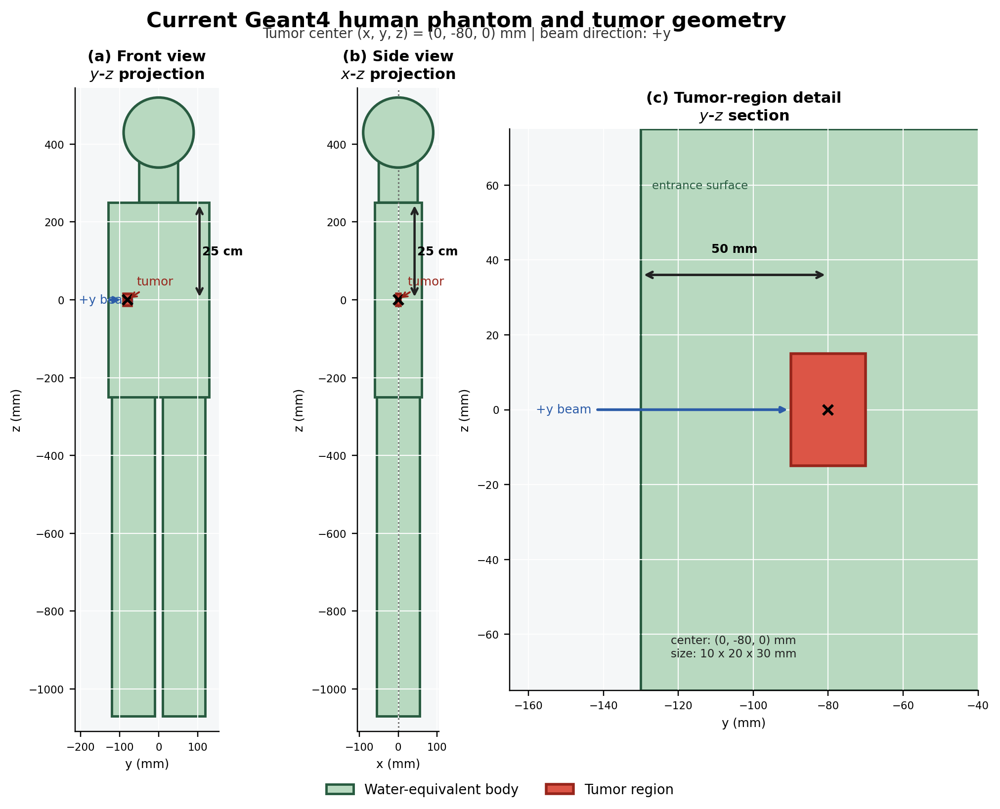

图 1 展示了 phantom 在 y-z 与 x-z 平面的投影，以及肿瘤所在 y-z 切片的局部细节：肿瘤中心沿 `+y` 方向距入口面（`y = -130 mm`）`50 mm`，沿束流方向跨 `2 cm`；右侧子图给出肿瘤与人体表面的精确距离参考。

### 4.3 实验方案

#### 4.3.1 实验设计

Q1 包含一个基准对比 run 与两次能量扫描，用以解耦"粒子种类差异"与"入射能量影响"两个变量：

| 实验 | 粒子 | 能量 | 束斑半径 | 事件数 | 用于图 |
|---|---|---:|---:|---:|---|
| 基准对比 | gamma | `1 MeV` | `8 mm` | `5000` | Q1_depth_dose / Q1_dose_heatmap / Q1_let_spectra / Q1_region_dose_comparison |
| 基准对比 | proton | `85 MeV` | `8 mm` | `5000` | 同上 |
| gamma 扫描 | gamma | `0.2, 0.5, 1, 2, 4, 6, 8, 10, 15 MeV` | `8 mm` | 每点 `5000` | Q1_gamma_energy_heatmap_grid / Q1_gamma_energy_scan |
| proton 扫描 | proton | `60, 65, 70, 75, 80, 85, 90, 95, 100 MeV` | `8 mm` | 每点 `5000` | Q1_proton_energy_heatmap_grid / Q1_proton_energy_scan |

#### 4.3.2 实验细节

- **物理列表**：`QGSP_BIC_HP`，覆盖 EM 过程、proton 强子过程、低能高精度中子（HP）过程；Q1 主要使用 EM 与 proton 强子链。
- **正常组织口径**：Q1 的"正常剂量"由整个 phantom 体积扣除肿瘤后的全部水组织得到，质量远大于肿瘤区，因此其平均剂量在数值上较小，不可直接与肿瘤区平均剂量等同看待。
- **深度剂量与体素热图**：在所有 phantom 体积（Torso/Neck/Head/Leg）内统一填充 `hDepthDose` 与三维 `(x, y, z)` 体素能量沉积，避免上一版只在两个盒子内填充导致的非物理零沉积区。
- **LET 显示范围**：直方图横轴限制在 `0–2 MeV/μm`，并使用 `200` bins，以便在低 LET 区分辨 gamma 与 proton 的差异；图中标注 step 数与平均 LET。
- **Q1 macro 关键命令**（以 proton 基准 run 为例）：

```text
/therapy/mode problem1
/therapy/boronMode none
/therapy/sourcePosition 0 -600 0 mm
/therapy/sourceDirection 0 1 0
/therapy/beamRadius 8 mm
/gun/particle proton
/gun/energy 85 MeV
/run/beamOn 5000
```

### 4.4 实验结论

#### 4.4.1 深度剂量曲线

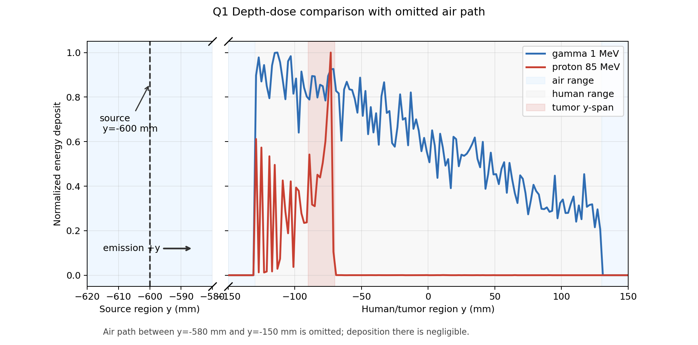

图 2 给出 `1 MeV` gamma 与 `85 MeV` proton 沿 y 轴的归一化深度剂量曲线。源位置（`y = -600 mm`）与入口面（`y = -130 mm`）之间的空气段沉积可忽略，因此使用断轴显示。可以看到：

- gamma 在进入人体后立即出现 buildup，并沿整个躯干 y 跨度呈缓变沉积，离开 phantom（`y ≈ +130 mm`）后剂量回落；曲线不存在局部峰值。
- proton 在进入人体后能量持续损失，并在 `y ≈ -73 mm` 处出现明显 Bragg peak。从入口面起算的物理深度约为 `57 mm`，肿瘤 y 跨为 `[-90, -70] mm`（即近端、中心、远端深度分别为 `40 / 50 / 60 mm`），峰位仍处于肿瘤内部偏远端位置。
- proton 远端紧随 Bragg peak 后剂量迅速下降到 ~0，因此肿瘤后方的正常组织几乎不受沉积；这是 proton 相对 gamma 在剂量学上的核心优势。

#### 4.4.2 二维剂量热图

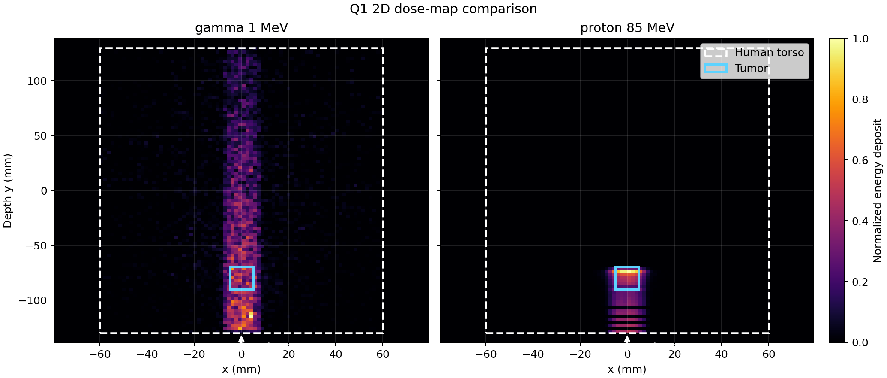

图 3 展示 phantom 在 `(x, y)` 平面投影上的归一化能量沉积，并在图中标出躯干边界与肿瘤边框。对比可见：

- gamma 在沿入射轴方向的较宽 y 范围内均有可见沉积，呈现沿束流方向的"长柱状"分布；
- proton 的高沉积区紧贴肿瘤位置，在肿瘤近端到中心形成明亮热点，沿 x 方向也较窄（束斑 `8 mm` 决定）；
- proton 热点之外，几乎看不到沿束流方向延伸的均匀沉积，这与图 2 中入口侧"近平台 + 末端 Bragg peak + 急速下降"的形态一致。

由于"全部正常组织"质量远大于肿瘤区质量，仅看区域平均剂量数值不能直接判断正常组织受照范围；图 2 与图 3 提供了空间形态的直接证据，是判断空间剂量选择性的主要依据。

#### 4.4.3 gamma 能量扫描

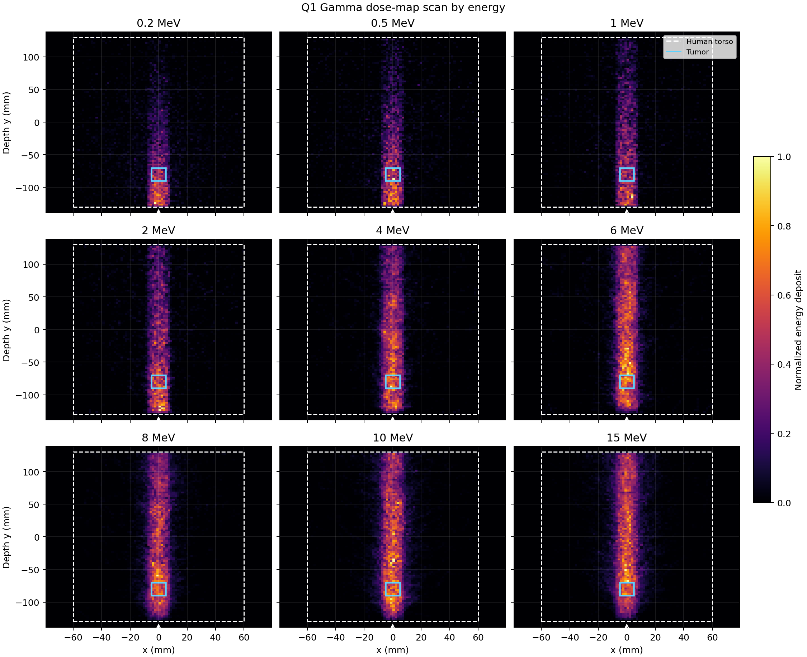

图 4 给出 9 个 gamma 能量点（`0.2 / 0.5 / 1 / 2 / 4 / 6 / 8 / 10 / 15 MeV`）在 `(x, y)` 平面的能量沉积分布。各能量点的沉积形态都是"沿束流方向的长柱"，没有任何能量出现局部峰；随着能量升高，柱状结构更长更宽，并整体向人体深部延伸。

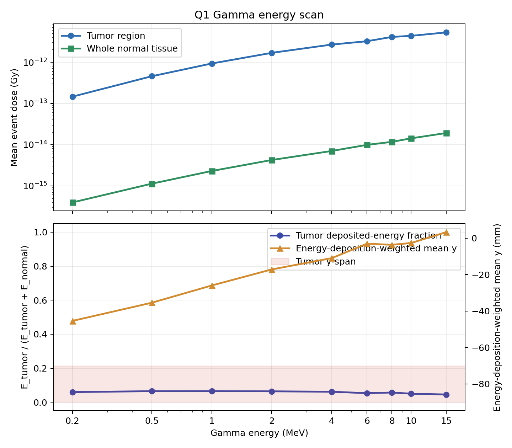

图 5 的上子图为肿瘤区与全部正常组织的平均 event 剂量（对数轴）。两条曲线都随能量单调增加，肿瘤区始终高于全部正常组织；两者的差值主要由 mass 归一化（肿瘤体积远小）决定，不应直接解读为空间选择性。下子图给出肿瘤沉积能量分数 `f_tumor`（蓝）与能量沉积加权平均深度 `y_mean`（橙）。结果显示：

- `f_tumor` 在所有 gamma 能量下都位于 `~4.5%–9%` 平台范围内，没有出现类似 Bragg peak 的局部最优；
- `y_mean` 随能量单调右移（从 `y ≈ -45 mm` 至 `y ≈ +10 mm`），表示沉积重心整体向人体深部移动；
- 这与图 4 的形态一致：gamma 升高能量主要意味着穿透更深，而不是局部峰值的"重新放置"。

因此，gamma 能量扫描得到的核心结论是 **"gamma 没有 Bragg peak，能量调节无法实现局部剂量峰的肿瘤对齐"**；这与下文 proton 扫描形成鲜明对比。

#### 4.4.4 proton 能量扫描

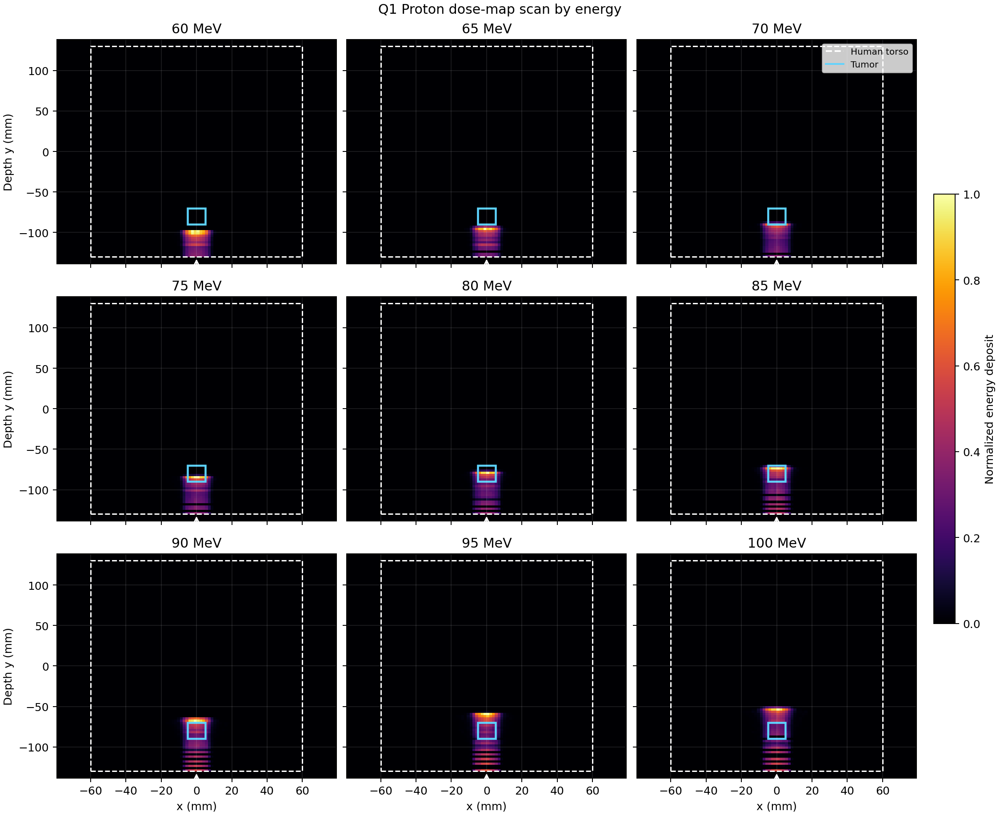

图 6 给出 9 个 proton 能量点（`60–100 MeV`，步长 `5 MeV`）在 `(x, y)` 平面的能量沉积分布。可以清晰看到：

- `60 / 65 / 70 MeV`：Bragg peak 位置在肿瘤近端之外（y 偏负侧），高沉积区落在肿瘤入口前；
- `75 / 80 / 85 MeV`：Bragg peak 进入肿瘤区（峰位 `y = -85 / -79 / -73 mm`），其中 `85 MeV` 的峰位最靠近肿瘤中心偏远端；
- `90 / 95 / 100 MeV`：Bragg peak 越过肿瘤远端，多余能量沉积到肿瘤后方的正常组织中。

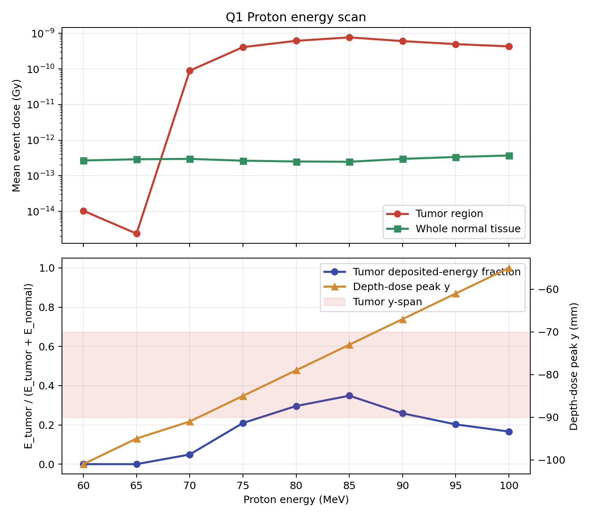

图 7 上子图为肿瘤区与全部正常组织的平均 event 剂量（对数轴）。`60 / 65 MeV` 因 Bragg peak 尚未进入肿瘤，肿瘤区剂量为零或极低；`70 MeV` 起肿瘤区剂量上升约 5–6 个数量级，并在 `85 MeV` 达到极大值，随后随能量进一步升高（峰越过肿瘤）而缓降。下子图同时给出肿瘤沉积能量分数 `f_tumor`（蓝）与深度剂量峰位 `y_peak`（橙）。`y_peak` 随能量单调右移，并通过 `~80 MeV` 处穿越肿瘤中心；`f_tumor` 呈现单峰：

| proton 能量 / MeV | 深度剂量峰 y / mm | 肿瘤沉积能量分数 `f_tumor` |
|---:|---:|---:|
| 60 | `-101` | `~0` |
| 65 | `-95` | `~0` |
| 70 | `-91` | `0.048` |
| 75 | `-85` | `0.210` |
| 80 | `-79` | `0.296` |
| 85 | `-73` | `0.349` |
| 90 | `-67` | `0.259` |
| 95 | `-61` | `0.201` |
| 100 | `-55` | `0.165` |

`75 / 80 / 85 MeV` 的 Bragg peak 都位于肿瘤区内（红色阴影区），其中 `85 MeV` 在 `f_tumor` 上为本次扫描的最大值。该结论严格依赖肿瘤位置（中心 y = -80 mm，距入口约 `50 mm`）；若肿瘤更深或更浅，最优能量将随之改变。若进一步要求 Bragg peak 在肿瘤内更均匀地展宽，可在 `80–90 MeV` 之间叠加多个能量形成 SOBP（Spread-Out Bragg Peak），这是 Q1 后续可扩展的方向。

#### 4.4.5 LET 谱比较

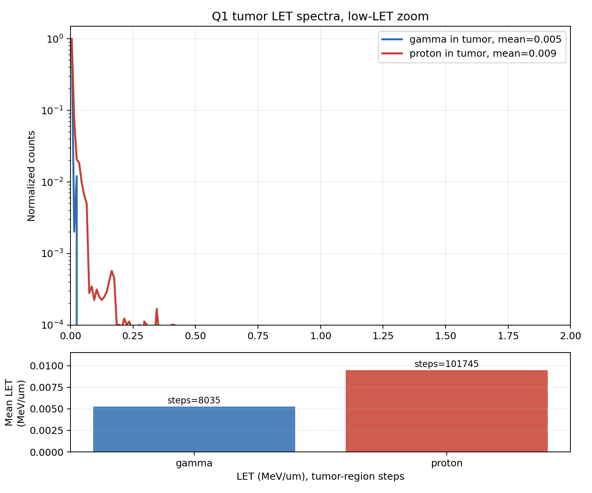

图 8 上子图为 gamma 与 proton 在肿瘤区内的 step-LET 归一化分布（半对数纵轴），下子图为平均 LET 柱状图（线性纵轴）。可以看到：

- 两者的 LET 主要集中在 `< 0.05 MeV/μm` 区间；
- proton 在肿瘤区的 step-LET 谱有明显尾部，最远延伸到 `~0.4 MeV/μm`，而 gamma 几乎完全压在最低 bin；
- 平均 LET：gamma `~0.005 MeV/μm`（`8035` steps），proton `~0.009 MeV/μm`（`101745` steps）。

由于两组 step 数差异显著，且该指标不是剂量加权 LET，也不直接对应临床 RBE，本章的剂量学主要证据仍来自深度剂量、二维热图与能量扫描，LET 谱用作"质子在肿瘤区微观能损更集中"的辅证。

#### 4.4.6 区域剂量对比

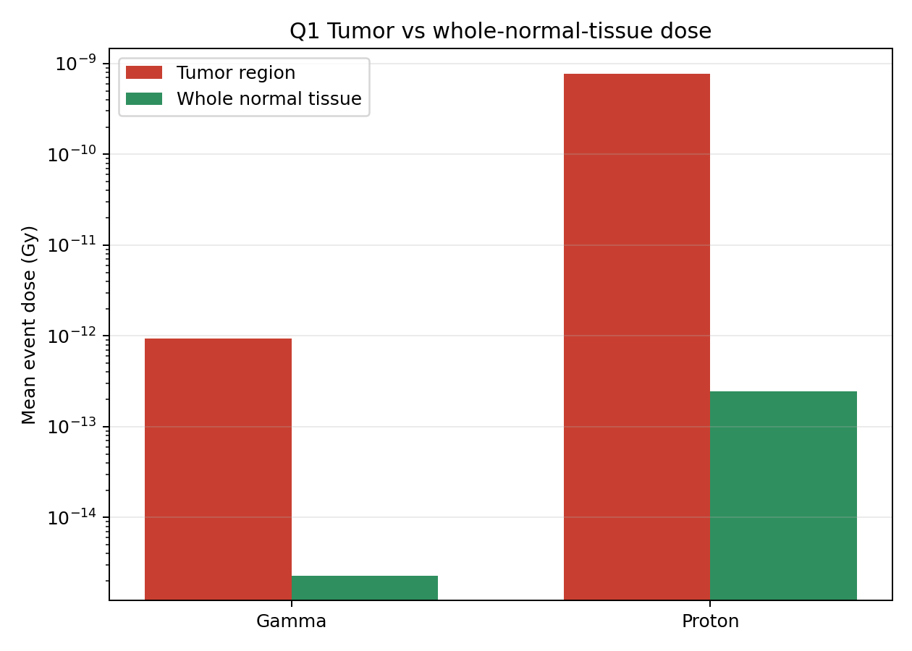

图 9 用对数纵轴并列展示基准 run 下两类粒子的肿瘤区与全部正常组织平均 event 剂量。两类粒子的肿瘤剂量都显著高于正常组织剂量，但二者差距主要受质量归一化主导，**不能用于判断正常组织受照范围**；空间选择性的判断仍以图 2、图 3 为准。

#### 4.4.7 Q1 小结

综合以上结果：

1. gamma 的剂量沉积沿入射方向呈弥散柱状分布，无 Bragg peak；调节能量主要改变穿透深度，肿瘤沉积能量分数 `f_tumor` 始终在 `~5%–9%` 平台。
2. proton 在肿瘤深度附近形成明显 Bragg peak，并因末端急剧下降而几乎不在肿瘤后方留下剂量；通过能量调节可以把 Bragg peak 放到肿瘤范围内。
3. 在当前肿瘤几何下，`60–100 MeV` 扫描中 `85 MeV` 是肿瘤沉积能量分数的最优点（`~34.9%`），与 Bragg peak 落在肿瘤中心偏远端的几何位置一致。
4. proton 在肿瘤区内的 step-LET 谱尾部更长，平均 LET 略高于 gamma，但差异较小，应作为辅助证据看待。

因此，**质子治疗相对 gamma 的关键剂量学优势是"空间剂量可控性"**，并不在于单粒子能量更高；这一结论将在 §6 中与 BNCT 的"细胞尺度选择性"形成对照。

## 5. BNCT 模拟（Q2）

### 5.1 实验动机与目标

BNCT 利用反应

```text
10B + n_thermal -> alpha + 7Li + 2.79 MeV (94% to 7Li*) / 2.31 MeV (6%)
```

将能量沉积到含 `10B` 的细胞中。反应产物 α 与 Li7 在水中的射程约为 `5–9 μm` 和 `3–5 μm`，因此一次俘获的高 LET 沉积几乎完全局限在一个细胞尺度（直径 `~10 μm`）内。BNCT 的两层选择性因此来自：

1. **细胞尺度选择性**：硼载体药物在肿瘤细胞内的优先富集；
2. **微剂量尺度选择性**：α/Li7 短射程使高 LET 沉积只发生在含硼细胞及其邻近薄层。

本章构建混合肿瘤/正常细胞 patch 与三种 `10B` 分布模式（uniform / cytoplasm / shell），围绕以下四个工作假设展开：

| 编号 | 假设 | 主证图 |
|---|---|---|
| H1 | 等 `10B` 总原子数下，shell 相比 uniform 在细胞核内可获得更高高 LET 沉积 | F2、F3 |
| H2 | 等肿瘤细胞剂量 `1 Gy` 下，BNCT 对正常细胞的剂量低于 gamma/proton | F4 |
| H3 | 反应活性（俘获率与 α+Li7 产额）随 ppm 单调增加；shell 的相对优势随 B10 总量降低而相对增大 | Q2_b10_concentration_scan |
| H4 | 中子注量主要放大累计剂量与二次粒子产额，不改变 B10 分布主导的细胞选择性 | Q2_neutron_fluence_scan / Q2_neutron_fluence_projected_maps |

H1 是 BNCT 教科书的"硼壳热源"直觉假说；H2 检验 BNCT 是否真正在剂量学层面优于常规放疗；H3–H4 用于把"B10 浓度"与"中子注量"两个治疗变量解耦。

### 5.2 几何模型与材料构建

#### 5.2.1 微观细胞 patch

宏观几何沿用 §4.2 的 phantom，肿瘤区位置与束流方向不变；BNCT 模拟将束斑收缩到 `R = 150 μm` 并对准 patch 中心，以提高在 patch 范围内的中子命中率。patch 与细胞参数如下：

| 参数 | 数值 |
|---|---:|
| patch 尺寸 | `200 × 200 × 200 μm` |
| 细胞中心间距 | `12 μm` |
| 细胞直径 | `10 μm` |
| 细胞半径 `R_cell` | `5 μm` |
| 细胞核半径 `R_nuc` | `2.5 μm` |
| shell 模式含硼壳厚 `t_shell` | `1 μm`（`r ∈ [4, 5] μm`） |
| 单 run 细胞数 | `4096`（肿瘤 `2048` + 正常 `2048`） |

patch 中肿瘤细胞与正常细胞在 `(x, z)` 平面上以棋盘格混合排列，并在 `+y` 方向上同一 `(x, z)` 柱内保持同一种细胞类型，便于沿束流方向投影做二维热图：

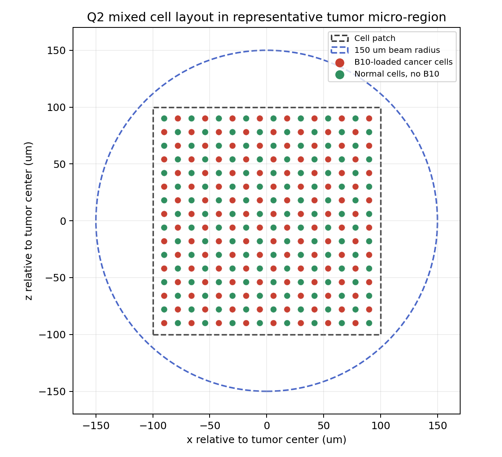

红色为含 B10 的肿瘤细胞，绿色为不含 B10 的对照细胞，虚线圆为束斑半径 `150 μm`。两类细胞处于同一中子场内，因此后续剂量差异主要可归因为 B10 加载差异，而不是空间位置差异。注意"正常细胞"在本模型中是理想化的不含硼对照细胞，并不等同于真实患者全身正常组织。

#### 5.2.2 B10 分布模式

本章比较三种 `10B` 分布模式（图 11）：

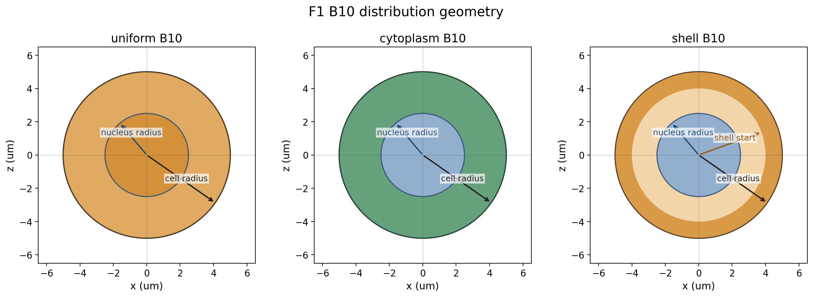

| 模式 | 含硼体积 | 物理含义 |
|---|---|---|
| uniform | 整个细胞 `r ∈ [0, 5] μm`（含核） | B10 进入整个肿瘤细胞内部 |
| cytoplasm | 细胞质 `r ∈ [2.5, 5] μm`（不含核） | B10 留在胞质中，未进入核 |
| shell | 外侧壳层 `r ∈ [4, 5] μm` | B10 偏向细胞膜或细胞外周 |

对照细胞默认不含 B10。该理想化设定用于突出 BNCT 中"肿瘤细胞选择性富集"的机制。

#### 5.2.3 等 B10 总原子数约束

直接比较"相同 ppm"会让 shell（仅在小体积内含硼）含硼总量显著少于 uniform，反应数被低估。本章因此施加"等 `10B` 总原子数"约束，把"相同硼浓度"的等价含义定义为"等总硼"。在 `R_cell = 5 μm`、`t_shell = 1 μm` 下：

```text
V_shell / V_cell = 1 - (4/5)^3 ≈ 0.488
ppm_shell · V_shell = ppm_uniform · V_cell
=> ppm_shell ≈ 2.049 · ppm_uniform
```

cytoplasm 模式同理：

```text
V_cyto / V_cell = 1 - (2.5/5)^3 = 0.875
=> ppm_cyto ≈ 1.143 · ppm_uniform
```

Geant4 `G4Material::AddElementByMassFraction` 要求质量分数 `≤ 1`，因此 `shell_ppm ≤ 1×10⁶`，对应 `uniform_equiv ≤ ~488000 ppm`。本次重运行采用 **`uniform_equiv = 300000 ppm`**（对应 shell 实际 `~614550 ppm`，约 `61%` 质量分数）。该浓度远高于真实 BNCT 临床的几十 ppm 量级，仅用于在合理 wall-clock 内得到足以稳定估计的反应统计；选择性结论的"方向"不依赖该浓度的绝对值，但绝对剂量值不应直接外推到临床。

#### 5.2.4 材料定义

uniform / shell / cytoplasm 模式下含硼区域填充自定义材料 `B10_Borated_Water`，由 `G4_WATER` 与 `EnrichedB10` 按质量分数 `boronFraction = ppm × 1e-6` 混合而成；其余区域填充 `G4_WATER`。

### 5.3 实验方案

#### 5.3.1 实验设计

为了把"俘获率"与"单位俘获核响应"两个独立物理量分别测准，本章设计五组互补实验：

| 实验 | 配置 | 跑次 / events | 用于图 |
|---|---|---:|---|
| A 真实中子一致性验证 | `uniform_equiv = 300k ppm` × {uniform, shell, none} × 3 seeds | `1M × 9` = `9M` | 5.4 一致性表 |
| B 跨疗法等剂量对照 | gamma `1 MeV`、proton `80 MeV`、BNCT {uniform, shell} | gamma/proton 各 `2M`，BNCT 各 `200k`（带 `100x` 偏置） | F4 |
| C 真实中子俘获率扫描 | `uniform_equiv ∈ {30k, 100k, 200k, 300k}` × {uniform, shell} | `~4M` 中子 | Q2_b10_concentration_scan |
| D B10 区域条件俘获 | {uniform, cytoplasm, shell} × 3 seeds | `100k × 3 × 3` = `900k` 条件俘获 | F2、F3 |
| E 中子注量扫描 | `500k ppm` × {uniform, shell} × histories ∈ {2k, 5k, 10k, 20k, 50k, 100k, 200k} | — | Q2_neutron_fluence_scan、Q2_neutron_fluence_projected_maps |

实验 D 中"条件俘获"在 `B10_Borated_Water` 逻辑体内为每个 event 强制生成一次 `10B(n,α)7Li` 反应，从而把"每个俘获产物的几何输运响应"独立测准。两阶段方法把待估量分解为：

```text
nucleus response / incident neutron
= (captures / incident neutron)   <-- 由实验 A、C 测得
× (nucleus response / capture)    <-- 由实验 D 测得
```

实验 D 不修改 Geant4 截面，也不代表绝对中子注量；它只消除"稀疏俘获事件"对几何响应估计的统计干扰。

#### 5.3.2 关键实验细节

- **物理列表**：`QGSP_BIC_HP`，其中 HP（High Precision）包覆 `< 20 MeV` 中子的精细评估库，承载 `10B(n,α)7Li` 通道的过程为 `neutronInelastic`（在 Geant4 中 `10B(n,α)` 通过 inelastic 通道的 final-state 模型实现，而非 capture 通道）。
- **occurrence bias（实验 B）**：在 `B10_Borated_Water` 逻辑体上挂接 `B10CaptureBiasOperator`，对 neutron `neutronInelastic` 过程施加 `100x` 截面偏置；偏置仅在 B10 区域生效，是方差缩减，不代表物理 B10 浓度或真实反应截面提高。所有偏置后产生的粒子由 Geant4 自动赋予权重 `w`，剂量、产额按权重还原：

```text
E_dep_weighted = Σ_i w_i · E_dep_i
N_yield_weighted = Σ_i w_i
```

当前几何中 `100x` 偏置实际获得约 `10x` 的 raw Li7 统计增益（因为 B10 区域体积占总 patch 比例有限），因此不应把倍率直接解释为统计增益，也不能把 raw captures 当作真实俘获数。

- **条件俘获（实验 D）**：通过开关 `/therapy/forceCapture true`（对应代码 `B10CaptureBiasOperator` 的 forced-capture 分支）使每个 event 在 B10 区域内强制进行一次 `10B(n,α)7Li`，反应后跟踪 α 与 Li7 在细胞/核/壳层中的能量沉积；该模式只输出"单位俘获"几何响应。
- **跨疗法等剂量归一化（实验 B）**：在后处理中将四种疗法的肿瘤细胞平均剂量分别归一化到 `D_tumor_cell = 1 Gy`，再比较 `D_normal_cell` 与 `S_therapy`；该口径用于剥离"每种粒子绝对反应数"差异，专注于"等肿瘤剂量下正常组织代价"。
- **两套生物效应口径（§3.5）并行给出**：A 口径用 LQ 模型 + 粒子拆分 RBE 加权；B 口径用核击中阈值。两套口径方向一致则采信，方向不一致则讨论参数不确定性。

### 5.4 实验结论

#### 5.4.1 F2 — 条件俘获单位响应（H1 主证之一）

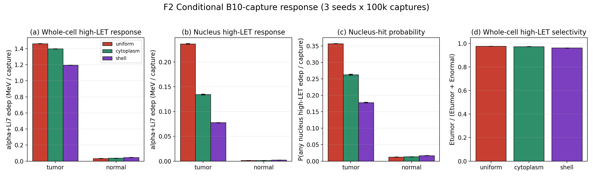

图 12（F2）使用三种 B10 模式 × 3 seeds × `100k` 条件俘获，给出每次 B10 俘获的几何响应。四个子图分别为：

- (a) **整细胞高 LET 沉积**（α+Li7 在整个细胞中的累计能量 / capture）：tumor uniform `~1.46`、cytoplasm `~1.39`、shell `~1.19 MeV/capture`；三种模式接近，但 shell 略低，说明部分初始动能逃逸出细胞；normal 控制组接近 0（验证不含 B10 时无 BNCT 响应）。
- (b) **核高 LET 沉积**（α+Li7 在核内累计能量 / capture）：tumor uniform `~0.236`、cytoplasm `~0.135`、shell `~0.0782 MeV/capture`；shell / uniform `≈ 0.331`，cytoplasm / uniform `≈ 0.572`。
- (c) **核命中概率**（单次俘获使核内至少 1 次高 LET 沉积的概率）：tumor uniform `~35.4%`、cytoplasm `~26.3%`、shell `~17.5%`；shell / uniform `≈ 0.493`。
- (d) **整细胞高 LET 选择性** `E_tumor / (E_tumor + E_normal)`：三种模式均接近 `~0.97`，差异不大；这与"对照细胞不含硼"的理想化设定一致。

三 seed 变异系数均 `< 0.5%`，因此 (b)(c) 子图的方向已不再受少数事件主导。**核心物理图像**：等总硼下，uniform 模式可以让俘获直接发生在核内，产物立即沉积；cytoplasm 把 B10 排出核外，但仍靠近核；shell 把 B10 推到 `r ∈ [4, 5] μm`，俘获产物必须穿过 `~1.5 μm` 的胞质间隔才能到达核边界，并且约一半初始方向背离核。**因此 H1 在核内剂量维度上与作业字面预期相反**：核内能量沉积反而 uniform 模式更高。

#### 5.4.2 F3 — 单细胞径向高 LET 沉积谱（H1 机制）

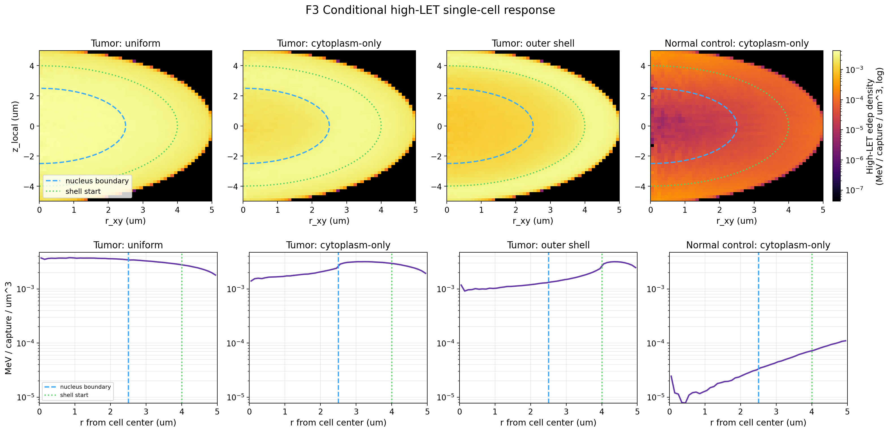

图 13（F3）上排为 `(r_xy, z_local)` 二维谱（按每个圆柱环 bin 体积 `π(r_out² - r_in²) dz` 归一化，共享对数色标），下排为按球壳体积归一化的径向 1D 曲线。蓝色虚线为核边界 `r = 2.5 μm`，绿色虚线为 shell 起点 `r = 4 μm`。可以看到：

- **Tumor uniform**：径向曲线在整个 `r ∈ [0, 5] μm` 范围内近平台，核内与胞质内沉积密度相近，反映俘获均匀分布；
- **Tumor cytoplasm**：核内沉积密度明显低于 uniform，胞质内（`r > 2.5 μm`）则相对升高，体现"B10 被排出核外"的几何效应；
- **Tumor shell**：核内（`r < 2.5 μm`）沉积密度大幅下降；`r ≈ 4 μm` 处出现清晰峰值，对应"硼壳热源"位置；峰从壳层向外径方向延伸到 `r = 5 μm`（细胞边界），这是 α/Li7 在壳内俘获后向外散射产物的径向沉积特征；
- **Normal cytoplasm 对照**：径向曲线显著低于三种 tumor 模式（约 4 个数量级），证明对照细胞中高 LET 沉积来源（散射进入的少量 α/Li7）极弱。

**F3 的方法学贡献**：在 BNCT 文献中"硼壳热源"是常见的直觉性描述，但很少有图能直接画出"单细胞径向高 LET 沉积谱"。本图把"反应位置集中于外壳"（在 shell 的 1D 曲线上 `r ≈ 4 μm` 峰）与"最终进入细胞核的能量较低"（核内 `r < 2.5 μm` 段的沉积密度低于 uniform）两件不同物理事实清晰地分开，避免按教科书字面命题做过强主张。

#### 5.4.3 F4 — 跨疗法等肿瘤剂量对照（H2 主证）


图 14（F4）使用真实粒子束流直接入射四种疗法，并在后处理中把每种疗法的肿瘤细胞平均剂量归一化到 `D_tumor_cell = 1 Gy`。上排为 patch 在 `+y` 方向投影的细胞剂量散点图（红色实心 = 含 B10 肿瘤细胞，绿色实心 = 不含 B10 正常细胞），中排为肿瘤 / 正常细胞平均剂量柱状图（对数轴），下排为 `S_therapy = D_tumor / (D_tumor + D_normal)`。

关键观察：

- **Gamma `1 MeV`**：肿瘤与正常细胞剂量近乎相等，`S_therapy ≈ 0.519`；散点图中红绿两类点强度无显著差异；
- **Proton `80 MeV`**：与 gamma 类似，`S_therapy ≈ 0.497`；同样在 patch 内对两类细胞"无区分"地沉积；
- **BNCT uniform**：`S_therapy ≈ 0.929`；散点图中红色（B10 加载）细胞明显比绿色（无 B10）亮；
- **BNCT shell**：`S_therapy ≈ 0.928`；与 uniform 接近。

`uniform` 与 `shell` 分别记录 `16` 与 `12` 个 raw Li7；权重还原后的等效 Li7 产额分别为 `0.925` 与 `0.432`。**结论**：在"正常细胞不含 B10"的理想化模型下，BNCT 在细胞尺度上的剂量学选择性远高于 gamma/proton；H2 被支持。需要注意的是：该选择性的高数值受"对照细胞完全无硼"这一理想化设定显著影响；真实临床中 B10 在正常组织（特别是血液与皮肤）有一定本底摄取，实际选择性会低于本图。

#### 5.4.4 B10 浓度扫描（H3）

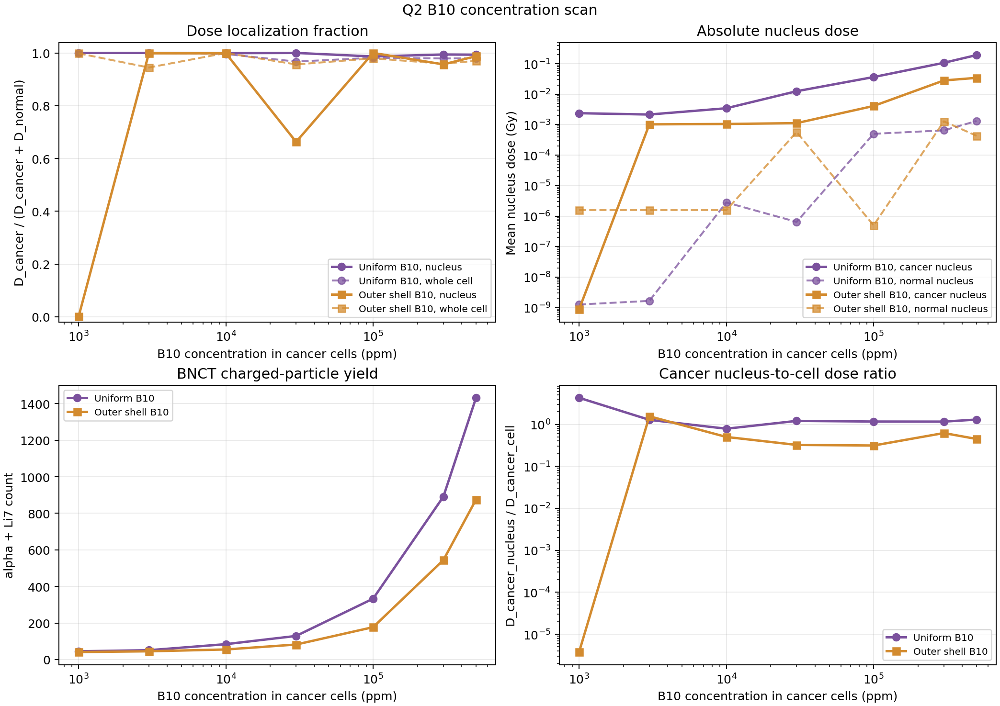

图 15 在真实中子直接入射下扫描 `uniform_equiv ∈ {30k, 100k, 200k, 300k} ppm`，分别对 uniform 与 shell 模式给出四个子图：

- **左上 Dose localization fraction**：`D_cancer / (D_cancer + D_normal)` 在整个 ppm 区间都接近 1（uniform）或 `~0.7–1`（shell，在 `30k–100k ppm` 区间因低统计而抖动）。整体上 B10 浓度对"细胞尺度选择性"影响有限。
- **右上 Absolute nucleus dose**：肿瘤细胞核平均剂量随 ppm 单调增加，并在 `300k ppm` 处接近 `~0.1 Gy`；正常细胞核剂量明显低，但随 ppm 略有增加（来自远距离散射）。
- **左下 BNCT charged-particle yield**：α+Li7 计数随 ppm 单调增加，uniform 与 shell 趋势一致；这是俘获率正比于含硼总原子数 `N_B10` 的直接体现。
- **右下 Cancer nucleus-to-cell dose ratio**：在 ppm `≥ 100k` 时，uniform 的核 / 细胞剂量比稳定在 `~1.0`，shell 在 `~0.5–0.8` 区间且抖动较大；这与 §5.4.1 中 shell 单位俘获核响应只有 uniform 的 `~30%` 的结论方向一致。

**结论**：随 B10 浓度增加，反应活性与肿瘤细胞核剂量单调增加；细胞尺度选择性几乎不变。H3 的"反应活性随 ppm 单调"被支持；"shell 相对优势随 B10 总量降低而相对增大"在当前几何中不成立（受 α/Li7 短射程主导，shell 始终低于 uniform）。

#### 5.4.5 中子注量扫描（H4）

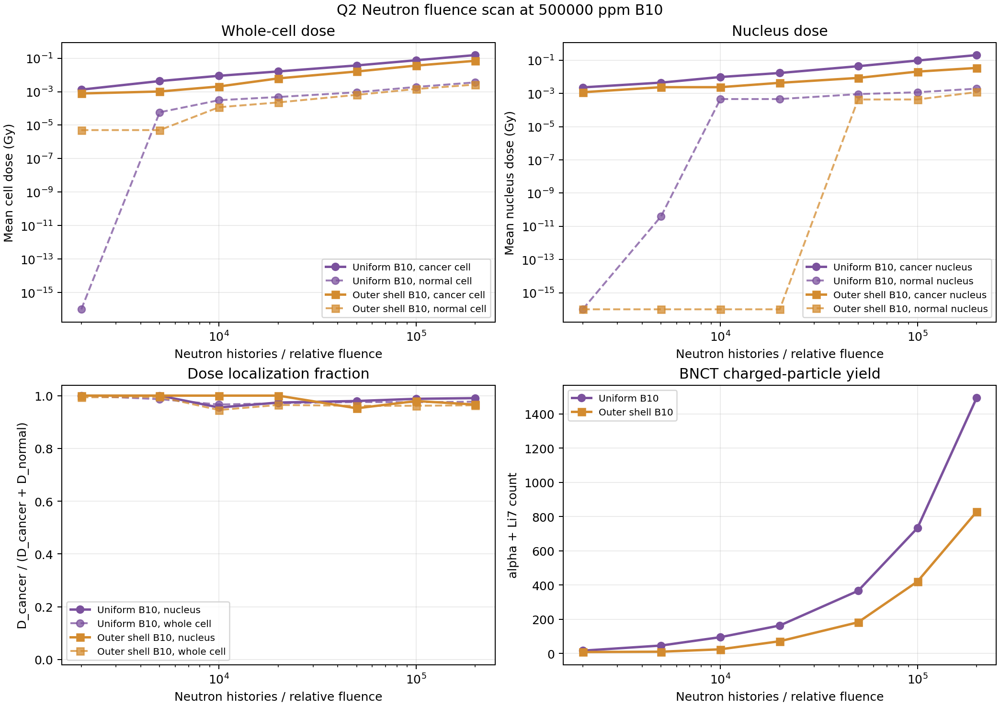

图 16 在固定 `500k ppm` B10 下扫描 7 个中子 histories 数（`2k–200k`），结果与 H4 假设完全一致：

- **左上 / 右上 Whole-cell / Nucleus dose**：肿瘤细胞与肿瘤核剂量随 histories 单调线性增加（双对数轴下斜率接近 1）；正常细胞剂量同步增加但绝对值显著低于肿瘤；
- **左下 Dose localization fraction**：`D_cancer / (D_cancer + D_normal)` 在所有 fluence 下都接近 1，并未随 fluence 变化；
- **右下 BNCT charged-particle yield**：α+Li7 计数随 histories 线性增加，uniform 持续高于 shell。

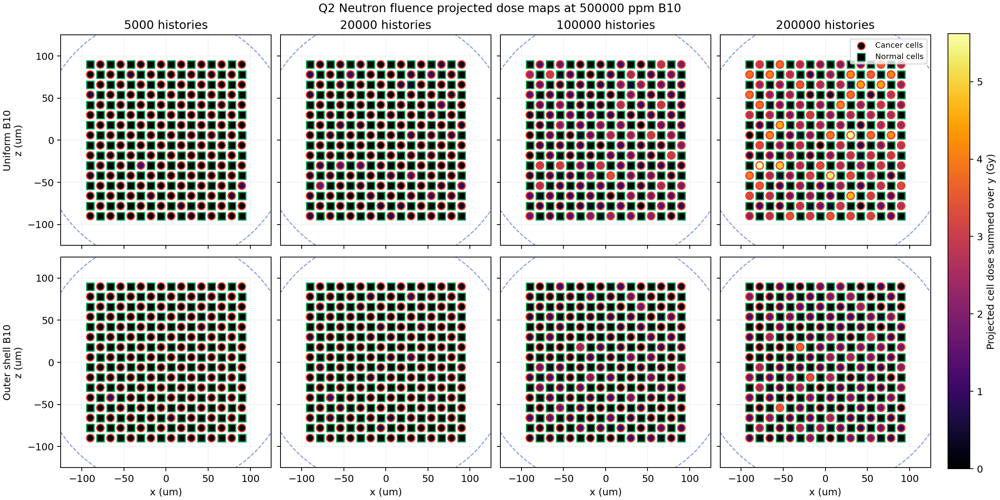

图 17 给出对应的 `(x, z)` 投影热点图：随 histories 增加，"被点亮"的细胞数量与亮度同步增加，但热点的红 / 绿分布形态保持稳定，红色（肿瘤）细胞始终显著比绿色（正常）细胞亮；下排 shell 模式与上排 uniform 模式形态相似，仅整体亮度略低（与 5.4.1 的单位俘获响应一致）。

**结论**：中子注量调控反应数量与累计剂量，但不改变 B10 分布主导的"细胞尺度选择性"。H4 被完全支持。这也符合 BNCT 反应公式 `R_BNCT ∝ N_B10 · Φ_n · σ` 的物理预期：注量调控反应数量，B10 分布调控反应位置。

#### 5.4.6 Q2 小结

综合 F2 / F3 / F4 与两次扫描：

1. **H1 一半成立，一半推翻**：径向"硼壳热源"在 F3 单细胞 1D 谱上清晰可见（shell 在 `r ≈ 4 μm` 处形成峰），机制图像成立；但在当前 `R_cell = 5 μm + t_shell = 1 μm` 几何下，α/Li7 短射程使大部分能量沉积在壳层与胞质内，进入核内的剂量与击中概率 **均低于 uniform**（shell / uniform `≈ 0.33`）。若把 shell 推到更靠近核的位置（如 `t_shell = 2 μm` 或更大核），或采用射程更长的 Q 值更高反应，结论可能反转。
2. **H2 被支持**：在理想化对照细胞无硼模型下，BNCT 在等肿瘤细胞剂量 `1 Gy` 归一化下的细胞尺度选择性 `~0.93`，远高于 gamma / proton 的 `~0.50`。该结论的高数值依赖"正常细胞完全无硼"，临床中应保守解释。
3. **H3 部分支持**：反应活性与肿瘤细胞核剂量随 ppm 单调增加（被支持）；"shell 相对优势随 B10 总量降低而相对增大"在当前几何下不成立。
4. **H4 完全支持**：中子注量主要放大反应数量与累计剂量；细胞尺度选择性平台保持不变。
5. **方法学贡献**：F3 的"单细胞径向高 LET 沉积谱"在 BNCT 文献中相对少见，把"硼壳热源径向位置"与"短射程能量传输路径"两个物理事实清晰分开；`100x` occurrence bias + 条件俘获两阶段法解决了稀疏俘获事件下的统计困难，使得"每次俘获的核响应"可以独立稳定测量。

## 6. 总结

本项目在同一个 Geant4 程序内完成了从厘米尺度人体 phantom 到微米尺度细胞 patch 的多尺度肿瘤放疗模拟，并在两个相对独立的子实验中比较了三种治疗机制的剂量学行为。归纳如下。

### 6.1 主要物理结论

1. **质子治疗 vs gamma（Q1，§4）**：gamma 的剂量沉积沿入射方向呈弥散柱状分布，能量调节只改变穿透深度而无 Bragg peak；proton 在水中具有可调 Bragg peak，在当前 `5 cm` 水等效深度、沿束流方向厚 `2 cm` 的肿瘤几何下，`60–100 MeV` 扫描中 `85 MeV` 的肿瘤沉积能量分数 `~34.9%` 为最优。**质子治疗的剂量学优势是"空间剂量可控性"，关键变量是入射能量与肿瘤深度的对齐**，并不在于单粒子能量更高。

2. **BNCT 中 B10 分布的微观几何效应（Q2，§5.4.1–5.4.2）**：在等 `10B` 原子总数约束下，shell 模式在 F3 的单细胞径向 1D 谱上形成清晰的 `r ≈ 4 μm` "硼壳热源"峰，**机制图像成立**；但因 α/Li7 在水中射程仅微米量级，在当前 `R_cell = 5 μm + t_shell = 1 μm` 几何下，shell 的单位俘获核内能量 `~0.078 MeV/capture` 与核命中概率 `~17.5%` 均显著低于 uniform 的 `~0.236 MeV/capture` 和 `~35.4%`（shell/uniform `≈ 0.33`）。**这说明 "B10 集中分布" 不是单调"更优"的设计变量**；最终核内剂量同时由"反应位置"和"产物射程"两个物理决定，几何参数的选择对结论方向有直接影响。

3. **跨疗法等剂量对照（§5.4.3）**：在等肿瘤细胞剂量 `1 Gy` 归一化下，BNCT uniform/shell 的细胞尺度选择性 `S_therapy ≈ 0.93`，远高于 gamma/proton 的 `~0.50`。该结果在"对照细胞完全无硼"的理想化模型下成立，定量值不能直接外推到临床。

4. **B10 浓度与中子注量的解耦（§5.4.4–5.4.5）**：B10 浓度调控反应活性（`α+Li7` 产额随 ppm 单调增加）与肿瘤细胞核绝对剂量；中子注量调控反应数量与累计剂量；两者对"细胞尺度选择性"几乎无影响，与 BNCT 反应公式 `R_BNCT ∝ N_B10 · Φ_n · σ` 的物理预期一致。

### 6.2 跨问题对比

把 Q1 的"宏观空间选择性"和 Q2 的"细胞尺度选择性"放在同一个项目内比较，可以看到三种治疗的差异最自然地落在不同尺度上：

- **gamma**：在毫米尺度上沿入射轴弥散沉积；在细胞尺度上对肿瘤/正常细胞几乎无区分。
- **proton**：在毫米尺度上通过 Bragg peak 实现"宏观位置"上的肿瘤集中；在细胞尺度上仍对肿瘤/正常细胞无区分（与 gamma 同形态）。
- **BNCT**：在毫米尺度上不依赖热中子的空间分布（由 `0.5 eV` 中子的弱方向性决定），但在细胞尺度上通过 `10B` 选择性富集与 α/Li7 短射程实现"细胞标签"式选择性。

因此 Q1 与 Q2 不是同一治疗指标的两个能级，而是 **"宏观空间剂量可控性" 与 "微观细胞尺度选择性"** 两条不同维度的优化路径。这也是常规放疗（依赖宏观束流定位）与 BNCT（依赖药物加载和热中子俘获）在临床上互补使用的物理基础。

### 6.3 方法学贡献

1. **统一可执行程序**：单个 `build/tumor_therapy` 通过 macro 命令切换 `problem1` / `problem2` 与 `boronMode` 参数，避免在 Q1 / Q2 间维护两套独立代码；几何、物理列表、源、ROOT 输出均共用同一基础设施。
2. **occurrence bias + 条件俘获两阶段法**：把"每个入射中子的核响应"分解为"真实中子下俘获率"（实验 A、C）与"单位俘获核响应"（实验 D）两个独立可测因子，使得在合理 wall-clock 内同时得到稳定的反应活性估计与稳定的几何输运响应；并通过 Geant4 统计权重将偏置后的剂量与产额还原到物理量。
3. **F3 的单细胞径向高 LET 沉积谱**：在 BNCT 文献中"硼壳热源"概念常以示意图描述，本图把 `(r_xy, z_local)` 二维谱与体积归一化的 1D 径向曲线并列给出，明确把"反应位置在哪里"与"能量最终在哪里沉积"两件事区分开，避免按字面命题做过强主张。

### 6.4 局限性

1. **组织材料近似**：人体 phantom 全部近似为水，未区分骨、肺、脂肪、皮肤等真实组织；Q1 的 Bragg peak 落点与 Q2 的中子慢化谱在真实组织中会有偏移。
2. **理想化对照细胞**：Q2 中"正常细胞完全无 B10"是理想化设定；真实硼载体药物在血液与正常组织中均有本底摄取，实际选择性会低于本报告给出的 `~0.93`。
3. **理想化浓度**：Q2 使用 `uniform_equiv = 300000 ppm`（shell 实际 `~614550 ppm`，约 `61%` 质量分数）以获得足够反应统计；该浓度远高于真实 BNCT 临床的几十 ppm 量级；选择性方向不依赖该值，但绝对剂量数值不能直接外推。
4. **代表性 patch**：Q2 仅用 `4096` 个细胞的代表性 patch 估计微剂量响应，不能直接外推为整个肿瘤区的绝对杀伤率。
5. **生物效应建模有限**：仅通过 LQ 模型 + 粒子拆分 RBE 加权（口径 A）和核击中阈值（口径 B）给出几何代理；未引入 DNA 损伤模型、修复动力学、α-particle 微剂量分布或细胞周期效应。
6. **统计量限制**：每个 ppm/能量扫描点 events 数有限，深度剂量曲线、`f_tumor`、`S_nucleus` 在低反应数区间存在明显涨落；本报告对相对趋势的论断保守，但若要做绝对数值的临床推断仍需显著增大统计量并提供重复 seed 误差条。
7. **单 seed 偏置估计**：F4 的 BNCT 跨疗法对照采用单 seed × `100x` occurrence bias；权重还原后的剂量值仍存在统计涨落，且当前几何中的 raw Li7 增益约为 `10x`。

### 6.5 后续可扩展方向

1. **真实组织材料**：引入 ICRP 软组织、骨、肺等定义；评估 Bragg peak 落点与中子慢化对组织异质性的敏感度。
2. **SOBP**：在 Q1 中叠加 `80 / 85 / 90 MeV` 多能量束，构造覆盖肿瘤 y 跨的展宽 Bragg peak，比较单能 vs SOBP 的肿瘤均匀性。
3. **临床浓度 BNCT**：结合 occurrence bias 与多 seed 重复，把 B10 浓度恢复到几十 ppm 量级，定量评估真实临床条件下的反应活性与剂量。
4. **B10 分布敏感性**：扫描 `t_shell` 与 `R_cell`，验证"shell vs uniform 核内剂量方向"的几何阈值（即在哪一组参数下两者交叉）。
5. **生物效应建模**：在 LQ 模型基础上引入 α-particle 微剂量分布、DNA 双链断裂模型与细胞周期敏感度，给出细胞存活曲线。
6. **真实硼药物本底摄取**：在对照细胞中引入非零 B10 浓度（如肿瘤 / 正常 = 3:1），评估"细胞尺度选择性"对该比值的依赖。

总体而言，本项目展示了 Geant4 在跨尺度肿瘤放疗模拟中的建模能力与多种方差缩减技术的联合使用，得到了与教科书直觉部分吻合、部分修正的物理结论；并为后续真实组织、临床浓度、生物效应建模等方向提供了可扩展的代码基础。


