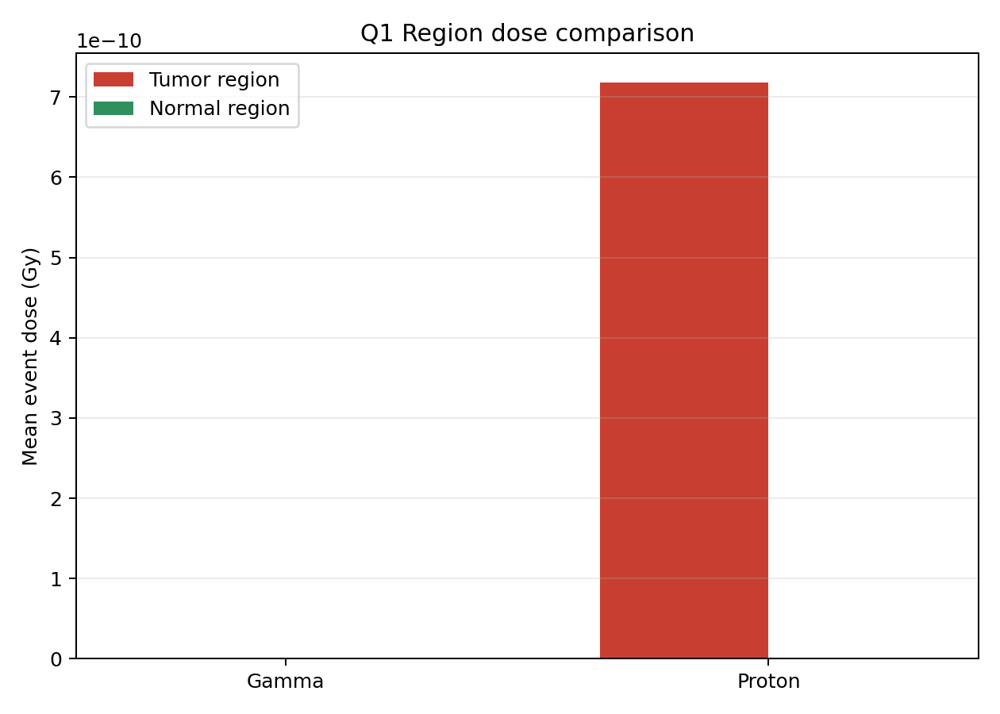
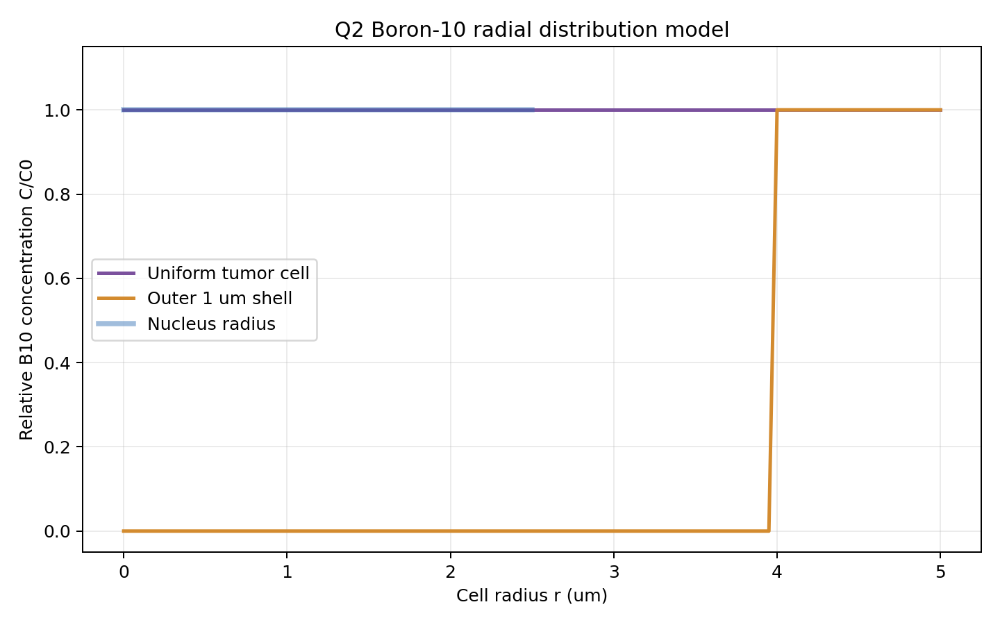
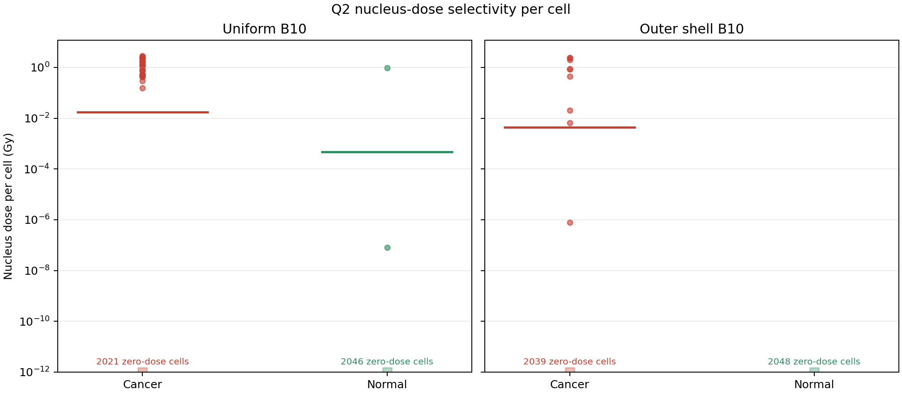
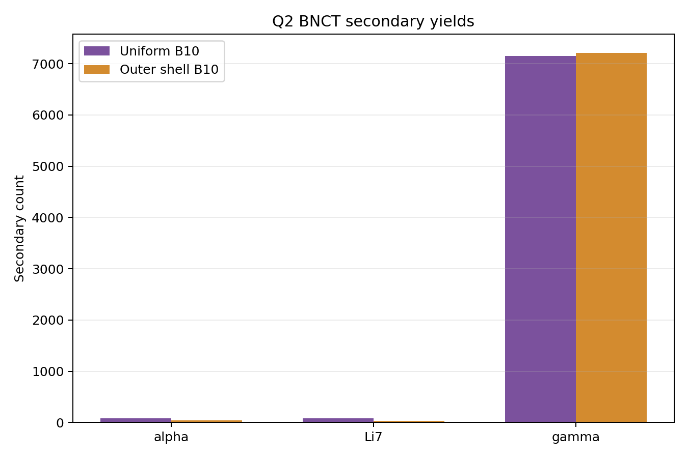
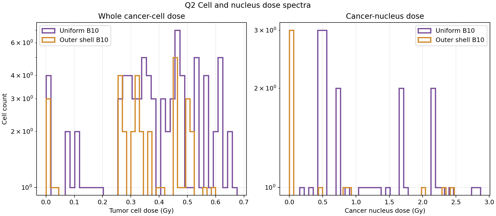

# Geant4 放射性肿瘤细胞治疗模拟任务总结

## 1. 任务理解

本任务要求基于 Geant4 设计一个放疗探测器模拟程序，比较常规放疗粒子和 BNCT 在肿瘤细胞治疗中的效果。根据 `G4_rad.md` 与题图要求，模拟分为两个层次：

- **Q1：宏观人体剂量学模拟**。构建简化人体和肿瘤区，将“正常组织”定义为整个人体 phantom 中除肿瘤以外的区域，比较 `gamma` 与 `proton` 的能量沉积、剂量和 LET 分布。
- **Q2：BNCT 细胞尺度模拟**。在宏观肿瘤区内放置代表性细胞 patch，比较 `10B` 均匀分布和细胞外 `1 um` 壳层分布时的细胞剂量、细胞核剂量与 alpha/Li7 产额。

项目采用多尺度近似：厘米尺度的人体和肿瘤区用宏观几何描述，微米尺度细胞只在代表性小区域中显式建模，避免把整个 `2 cm x 1 cm x 3 cm` 肿瘤区离散成不可计算数量的细胞。

## 2. Workflow

本次交付使用 Superpowers 风格构建了可复现 workflow，计划文件位于：

```text
docs/superpowers/plans/2026-06-03-geant4-radiotherapy-delivery.md
```

一键运行命令：

```bash
cd /home/NagaiYoru/homeworks/G4sim/Geant4TumorTherapySim
bash scripts/run_assignment_workflow.sh
```

该 workflow 会执行：

1. source Geant4/ROOT 环境：`/home/NagaiYoru/packages/setup-geant4-root.sh`
2. CMake 配置与编译：生成 `build/tumor_therapy`
3. 运行四个宏：
   - `macros/problem1_gamma.mac`
   - `macros/problem1_proton.mac`
   - `macros/problem2_bnct_uniform.mac`
   - `macros/problem2_bnct_shell.mac`
4. 自动生成并运行 `0.2, 0.5, 1, 2, 4, 6, 8, 10, 15 MeV` gamma 扫描宏。
5. 自动生成并运行 `30, 35, 40, 45, 50, 55, 60, 70, 80 MeV` 质子扫描宏。
6. 自动生成并运行 Q2 的 `1000, 3000, 10000, 30000, 100000, 300000, 500000 ppm` B10 浓度扫描宏。
7. 生成 ROOT 输出：
   - `output_problem1_gamma.root`
   - `output_problem1_gamma_<energy>MeV.root`
   - `output_problem1_proton.root`
   - `output_problem1_proton_<energy>MeV.root`
   - `output_problem2_bnct_uniform.root`
   - `output_problem2_bnct_shell.root`
   - `output_problem2_bnct_<uniform|shell>_<ppm>ppm.root`
8. 调用 `scripts/plot_assignment_results.py` 生成 Q1/Q2 图。

## 3. 几何与物理设置

简化人体模型使用水材料近似软组织，世界体积使用空气，避免粒子在到达人体前就在“水世界”中损失能量。人体几何包括：

| 部位 | 几何 | 尺寸 |
|---|---|---|
| 头部 | 球 | 直径 `180 mm` |
| 颈部 | 圆柱 | 直径 `100 mm`，高 `90 mm` |
| 躯干 | 长方体 | `260 mm x 120 mm x 500 mm` |
| 双腿 | 圆柱 | 直径 `110 mm`，高 `820 mm` |
| 肿瘤区 | 长方体 | `2 cm x 1 cm x 3 cm` |

肿瘤区中心设为 `(-45, -45, 30) mm`。Q1 中正常组织剂量定义为整个人体 phantom 中除 `TumorRegion` 外的所有水组织平均剂量；热点图中只标注人体俯瞰范围和肿瘤区，不再用局部小区域代表 normal。束流从 `(-45, -600, 30) mm` 沿 `+y` 方向入射。

物理列表采用：

```text
QGSP_BIC_HP
```

该物理列表同时支持电磁输运、质子强子过程和高精度低能中子过程，适合 Q1 与 Q2 统一使用。

## 4. Q1：gamma 与 proton 对比

Q1 宏参数：

| 粒子 | 能量 | 束斑半径 | 事件数 |
|---|---:|---:|---:|
| gamma | `1 MeV` | `8 mm` | `1000` |
| proton | `45 MeV` | `8 mm` | `1000` |
| gamma scan | `0.2-15 MeV` | `8 mm` | 每点 `1000` |
| proton scan | `30-80 MeV` | `8 mm` | 每点 `500` |

输出图：

- 深度剂量曲线：
- 二维剂量热图：
- 不同 gamma 能量二维热图扫描：
- gamma 能量扫描：
- 不同质子能量二维热图扫描：
- 质子能量扫描：
- 区域剂量对比：
- LET 谱：

本次运行得到的平均 event 剂量为：

| 模式 | 肿瘤区平均剂量/Gy | 整体正常组织平均剂量/Gy | 选择性说明 |
|---|---:|---:|---|
| gamma | `7.46e-13` | `1.35e-15` | 正常组织按整个人体非肿瘤质量归一化 |
| proton 45 MeV | `7.19e-10` | `7.73e-14` | Bragg peak 位于肿瘤区，整体正常组织平均剂量较低 |

肿瘤区 LET 谱使用低 LET 区间放大显示，统计范围为 `0-2 MeV/um`。当前结果为：

| 粒子 | 肿瘤区 step 数 | 平均 LET/(MeV/um) | 说明 |
|---|---:|---:|---|
| gamma 1 MeV | `1233` | `0.0052` | 主要集中在最低 LET bins |
| proton 45 MeV | `22672` | `0.0090` | 低 LET 尾部更长，平均值高于 gamma |

质子能量扫描得到的深度峰位置如下：

| 质子能量/MeV | 深度剂量峰 y/mm | 肿瘤沉积能量分数 `E_tumor/(E_tumor+E_normal)` |
|---:|---:|---:|
| 30 | `-53` | `0.000` |
| 35 | `-49` | `0.270` |
| 40 | `-47` | `0.500` |
| 45 | `-43` | `0.616` |
| 50 | `-39` | `0.457` |
| 55 | `-35` | `0.328` |
| 60 | `-31` | `0.255` |
| 70 | `-21` | `0.175` |
| 80 | `-9` | `0.132` |

gamma 能量扫描得到的趋势如下。由于 gamma 没有 Bragg peak，这里不用“峰位置”作为主指标，而使用剂量加权平均深度 `y_mean` 表示能量沉积分布整体向人体深处移动的趋势。

| gamma 能量/MeV | 肿瘤平均剂量/Gy | 整体正常组织平均剂量/Gy | 肿瘤沉积能量分数 | `y_mean`/mm |
|---:|---:|---:|---:|---:|
| 0.2 | `1.61e-13` | `3.22e-16` | `0.079` | `-7.7` |
| 0.5 | `4.53e-13` | `7.79e-16` | `0.091` | `-6.7` |
| 1 | `7.46e-13` | `1.35e-15` | `0.087` | `-5.9` |
| 2 | `1.20e-12` | `2.19e-15` | `0.086` | `-1.3` |
| 4 | `1.88e-12` | `3.91e-15` | `0.076` | `1.4` |
| 6 | `2.50e-12` | `4.56e-15` | `0.086` | `-3.2` |
| 8 | `1.79e-12` | `5.76e-15` | `0.051` | `3.0` |
| 10 | `2.44e-12` | `6.52e-15` | `0.060` | `3.0` |
| 15 | `2.13e-12` | `9.75e-15` | `0.036` | `8.4` |

结果说明：

- `gamma` 的剂量分布较分散，非肿瘤人体组织中有能量沉积；由于正常组织质量远大于肿瘤，整体平均剂量较小。
- gamma 能量升高时，整体穿透能力增强，沉积区域更容易延伸到人体深部；但肿瘤沉积能量分数没有质子 Bragg peak 那样的局部优化峰。
- `45 MeV` 质子在本几何中可以把 Bragg peak 放到 `y=-50 mm` 到 `y=-40 mm` 的肿瘤区域内。
- 扫描结果显示，随着质子能量升高，Bragg peak 从入射侧向下游移动；当峰越过肿瘤后，肿瘤沉积能量分数下降，更多能量沉积到非肿瘤人体组织中。
- 多能量二维热图进一步显示，`30-40 MeV` 的高沉积区偏浅或刚进入肿瘤，`45 MeV` 与肿瘤位置匹配较好，`50 MeV` 以上的热点逐渐越过肿瘤并向人体深部移动。
- LET 图经过低 LET 区间放大后可见 proton 在肿瘤区的 LET 分布有更长尾部，平均 LET 高于 gamma；但该差异仍较小，Q1 的主要证据应来自深度剂量、热点图和能量扫描，而不是单独依赖 LET 谱。

## 5. Q2：BNCT 与硼分布

Q2 使用 `0.5 eV` 热中子，比较两种 `10B` 分布：

1. **uniform**：肿瘤细胞整体均匀含硼。
2. **shell**：`10B` 集中在肿瘤细胞外侧 `1 um` 壳层。

细胞模型：

| 结构 | 尺寸 |
|---|---:|
| 细胞半径 | `5 um` |
| 细胞直径 | `10 um` |
| 细胞核半径 | `2.5 um` |
| 含硼壳层厚度 | `1 um` |

为了在短时间、有限事件数中观察到 BNCT 反应信号，Q2 宏采用了信号增强设置：束斑半径 `150 um`，硼浓度 `500000 ppm`，事件数 `20000`。这个设置用于展示机制和比较趋势；若做接近真实治疗条件的研究，应恢复到几十 ppm 量级并显著增加事件数。

Q2 的微观细胞几何已改为同一个 `200 um x 200 um x 200 um` patch 内的棋盘格混合分布：肿瘤细胞和正常细胞处在同一代表性肿瘤微区中，肿瘤细胞含硼，正常细胞不含硼。这样可以把选择性剂量差异主要归因于 `10B` 富集，而不是左右分离 patch 带来的空间位置差异。为了让热点图可以沿束流方向投影，同一 `(x,z)` 柱内的所有 y 层细胞保持同一种细胞类型，`x-z` 平面仍为 tumor/normal 交错分布。

输出图：

- 硼径向分布：
- 混合细胞几何：
- 微区 y 投影剂量热点图（下方嵌入 tumor/normal 平均细胞剂量柱状图）：
- 细胞核剂量散点选择性：
- 次级粒子产额：
- 肿瘤细胞剂量谱：
- B10 浓度扫描：
- 中子流强扫描：
- 中子流强投影热点图：

本次运行得到：

| 模式 | alpha 数 | Li7 数 | gamma 数 | 肿瘤细胞平均剂量/Gy | 正常细胞平均剂量/Gy | 肿瘤核平均剂量/Gy | 正常核平均剂量/Gy |
|---|---:|---:|---:|---:|---:|---:|---:|
| uniform | `84` | `79` | `7149` | `1.62e-02` | `4.81e-04` | `1.72e-02` | `4.63e-04` |
| shell | `38` | `33` | `7214` | `6.23e-03` | `2.28e-04` | `4.39e-03` | `0.00e+00` |

为了把 Q2 做成类似 Q1 能量扫描的优化问题，本版增加了 B10 浓度扫描。定义剂量局域化指标：

```text
S_cell = D_tumor_cell / (D_tumor_cell + D_normal_cell)
S_nucleus = D_tumor_nucleus / (D_tumor_nucleus + D_normal_nucleus)
```

其中 `S_nucleus` 作为主要优化指标，`S_cell` 和肿瘤细胞核平均剂量作为辅助指标。由于低浓度下 `10B(n,alpha)Li7` 反应数很少，`S_nucleus` 在 `1000-10000 ppm` 区间会受到零剂量细胞和少数反应事件的强统计涨落影响，因此解释时应同时查看 alpha+Li7 产额和绝对肿瘤核剂量。

本次扫描的代表性结果为：

| 模式 | B10/ppm | alpha+Li7 数 | `S_cell` | `S_nucleus` | 肿瘤核平均剂量/Gy |
|---|---:|---:|---:|---:|---:|
| uniform | `1000` | `1` | `0.547` | `0.000` | `0.00e+00` |
| uniform | `30000` | `5` | `1.000` | `1.000` | `8.73e-04` |
| uniform | `100000` | `32` | `0.964` | `1.000` | `2.84e-03` |
| uniform | `500000` | `148` | `0.960` | `1.000` | `1.20e-02` |
| shell | `1000` | `1` | `0.609` | `0.000` | `0.00e+00` |
| shell | `30000` | `5` | `1.000` | `0.886` | `1.79e-10` |
| shell | `100000` | `24` | `0.921` | `0.134` | `4.60e-05` |
| shell | `500000` | `63` | `0.980` | `1.000` | `4.82e-04` |

为了对比“增加 B10 浓度”和“增强中子照射量”的不同作用，本版还在固定 `500000 ppm` B10 下扫描了中子 histories 数：

```text
2000, 5000, 10000, 20000, 50000, 100000, 200000
```

这里的 histories 数可作为相对中子 fluence 或相对照射时间的代理量。代表性结果为：

| 模式 | neutron histories | alpha+Li7 数 | `S_cell` | `S_nucleus` | 肿瘤细胞平均剂量/Gy | 肿瘤核平均剂量/Gy |
|---|---:|---:|---:|---:|---:|---:|
| uniform | `2000` | `16` | `1.000` | `1.000` | `1.33e-03` | `2.34e-03` |
| uniform | `20000` | `163` | `0.971` | `0.974` | `1.62e-02` | `1.72e-02` |
| uniform | `100000` | `733` | `0.975` | `0.988` | `7.53e-02` | `9.66e-02` |
| uniform | `200000` | `1495` | `0.977` | `0.991` | `1.54e-01` | `2.06e-01` |
| shell | `2000` | `8` | `0.994` | `1.000` | `7.81e-04` | `1.19e-03` |
| shell | `20000` | `71` | `0.965` | `1.000` | `6.23e-03` | `4.39e-03` |
| shell | `100000` | `420` | `0.962` | `0.980` | `3.62e-02` | `2.08e-02` |
| shell | `200000` | `829` | `0.963` | `0.966` | `6.99e-02` | `3.47e-02` |

中子流强扫描显示，随着 histories 数增加，alpha+Li7 产额、肿瘤细胞剂量和肿瘤细胞核剂量都整体升高；但 `S_cell` 和 `S_nucleus` 主要维持在较高平台附近，并未像绝对剂量那样随 fluence 明显单调提高。这说明增强中子束流主要是在放大照射强度和反应次数，而不是根本改善 tumor/normal 剂量局域化。

结果说明：

- BNCT 的选择性主要来自 `10B` 在肿瘤细胞中的富集；默认正常细胞无硼，因此正常细胞核剂量接近 0。
- 均匀含硼时，细胞核内部也可能发生俘获反应，肿瘤核剂量更高。
- 壳层含硼时，反应产物 alpha 和 Li7 的射程只有微米量级，部分能量沉积在壳层/细胞质中，进入细胞核的概率降低，因此平均核剂量低于均匀分布。
- 混合 patch 下，肿瘤细胞和正常细胞处在相同中子场内；uniform 与 shell 两种模式的肿瘤细胞剂量均高于正常细胞，说明选择性主要来自含硼区域，而不是空间分离。
- B10 浓度升高时，alpha+Li7 产额整体升高，肿瘤核平均剂量随之增加；但低浓度点统计量不足，不能只凭单个 `S_nucleus` 点判断最优浓度。
- 中子流强升高时，投影热点图中亮点数量和亮度增加，说明更多细胞柱获得可见剂量；但正常细胞背景剂量也会同步累积，因此提高中子流强不等价于提高 B10 肿瘤富集。
- 这正体现了 BNCT 的核心特征：宏观中子束本身不一定产生高剂量，关键在于 `10B(n,alpha)Li7` 反应产物在微米尺度的高 LET 局部沉积。

## 6. 实现修正与注意事项

本次 workflow 中做了两个关键修正：

1. **World 材料改为空气**：原始实现把 world 也设为水，粒子会在到达人体前就在外部水中损失能量，导致肿瘤/正常区剂量为 0。
2. **束流对准肿瘤区**：源位置调整到肿瘤中心所在的 `x=-45 mm, z=30 mm` 线上。
3. **正常组织定义更新**：Q1 的 normal dose 改为整个人体 phantom 中除肿瘤以外的所有区域，而不是一个小的正常控制盒。
4. **深度剂量统计改为整个人体 phantom**：上一版只在 `TumorRegion` 和 `NormalRegion` 两个盒子里填 `hDepthDose`，因此两个盒子之间出现非物理的零沉积区。本版在 `Torso/Neck/Head/Leg` 等 phantom 体积内统一填充深度剂量和体素热图。
5. **默认质子能量改为 `45 MeV` 并增加扫描**：`120 MeV` 的 Bragg peak 对当前肿瘤深度过深，无法展示质子治疗优势。本版使用扫描图确定肿瘤深度附近的合适能量。
6. **LET 图改为低 LET 区间放大**：原始 `0-50 MeV/um` 横轴把 gamma 和 proton 的肿瘤区 LET 都压在 0 附近，难以读出差异。本版将 histogram 改为 `0-2 MeV/um`、`200` bins，并在图中标出平均 LET。

## 7. 局限与后续优化

当前结果是作业级第一版模拟，主要用于展示建模方法和比较趋势，仍有以下局限：

- 人体组织全部近似为水，未区分骨、肺、脂肪等真实组织。
- Q1 已做初步质子能量扫描，但每个能量点只有 `500` 个事件，若要获得平滑 Bragg 曲线应进一步提高统计量。
- Q2 使用了信号增强硼浓度，真实 BNCT 需要更低浓度、更高事件数和严格归一化。
- Q2 B10 浓度扫描在低 ppm 区间反应数很少，剂量局域化指标会有明显统计涨落；若要寻找稳定最优浓度，应对低浓度点增加事件数或采用反应数归一化分析。
- 当前只使用代表性细胞 patch，不能直接解释为整个肿瘤内所有细胞的绝对杀伤率。
- 生物效应只用剂量和简单阈值表示，尚未引入 RBE、细胞存活曲线或 DNA 损伤模型。

## 8. 结论

本项目完成了从宏观人体剂量学到微观细胞 BNCT 的 Geant4 模拟 workflow：

- Q1 表明 gamma 剂量分布较弥散；质子治疗需要通过能量扫描把 Bragg peak 调到肿瘤深度，才能体现剂量集中优势。
- Q2 表明 BNCT 的治疗优势来自 `10B` 的细胞选择性富集和 alpha/Li7 的微米尺度高 LET 沉积；均匀含硼比外壳层含硼更容易提高肿瘤细胞核剂量。
- 交付物包括可复现 workflow、ROOT 输出、Q1/Q2 图和本总结文档。
